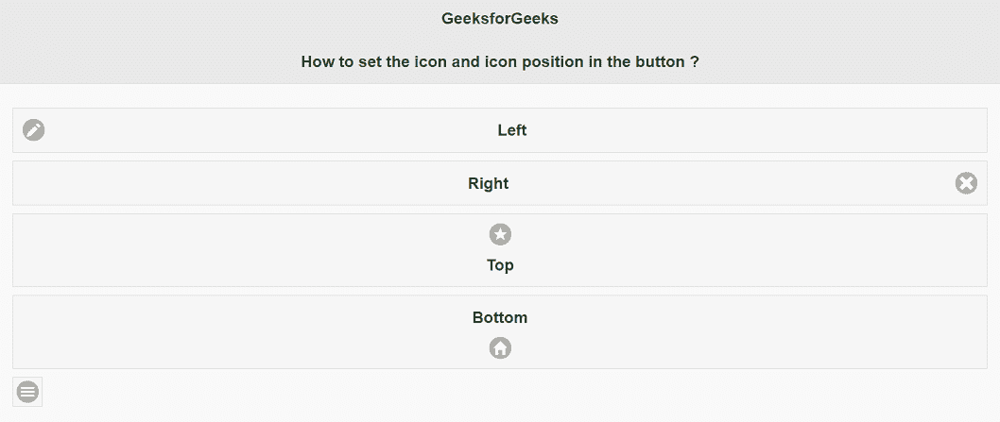

# 如何使用 jQuery Mobile 设置图标及其在按钮中的位置？

> 原文:[https://www . geeksforgeeks . org/如何使用 jquery-mobile 设置图标及其在按钮中的位置/](https://www.geeksforgeeks.org/how-to-set-the-icon-and-its-position-in-button-using-jquery-mobile/)

在本文中，我们将看到如何使用 jQuery Mobile 设置按钮中的图标和图标位置。jQuery Mobile 是一个基于 HTML5 的用户界面系统，旨在使所有智能手机、平板电脑和桌面设备都可以访问响应迅速的网站和应用程序。

这里，我们使用***ui-BTN ui-icon-name ui-BTN-icon-position***类来设置网页中的图标和图标位置。类别描述如下:

*   **ui-btn:** 这个类是用来创建按钮的。
*   **ui-icon-name:** 这个类是用来创建图标的，这里我们用 icon-name 替换 name。例如–用户界面-图标-星形。
*   **ui-BTN-图标-位置:**此类用于设置按钮中图标的位置。这里，我们用位置名称替换位置，如左、右、上等。

**示例:**

## 超文本标记语言

```
<!DOCTYPE html>
<html>

<head>
    <title>
        How to set the icon and icon 
        position in the button ?
    </title>

    <meta name="viewport" content=
        "width=device-width, initial-scale=1">
    <link rel="stylesheet" href=
"//code.jquery.com/mobile/1.4.5/jquery.mobile-1.4.5.min.css">
    <script src="//code.jquery.com/jquery-1.10.2.min.js">
    </script>
    <script src=
"//code.jquery.com/mobile/1.4.5/jquery.mobile-1.4.5.min.js">
    </script>
</head>

<body>
    <div data-role="page" id="page1">
        <div data-role="header">

            <h1 style="color:green;">
                GeeksforGeeks
            </h1>

            <h2>
                How to set the icon and icon 
                position in the button ?
            </h2>
        </div>

        <a href="#" class="ui-btn ui-icon-edit 
            ui-btn-icon-left">Left</a>
        <a href="#" class="ui-btn ui-icon-delete 
            ui-btn-icon-right">Right</a>
        <a href="#" class="ui-btn ui-icon-star 
            ui-btn-icon-top">Top</a>
        <a href="#" class="ui-btn ui-icon-home 
            ui-btn-icon-bottom">Bottom</a>
        <a href="#" class="ui-btn ui-icon-bars 
            ui-btn-icon-notext">Icon only</a>
    </div>
</body>

</html>
```

**输出:**

