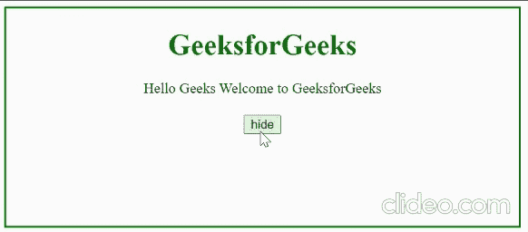

# 如何使用 jQuery 显示/隐藏一个元素？

> 原文:[https://www . geesforgeks . org/how-show-hide-an-element-use-jquery/](https://www.geeksforgeeks.org/how-to-show-hide-an-element-using-jquery/)

在本文中，我们将学习如何使用 [jQuery](https://www.geeksforgeeks.org/jquery-tutorials/) 显示/隐藏元素。我们可以使用类似 [css()](https://www.geeksforgeeks.org/jquery-css-method/) 、 [show()](https://www.geeksforgeeks.org/jquery-effect-show-method/amp/) 、 [hide()](https://www.geeksforgeeks.org/jquery-hide-with-examples/) 和 [toggle()](https://www.geeksforgeeks.org/jquery-toggle-method/) 的方法来完成这些操作。

**进场:**

1.  在你的本地系统“index.html”中创建一个 HTML 文件
2.  在 [<主体>](https://www.geeksforgeeks.org/html-body-tag/) 标签内创建一个 HTML 元素，例如段落 [< p >](https://www.geeksforgeeks.org/html-paragraph/) ，图像 [< img >](https://www.geeksforgeeks.org/html-img-tag/) 等。
3.  使用 [<按钮>](https://www.geeksforgeeks.org/html-button-tag/) 标签创建一个按钮，并附加一个[事件监听器](https://www.geeksforgeeks.org/javascript-addeventlistener-with-examples/)。
4.  我们使用这个按钮来切换显示和隐藏动画。这意味着当显示所选元素并单击隐藏按钮时，事件侦听器中的代码应该隐藏所选元素并更改该元素的文本，反之亦然。

**方法 1:使用 css()方法–**它采用两个参数，其中第一个参数是属性名称，第二个参数是属性的值。

```html
$(selector).css(property, value);
```

它采用一个参数类型 JSON 字符串对象，该对象包含属性及其值。

```html
$(selector).css(property);
```

## 超文本标记语言

```html
<!DOCTYPE html>
<html>

<head>
    <script src=
"https://cdnjs.cloudflare.com/ajax/libs/jquery/3.6.0/jquery.min.js">
    </script>

    <style>
        body {
            border: 2px solid green;
            min-height: 240px;
            text-align: center;
        }

        h1 {
            color: green;
        }

        div {
            display: flex;
            justify-content: center;
        }

        .button-container {
            display: flex;
            justify-content: center;
            margin-top: 20px;
        }
    </style>
</head>

<body>
    <h1>GeeksforGeeks</h1>

    <div id="element">
        Hello Geeks Welcome to GeeksforGeeks
    </div>

    <div class="button-container">
        <button id="click">
            hide
        </button>
    </div>

    <script>
        $('#click').on('click', function () {
            if ($('#click').text() === 'show') {

                // This block is executed when
                // you click the show button
                $('#click').text('hide');
                $('#element').css('display', 'flex');
            }
            else {

                // This block is executed when
                // you click the hide button
                $('#click').text('show');
                $('#element').css('display', 'none');
            }
        });
    </script>
</body>

</html>
```

**输出:**



输出

**方法 2:** 该方法用于显示隐藏元素，其所取的参数是可选的。

```html
$(selector).show(optional);
```

此方法用于隐藏可见元素，它采用的参数是可选的。

```html
$(selector).hide(optional);
```

## 超文本标记语言

```html
<!DOCTYPE html>
<html>

<head>
    <script src=
"https://cdnjs.cloudflare.com/ajax/libs/jquery/3.6.0/jquery.min.js">
    </script>

    <style>
        body {
            border: 2px solid green;
            min-height: 240px;
              text-align: center;
        }

        h1 {
            color: green;
        }

        div {
            display: flex;
            justify-content: center;
        }

        .button-container {
            display: flex;
            justify-content: center;
            margin-top: 20px;
        }
    </style>
</head>

<body>
    <h1>GeeksforGeeks</h1>

    <div id="element">
        Hello Geeks Welcome to GeeksforGeeks
    </div>

    <div class="button-container">
        <button id="click">
            hide
        </button>
    </div>

    <script>
        $('#click').on('click', function () {
            if ($('#click').text() === 'show') {

                // This block is executed when
                // you click the show button
                $('#click').text('hide');
                $('#element').show();
            }
            else {

                // This block is executed when
                // you click the hide button
                $('#click').text('show');
                $('#element').hide();
            }
        });
    </script>
</body>

</html>
```

**输出:**


显示/隐藏方法的输出

**方法 3:** 该方法隐藏可见的元素，隐藏显示。该方法可以实现 show 和 hide 方法的两种功能，并且参数是可选的。

```html
$(selector).toggle(optional)
```

## 超文本标记语言

```html
<!DOCTYPE html>
<html>

<head>
    <script src=
"https://cdnjs.cloudflare.com/ajax/libs/jquery/3.6.0/jquery.min.js">
    </script>

    <style>
        body {
            border: 2px solid green;
            min-height: 240px;
            text-align: center;
        }

        h1 {
            color: green;
        }

        div {
            display: flex;
            justify-content: center;
        }

        .button-container {
            display: flex;
            justify-content: center;
            margin-top: 20px;
        }
    </style>
</head>

<body>
    <h1>GeeksforGeeks</h1>

    <div id="element">
        Hello Geeks Welcome to GeeksforGeeks
    </div>

    <div class="button-container">
        <button id="click">
            hide
        </button>
    </div>

    <script>
        $('#click').on('click', function () {
            if ($('#click').text() === 'show') {

                // This block is executed when
                // you click the show button
                $('#click').text('hide');
            }
            else {

                // This block is executed when
                // you click the hide button
                $('#click').text('show');
            }
            $('#element').toggle();
        });
    </script>
</body>

</html>
```

**输出:**


切换方法的输出