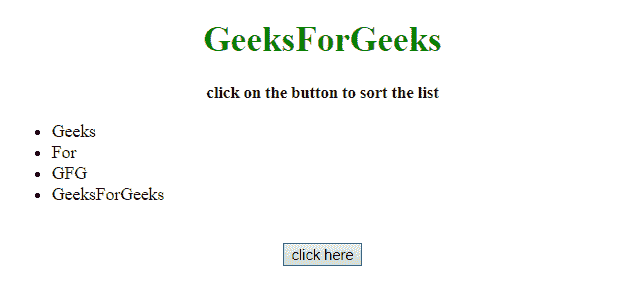
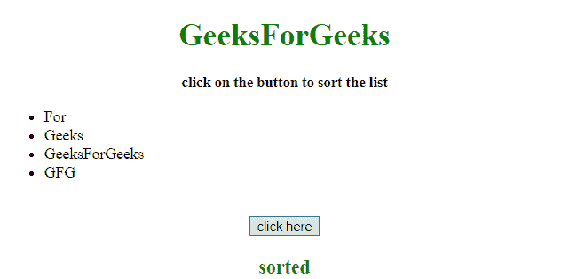

# 如何使用 jQuery 对列表进行字母排序？

> 原文:[https://www . geesforgeks . org/如何使用-jquery/](https://www.geeksforgeeks.org/how-to-sort-a-list-alphabetically-using-jquery/) 按字母顺序对列表进行排序

给定一个元素列表，任务是按照字母顺序对它们进行排序，并在 jQuery 的帮助下将每个元素放入列表中。

*   **jQuery text() Method:** This method set/return the text content of the selected elements. If this method is used to return content, it provides the text content of all matched elements (HTML tags will be removed). If this method is used to set content, it replace the content of all matched elements.

    **语法:**

    *   **返回文字内容:**

        ```html
        $(selector).text()
        ```

    *   **设置文字内容:**

        ```html
        $(selector).text(content)
        ```

    *   **使用功能设置文本内容:**

        ```html
        $(selector).text(function(index, curContent))
        ```

    **参数:**

    *   **内容:**必输参数。它为选定的元素指定新的文本内容。
    *   **函数(index，curContent):** 为可选参数。它指定了一个函数，为选定的元素返回新的文本内容。
        *   **索引:**返回元素在集合中的索引位置。
        *   **curContent:** 返回当前选中元素的内容。
*   **JavaScript String toUpperCase() Method:** This method converts a string to uppercase letters.

    **语法:**

    ```html
    string.toUpperCase()
    ```

    **返回值:**返回一个字符串，代表转换为大写的字符串的值。

*   **jQuery appendTo() Method:** This method adds HTML elements at the end of the selected elements.

    **语法:**

    ```html
    $(content).appendTo(selector)
    ```

    **参数:**

    *   **内容:**必输参数。它指定要插入的内容(必须包含 HTML 标记)。
    *   **选择器:**必选参数。它指定在哪些元素上追加内容。

**示例 1:** 在本例中，首先选择列表元素，然后将其传递给函数进行排序。排序后，使用 **appendTo()方法**以排序的方式将它们追加到父元素。

```html
<!DOCTYPE HTML> 
<html> 
    <head> 
        <title> 
            Sort a list alphabetically
        </title>

        <script src = 
"https://ajax.googleapis.com/ajax/libs/jquery/3.4.0/jquery.min.js">
        </script>
    </head> 

    <body> 
        <h1 style = "text-align:center; color:green;"> 
            GeeksForGeeks 
        </h1>

        <p id = "GFG_UP" style = 
            "text-align:center; font-size: 15px; font-weight: bold;">
            click on the button to sort the list
        </p>

        <ul>
            <li>Geeks</li>
            <li>For</li>
            <li>GFG</li>
            <li>GeeksForGeeks</li>
        </ul>
        <br>

        <center>
            <button>
                click here
            </button>
        </center>

        <p id = "GFG_DOWN" style = 
            "text-align:center; color:green; font-size:20px; font-weight:bold;">
        </p>

        <script>
            function Ascending_sort(a, b) {
                return ($(b).text().toUpperCase()) < 
                    ($(a).text().toUpperCase()) ? 1 : -1; 
            }
            $('button').on('click', function() {
                $("ul li").sort(Ascending_sort).appendTo('ul');
                $("#GFG_DOWN").text("sorted");
            });                 
        </script> 
    </body> 
</html>                    
```

**输出:**

*   **点击按钮前:**
    
*   **点击按钮后:**
    

**示例 2:** 在本例中，首先选择列表元素，然后将其传递给函数进行排序。排序后，使用 **appendTo()方法**以排序的方式将它们追加到父元素。本示例使用与第一个示例相同的方法，但方法不同。

```html
<!DOCTYPE HTML> 
<html> 
    <head> 
        <title> 
            Sort a list alphabetically
        </title>

        <script src = 
"https://ajax.googleapis.com/ajax/libs/jquery/3.4.0/jquery.min.js">
        </script>
    </head> 

    <body> 
        <h1 style = "text-align:center; color:green;"> 
            GeeksForGeeks 
        </h1>

        <p id = "GFG_UP" style =
            "text-align:center; font-size: 15px; font-weight: bold;">
            click on the button to sort the list
        </p>

        <ul class="mylist">
            <li>a</li>
            <li>c</li>
            <li>b</li>
            <li>B</li>
        </ul>
        <br>

        <center>
            <button>
                click here
            </button>
        </center>

        <p id = "GFG_DOWN" style = 
            "text-align:center; color:green; font-size:20px; font-weight:bold;">
        </p>

        <script>
            function sort(selector) {
                $(selector).children("li").sort(function(a, b) {
                    var A = $(a).text().toUpperCase();
                    var B = $(b).text().toUpperCase();
                    return (A < B) ? -1 : (A > B) ? 1 : 0;
                }).appendTo(selector);
            }

            $('button').on('click', function() {
                sort("ul.mylist");
                $("#GFG_DOWN").text("sorted");
            });                 
        </script> 
    </body> 
</html>                    
```

**输出:**

*   **点击按钮前:**
    
*   **点击按钮后:**
    