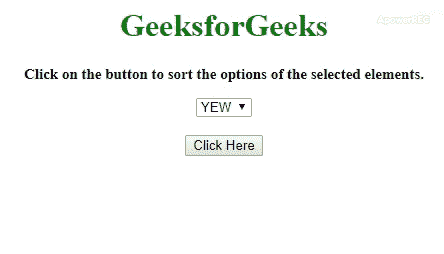

# 如何使用 jQuery 对选项元素进行字母排序？

> 原文:[https://www . geesforgeks . org/如何排序-选项-元素-按字母顺序-使用-jquery/](https://www.geeksforgeeks.org/how-to-sort-option-elements-alphabetically-using-jquery/)

任务是对 **<的选项进行排序，选择>** 元素在其位置上。这里有一些在 JavaScript 帮助下讨论最多的技术。

**方法 1:** 首先获取所有选项元素的值。使用**。移除()方法**要移除选项暂时从 **<中选择>** 元素。然后调用**。对值使用 sort()方法**并按字母顺序排序。现在使用**。追加()方法**再次追加它们。

*   **示例:**该示例实现了上述方法。

    ```html
    <!DOCTYPE HTML>
    <html>

    <head>
        <title>
            Sorting options elements alphabetically using jQuery.
        </title>
        <script src=
    "https://ajax.googleapis.com/ajax/libs/jquery/3.4.1/jquery.min.js">
        </script>
    </head>

    <body style="text-align:center;" id="body">
        <h1 id="h1" style="color:green;"> 
                GeeksforGeeks 
            </h1>
        <p id="GFG_UP" style="font-size: 15px;
                              font-weight: bold;">
        </p>
        <select id="elmt">
            <option value="v1"> YEW </option>
            <option value="v4"> ZAC </option>
            <option value="v2"> ABC </option>
            <option value="v3"> DFG </option>
            <option value="v5"> MNO </option>
            <option value="v9"> STU </option>
        </select>
        <br>
        <br>
        <button onclick="gfg_Run()">
            Click Here
        </button>
        <p id="GFG_DOWN" style="color:green; 
                                font-size: 30px; 
                                font-weight: bold;">
        </p>
        <script>
            var el_up = document.getElementById("GFG_UP");
            var el_down = document.getElementById("GFG_DOWN");
            el_up.innerHTML = 
              "Click on the button to sort the options" +
              " of the selected elements.";

            function gfg_Run() {
                $("#elmt").append($("#elmt option")
                                  .remove().sort(function(a, b) {
                    var at = $(a).text(),
                        bt = $(b).text();
                    return (at > bt) ? 1 : ((at < bt) ? -1 : 0);
                }));
                el_down.innerHTML = "Select options are sorted";
            }
        </script>
    </body>

    </html>
    ```

*   **输出:**
    

**方法 2:** 首先获取所有选项元素的值，然后使用**。分离()方法**从 DOM 树中临时移除选项。然后打电话给**。对值使用 sort()方法**并按字母顺序排序。使用**。appendTo()方法**将选项追加到 **<选择>** 元素。

*   **示例:**该示例实现了上述方法。

    ```html
    <!DOCTYPE HTML>
    <html>

    <head>
        <title>
            Sorting options elements alphabetically using jQuery.
        </title>
        <script src=
    "https://ajax.googleapis.com/ajax/libs/jquery/3.4.1/jquery.min.js">
        </script>
    </head>

    <body style="text-align:center;" id="body">
        <h1 id="h1" style="color:green;"> 
                GeeksforGeeks 
            </h1>
        <p id="GFG_UP" style="font-size: 15px; 
                              font-weight: bold;">
        </p>
        <select id="elmt">
            <option value="v1"> YEW </option>
            <option value="v4"> ZAC </option>
            <option value="v2"> ABC </option>
            <option value="v3"> DFG </option>
            <option value="v5"> MNO </option>
            <option value="v9"> STU </option>
        </select>
        <br>
        <br>
        <button onclick="gfg_Run()">
            Click Here
        </button>
        <p id="GFG_DOWN" style="color:green; 
                                font-size: 30px;
                                font-weight: bold;">
        </p>
        <script>
            var el_up = document.getElementById("GFG_UP");
            var el_down = document.getElementById("GFG_DOWN");
            el_up.innerHTML = 
                 "Click on the button to sort the options" +
                 " of the selected elements.";

            function gfg_Run() {
                var options = $("#elmt option");
                options.detach().sort(function(a, b) {
                    var at = $(a).text();
                    var bt = $(b).text();
                    return (at > bt) ? 1 : ((at < bt) ? -1 : 0);
                });
                options.appendTo("#elmt");
                el_down.innerHTML = "Select options are sorted";

            }
        </script>
    </body>

    </html>
    ```

    *   **Output:**

    