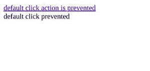

# 如何用 jQuery 停止默认的 hashtag 行为？

> 原文:[https://www . geesforgeks . org/how-stop-default-hashtag-behavior-with-jquery/](https://www.geeksforgeeks.org/how-to-stop-default-hashtag-behavior-with-jquery/)

jQuery 中的**[event . isdefaultprevented()](https://www.geeksforgeeks.org/jquery-event-isdefaultprevented-method/)**方法用于确定该事件触发的事件处理程序是否调用了该方法。如果调用 **event.preventDefault()** 方法，则不会触发事件的默认动作。

**语法:**

```html
event.preventDefault()
```

**参数:**此方法不接受任何参数。

**返回值:**该方法返回未定义。

**示例:**

## 超文本标记语言

```html
<!doctype html>
<html lang="en">

<head>
    <meta charset="utf-8">

    <script src=
"https://code.jquery.com/jquery-3.5.0.js">
    </script>
</head>

<body>

    <a href="https://jquery.com">
        default click action is prevented
    </a>

    <div id="log"></div>

    <script>
        $("a").click(function(event) {
            event.preventDefault();
            $("<div>")
                .append("default " 
                    + event.type + " prevented")
                .appendTo("#log");
        });
    </script>
</body>

</html>
```

**输出:**

