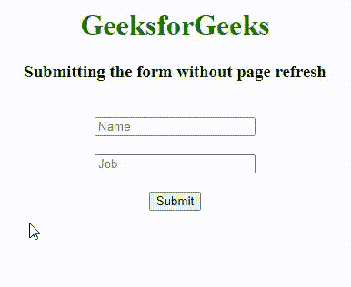

# 如何使用 jQuery 提交表单或表单的一部分而不刷新页面？

> 原文:[https://www . geeksforgeeks . org/如何使用-jquery 提交表单或表单的一部分而不刷新页面/](https://www.geeksforgeeks.org/how-to-submit-a-form-or-a-part-of-a-form-without-a-page-refresh-using-jquery/)

在本文中，我们将学习如何使用 JQuery 提交表单或表单的一部分而无需页面刷新，并将通过示例了解其实现。

**如何防止一个 HTML 表单提交？**

一般来说，当我们提交表单时，我们应该单击提交按钮，然后我们的页面将导航到表单操作属性中提到的另一条路线，但是我们可以在网页的背景中完成，而无需将网页导航到其他路线。这可以通过使用[*event . preventdefault()*](https://www.geeksforgeeks.org/preventdefault-event-method/)*方法来实现，该方法阻止默认事件并且不允许它触发。当我们单击提交按钮时，就会触发一个事件，所以我们需要防止这个事件，因为这个事件负责将用户带到其他路线。因此，我们必须在该表单上附加一个 [*onsubmit*](https://www.geeksforgeeks.org/html-dom-onsubmit-event/) 事件侦听器，这样当用户单击提交按钮时，我们就可以获得该事件对象，并通过使用 preventDefault 方法防止该特定事件触发。在使用 *event.preventDefault()* 方法阻止事件之后，我们需要获取表单值，并向我们想要发布值的特定路线发出发布请求。*

***先决条件**:需要对 [HTML](https://www.geeksforgeeks.org/html-tutorials/) 、 [CSS](https://www.geeksforgeeks.org/css-tutorials/) 、 [Javascript](https://www.geeksforgeeks.org/javascript-tutorial/) 、 [JQuery](https://www.geeksforgeeks.org/jquery-tutorials/) 有一个基本的了解，才能继续。*

***进场:***

*   *创建一个 HTML 文件&在 javascript 代码上面添加 jquery 库 CDN。*
*   *创建两个输入字段、一个提交按钮和一个显示结果的范围。*
*   *向表单中添加一个 *onsubmit* 侦听器，并用一个参数进行回调。*

***示例**:在这个示例中，我们采取了一个伪造的帖子请求，我们需要发布一些信息，服务器将返回 id 作为对象。*

## *超文本标记语言*

```html
*<!DOCTYPE html>
<html>

<head>
    <style>
    .container {
        display: flex;
        flex-direction: column;
        align-items: center;
        justify-content: center;
    }

    h1 {
        color: green;
    }

    h3 {
        text-align: center;
    }

    input,
    span {
        margin-top: 20px;
    }
    </style>
</head>

<body>
    <div>
        <h1 class="container">
            GeeksforGeeks
        </h1>
        <h3>Submitting the form without page refresh</h3>
    </div>
    <form>
        <div class="container">
            <input placeholder="Name" type="text" name="Name" />
            <input placeholder="Job" type="text" name="job" />
            <input type="submit" /> 
        </div> 
        <span class="container"></span> 
    </form>
    <script src=
"https://cdnjs.cloudflare.com/ajax/libs/jquery/3.6.0/jquery.min.js">
    </script>
    <script type="text/javascript">
    $(document).ready(function() {
        $('form').on('submit', function(event) {
            event.preventDefault();

            // It returns a array of object 
            let userinfo = $(this).serializeArray();
            let user = {};
            userinfo.forEach((value) => {

                // Dynamically create an object
                user[value.name] = value.value;
            });
            let url = "https://reqres.in/api/users";
            $.ajax({
                method: "POST",
                url: url,
                data: user
            }).done(function(msg) {

                // When the request is successful
                $('span').text('user is successfully created with Id ' + msg.id);
            }).fail(function(err, textstatus, error) {
                $('span').text(textstatus);
            });
        });
    });
    </script>
</body>

</html>*
```

***输出:***

**