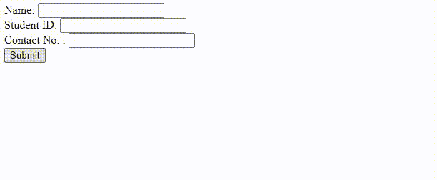

# 如何在 jQuery 中使用 ajax 提交表单？

> 原文:[https://www . geeksforgeeks . org/如何使用 jquery 中的 ajax 提交表单/](https://www.geeksforgeeks.org/how-to-submit-a-form-using-ajax-in-jquery/)

[**jQuery**](https://www.geeksforgeeks.org/jquery-tutorials/) 是一个开源 JavaScript 库，它简化了 [HTML/CSS](https://www.geeksforgeeks.org/web-technology/html-css/) 文档，或者更准确地说[文档对象模型(DOM)](https://www.geeksforgeeks.org/dom-document-object-model/) 和 [JavaScript](https://www.geeksforgeeks.org/javascript-tutorial/) 之间的交互。阐述术语， [jQuery](https://www.geeksforgeeks.org/jquery-introduction/) 简化了 HTML 文档遍历和操作、浏览器事件处理、 [DOM](https://www.geeksforgeeks.org/dom-document-object-model/) 动画、 [Ajax](https://www.geeksforgeeks.org/ajax-introduction/) 交互和跨浏览器 JavaScript 开发。

**$。ajax()** 函数用于使用 jQuery 进行 ajax 调用。

**语法:**

```html
$.ajax({name:value, name:value, ... })
```

我们可以通过 ajax 提交表单，使用 submit 按钮，并提及以下参数的值。

*   **类型:**用于指定请求的类型。
*   **url:** 用于指定发送请求的 url。
*   **数据:**用于指定发送给服务器的数据。

**示例:**

## 超文本标记语言

```html
<!Doctype html>
<html>

<head>
    <title>JQuery AJAX Call</title>

    <!--Include JQuery Library -->
    <script src=
"https://code.jquery.com/jquery-3.5.0.js">
    </script>
    <script>

    // When DOM is loaded this 
    // function will get executed
    $(() => {
        // function will get executed 
        // on click of submit button
        $("#submitButton").click(function(ev) {
            var form = $("#formId");
            var url = form.attr('action');
            $.ajax({
                type: "POST",
                url: url,
                data: form.serialize(),
                success: function(data) {

                    // Ajax call completed successfully
                    alert("Form Submited Successfully");
                },
                error: function(data) {

                    // Some error in ajax call
                    alert("some Error");
                }
            });
        });
    });
    </script>
</head>

<body>
    <form id='formId' action=''> Name:
        <input type='text' 
               id='nm' 
               name='nm'> 
        </input>
        <br> Student ID:
        <input type='text' 
               id='studentId' 
               name='studentId'> 
        </input>
        <br> Contact No. :
        <input type='text' 
               id='contactNumber' 
               name='contactNumber'> 
        </input>
        <br>
        <button type='submit' 
               id='submitButton'>
            Submit
        </button>
    </form>
</body>

</html>
```

**输出:**

