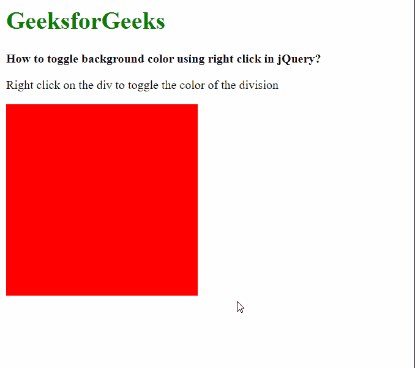

# 如何在 jQuery 中使用右键切换背景色？

> 原文:[https://www . geesforgeks . org/如何切换-背景色-使用-右键单击-jquery/](https://www.geeksforgeeks.org/how-to-toggle-background-color-using-right-click-in-jquery/)

在本文中，我们将学习在 jQuery 中使用右键来切换背景颜色。

**方法 1:** 方法是使用 [*上下文菜单*](https://www.geeksforgeeks.org/javascript-mouseevent-contextmenu-event/) 事件。 *contextmenu()* 方法用于将 *contextmenu* 事件绑定到正在使用的元素。这可用于对正在使用的元素执行颜色切换操作。我们从绑定功能返回 *false* ，防止上下文菜单打开。

这两种背景颜色可以在两个类中定义，这两个类可以使用布尔变量来跟踪。当检测到点击时，该变量被切换。在元素上使用[*【add class()】*](https://www.geeksforgeeks.org/jquery-addclass-with-examples/)和 [*removeClass()*](https://www.geeksforgeeks.org/jquery-removeclass-with-examples/) 方法根据该元素添加或移除类。

**jQuery Code:**

```
let isRedBackground = true;

let box = $(".box");

box.contextmenu(function () {

  // Add and remove the background classes
  if (isRedBackground) {
    box.removeClass("redbg");
    box.addClass("greenbg");
  }
  else {
    box.removeClass("greenbg");
    box.addClass("redbg");
  }

  // Toggle the background color variable
  isRedBackground = !isRedBackground;

  return false;
});
```

**示例:**下面的示例说明了上述方法。

## 超文本标记语言

```
<!DOCTYPE html>
<html>

<head>
    <script src=
"https://code.jquery.com/jquery-3.3.1.min.js">
    </script>

    <style>
        .redbg {
            background-color: red;
        }

        .greenbg {
            background-color: green;
        }

        .box {
            height: 250px;
            width: 250px;
        }
    </style>
</head>

<body>
    <h1 style="color: green">
        GeeksforGeeks
    </h1>

    <b>
        How to toggle background color
        using right click in jQuery?
    </b>

    <p>
        Right click on the div to toggle
        the color of the division
    </p>

    <div class="box redbg"></div>
    <br>

    <script>

        // Variable for storing the current
        // background color
        let isRedBackground = true;

        // Get the div that has to be
        // toggled
        let box = $(".box");

        box.contextmenu(function () {

            // Add and remove class depending
            // on the variable
            if (isRedBackground) {
                box.removeClass("redbg");
                box.addClass("greenbg");
            }
            else {
                box.removeClass("greenbg");
                box.addClass("redbg");
            }

            // Toggle the background color variable
            isRedBackground = !isRedBackground;

            return false;
        });
    </script>
</body>

</html>
```

**输出:**



**方法 2:** 第二种方法是使用[*mouse down()*](https://www.geeksforgeeks.org/jquery-mousedown-with-examples/)**事件获取右键。 *mousedown()* 方法用于将 *mousedown* 事件绑定到正在使用的元素。这可以通过检查事件的[](https://www.geeksforgeeks.org/javascript-mouseevent-which-property/)**属性是否等于表示右键单击的“3”来获得鼠标的右键单击。****

****这两种背景颜色可以定义为两个变量，而不是在类中定义背景颜色，并且可以使用[*【CSS()】*](https://www.geeksforgeeks.org/jquery-css-method/)**方法来设置分割的背景颜色。一个单独的布尔变量可以用来跟踪当前的背景颜色，并自动设置分割的颜色，类似于上面的方法。******

********jQuery code:********

```
****let isBackgroundOne = true;
let backgroundOne = "red";
let backgroundTwo = "blue";
let box = $(".box");

// Bind the mousedown event
box.mousedown(function (event) {

    // Disable the context menu
    box.contextmenu(false);

    // Check if right mouse button
    if (event.which == 3) {

        // Toggle the color based on the 
        // variable
        if (isBackgroundOne) {
            box.css({
                backgroundColor: backgroundTwo
        );
        }
        else {
            box.css({
                backgroundColor: backgroundOne
            });
        }

        // Toggle the variable itself
        isBackgroundOne = !isBackgroundOne;
    }
});****
```

********示例:**下面的示例说明了上述方法。******

## ******超文本标记语言******

```
****<!DOCTYPE html>
<html>

<head>
    <script src=
"https://code.jquery.com/jquery-3.3.1.min.js">
    </script>

    <style>
        .box {
            height: 250px;
            width: 250px;

            /* Initial background color */
            background-color: red;
        }
    </style>
</head>

<body>
    <h1 style="color: green">
        GeeksforGeeks
    </h1>

    <b>
        How to toggle background color
        using right click in jQuery?
    </b>

    <p>
        Right click on the div to
        toggle the color of the division
    </p>

    <div class="box"></div>
    <br>

    <script>

        // Variable for storing the current
        // background color
        let isBackgroundOne = true;

        // Defining both the background colors
        let backgroundOne = "red";
        let backgroundTwo = "blue";

        let box = $(".box");

        // Bind the mousedown event
        box.mousedown(function (event) {

            // Disable the context menu
            box.contextmenu(false);

            // Check if the right mouse button
            // is pressed
            if (event.which == 3) {

                // Toggle the color based on the 
                // variable
                if (isBackgroundOne) {
                    box.css({
                        backgroundColor: backgroundTwo
                    });
                }
                else {
                    box.css({
                        backgroundColor: backgroundOne
                    });
                }

                // Toggle the variable itself
                isBackgroundOne = !isBackgroundOne;
            }
        });
    </script>
</body>

</html>****
```

********输出:********

******

切换背景******