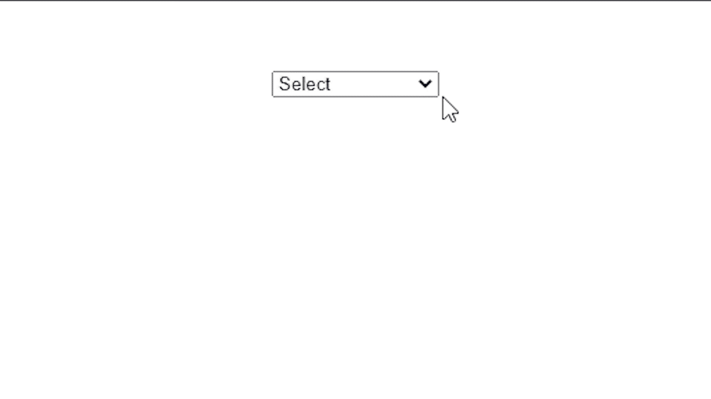

# 如何使用 jQuery 触发悬停时点击选择框？

> 原文:[https://www . geesforgeks . org/how-to-trigger-click-select-box-on-hover-use-jquery/](https://www.geeksforgeeks.org/how-to-trigger-click-on-select-box-on-hover-using-jquery/)

在本文中，我们将学习如何使用 jQuery 在鼠标悬停时，在[选择框](https://www.geeksforgeeks.org/html-select-tag/)或下拉菜单上触发[点击](https://www.geeksforgeeks.org/jquery-click-with-examples/)事件。

为了为选择框创建这样的行为，我们将使用 jQuery [attr()](https://www.geeksforgeeks.org/jquery-attr-method/) 方法。此方法用于设置或返回网页上所选元素的属性和值。请注意，我们无法直接触发[悬停](https://www.geeksforgeeks.org/jquery-hover-with-examples/)上的点击事件，因此我们使用 **attr()** 方法来完成工作。

**方法:**我们将在选择框的以下 [id](https://www.geeksforgeeks.org/html-id-attributes/) 或[类](https://www.geeksforgeeks.org/difference-between-an-id-and-class-in-html/)上调用[悬停()](https://www.geeksforgeeks.org/jquery-hover-with-examples/)方法。我们将使用 [attr()](https://www.geeksforgeeks.org/jquery-attr-method/) 方法来获取选择框的大小，在相同的方法中，我们将它的大小更改为 1，因此当我们将光标从选择框移出时，它会恢复到默认大小。通过使用这种方法，我们将能够在鼠标悬停时显示整个列表，当用户从列表中选择任何值时，它将返回到默认视图。

**示例:**

## 超文本标记语言

```html
<!DOCTYPE html>
<head>
    <script src=
     "https://code.jquery.com/jquery-3.6.0.min.js"
           integrity=
     "sha256-/xUj+3OJU5yExlq6GSYGSHk7tPXikynS7ogEvDej/m4="
            crossorigin=
      "anonymous">
     </script>
    <title>Trigger click on hover on the select box</title>
    <style>
        body {
            margin: 0px;
            padding: 0px;
            box-sizing: border-box;
        }
        .main{
            display: flex;
            align-items: center;
            align-items: center;
            justify-content: center;
            margin: 50px;
        }
        .main div{
            width: 100px;
            height: 100px;
            background-color: red;
            margin: 10px;
            border-radius: 50%;
            cursor: pointer;
        }
        #select_value{
            outline: none;
            width: 120px;
        }
    </style>
</head>
<body>
<div class="main">
    <select id="select_value">
        <!--  There are five items on the list  -->
        <option value="">Select</option>
        <option value="Actor">Actor</option>
        <option value="Dancer">Dancer</option>
        <option value="Singer">Singer</option>
        <option value="Musician">Musician</option>
        <option value="Fighter">Fighter</option>
    </select>
</div>
</body>
<script>
    $(function(){
        // When the user hovers over the select box,
        // it gets the value of the whole list.
        $('#select_value').hover(function() {
            $(this).attr('size', $('option').length);
        },

        // When the user stops hovering over the select box, 
        // it gets back to the normal or default value.
        function() {
            $(this).attr('size', 1);
        });

        // When the user clicks on the select box, 
        // it gets the value of the selected item.

        $('#select_value').click(function() {
            $(this).attr('size', 1);
        });
    });    
</script>
</html>
```

**输出:**

