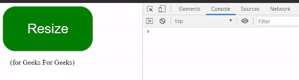

# jQuery 中如何触发窗口调整大小事件？

> 原文:[https://www . geesforgeks . org/如何在 jquery 中触发窗口调整大小事件/](https://www.geeksforgeeks.org/how-to-trigger-the-window-resize-event-in-jquery/)

在本文中，我们将讨论如何使用 jQuery 触发窗口大小调整事件。为此，我们将使用 jQuery 提供的以下库函数。

1.  **$( <元素>)。trigger():** 这个库函数允许我们同时触发原生和定制事件。该方法可以独立使用，也可以由另一个事件启动。在这种情况下，我们将使用原生的 **JavaScript 事件“调整大小”**，以便根据我们的方便触发调整大小事件。语法应该是: **$(窗口)。触发器(“调整大小”)；**
2.  **$( <元素>)。resize():** 这个方法用来监听 resize 事件。方法可以将回调函数作为参数，一旦遇到 resize 事件，就会执行回调函数。

**jQuery CDN 链接:**

这里，为了更容易理解，将在按钮上触发调整大小事件。

```html
<!DOCTYPE html>
<html lang="en">

<head>
    <meta charset="UTF-8">

    <meta name="viewport" content=
        "width=device-width,initial-scale=1.0">

    <script src=
"https://code.jquery.com/jquery-3.5.1.min.js"
        integrity=
"sha256-9/aliU8dGd2tb6OSsuzixeV4y/faTqgFtohetphbbj0="
        crossorigin="anonymous">
    </script>
</head>

<body>
    <button id="res" style="
                background-color: green;
                color: white;
                font-size: 30px;
                border: none;
                border-radius: 28px;
                width: 200px;
                height: 100px;
                outline: none;
                cursor: pointer;">
        Resize
    </button>
    <br>

    <p id="gfg" style>
         (for Geeks For Geeks)
    </p>

    <script>
        $(document).ready(() => {
            $('#res').on('click', () => {
                $(window).trigger('resize');
            });
            $(window).resize(() => {
                console.log("resize function called");
            })
        });
    </script>
</body>

</html>
```

**给定代码片段的输出:**

