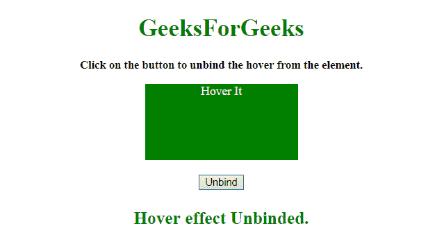

# 如何使用 JQuery 解除“悬停”事件的绑定？

> 原文:[https://www . geesforgeks . org/how-解除绑定-悬停-事件-使用-jquery/](https://www.geeksforgeeks.org/how-to-unbind-hover-event-using-jquery/)

问题是在 JQuery 的帮助下解除特定元素的悬停效果。这里我们使用 2 个 JQuery 方法**。解除绑定()**和**。off()方法**。这里讨论一些技巧。

**进场:**

*   选择悬停效果需要取消绑定的元素。(确保悬停效果只能由 JQuery 添加，CSS 添加的悬停效果在这里不起作用)。
*   使用任一**。解除绑定()**或**。off()方法。**
*   传递我们想要为该特定元素关闭的事件。

**例 1:** 本例使用了**。解除绑定()方法**。

```
<!DOCTYPE HTML>
<html>

<head>
    <title>
        How to unbind “hover” event using JQuery?
    </title>
    <script src=
"https://ajax.googleapis.com/ajax/libs/jquery/3.4.1/jquery.min.js">
    </script>
    <style>
        #div {
            height: 100px;
            width: 200px;
            background: green;
            color: white;
            margin: 0 auto;
        }
    </style>
</head>

<body style="text-align:center;">
    <h1 id="h1" style="color:green;">  
            GeeksForGeeks  
        </h1>
    <p id="GFG_UP" 
       style="font-size: 15px;
              font-weight: bold;">
    </p>
    <div id="div">
        Hover It
    </div>
    <br>
    <button onclick="gfg_Run()">
        Unbind
    </button>
    <p id="GFG_DOWN" 
       style="font-size: 23px; 
              font-weight: bold; 
              color: green; ">
    </p>
    <script>
        var el_up = document.getElementById("GFG_UP");
        var el_down = document.getElementById("GFG_DOWN");
        var heading = document.getElementById("h1");
        var div = document.getElementById("div");

        el_up.innerHTML = 
          "Click on the button to unbind the hover from the element.";

        $("#div").hover(function() {
            $(this).css("background-color", "blue");
        }, function() {
            $(this).css("background-color", "green");
        });

        function gfg_Run() {
            $('#div').unbind('mouseenter mouseleave');
            el_down.innerHTML = "Hover effect Unbinded.";
        }
    </script>
</body>

</html>
```

**输出:**

*   **点击按钮前:**
    
*   **在元素上悬停:**
    
*   **点击按钮后:**
    

**例 2:** 本例使用了**。off()方法**。

```
<!DOCTYPE HTML>
<html>

<head>
    <title>
        How to unbind “hover” event using JQuery?
    </title>
    <script src=
     "https://ajax.googleapis.com/ajax/libs/jquery/3.4.1/jquery.min.js">
    </script>
    <style>
        #div {
            height: 100px;
            width: 200px;
            background: green;
            color: white;
            margin: 0 auto;
        }
    </style>
</head>

<body style="text-align:center;">
    <h1 id="h1" style="color:green;">  
            GeeksForGeeks  
        </h1>
    <p id="GFG_UP" style="font-size: 15px; font-weight: bold;">
    </p>
    <div id="div">
        Hover It
    </div>
    <br>
    <button onclick="gfg_Run()">
        Unbind
    </button>
    <p id="GFG_DOWN"
       style="font-size: 23px;
              font-weight: bold; 
              color: green; ">
    </p>
    <script>
        var el_up = document.getElementById("GFG_UP");
        var el_down = document.getElementById("GFG_DOWN");
        var heading = document.getElementById("h1");
        var div = document.getElementById("div");

        el_up.innerHTML = 
          "Click on the button to unbind the hover from the element.";
        $("#div").hover(function() {
            $(this).css("background-color", "blue");
        }, function() {
            $(this).css("background-color", "green");
        });

        function gfg_Run() {
            $('#div').off('mouseenter mouseleave');
            el_down.innerHTML = "Hover effect Unbinded.";
        }
    </script>
</body>

</html>
```

**输出:**

*   **点击按钮前:**
    
*   **在元素上悬停:**
    
*   **点击按钮后:**
    