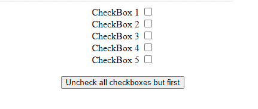
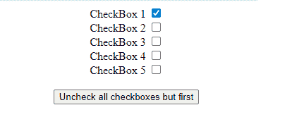

# 如何使用 jQuery 取消选中除一个复选框之外的所有其他复选框？

> 原文:[https://www . geeksforgeeks . org/如何取消选中所有其他复选框-除了一个使用-jquery/](https://www.geeksforgeeks.org/how-to-uncheck-all-other-checkboxes-apart-from-one-using-jquery/)

在本文中，我们将看到如何取消所有复选框，除了首先使用 jQuery。

**逼近**:首先，我们需要获取一个页面中所有的复选框元素。我们可以使用以下 jQuery 调用获得所有复选框:

```html
$('input[type=checkbox]')
```

接下来，我们可以使用 jQuery 每个函数来迭代每个复选框，

```html
each(function (index, checkbox){
     if (index != 0) {
     checkbox.checked = false;
    }
 });
```

在上面的代码片段中，我们给每个 方法传递一个函数。该函数使用两个参数，索引和当前元素引用。在这个函数中，我们检查每个复选框的索引。如果索引为 0，我们什么也不做。如果索引不为零，我们取消选中当前复选框元素。

**示例:**下面是说明使用上述方法的代码。

## 超文本标记语言

```html
<!DOCTYPE html>
<html>

<head>
    <script type="text/javascript" src=
"https://code.jquery.com/jquery-3.6.0.min.js">
    </script>

    <script type="text/javascript">
        $(document).ready(function () {
            $('#btnUncheckAll').click(function () {
                $('input[type=checkbox]').each(
                  function (index, checkbox) {
                    if (index != 0) {
                        checkbox.checked = false;
                    }
                });
            });
        });
    </script>
</head>

<body style="text-align:center">
    <label for="cb1">CheckBox 1</label>
    <input type="checkbox" value="cb1"/>
    <br/>

    <label for="cb2">CheckBox 2</label>
    <input type="checkbox" value="cb2"/>
    <br/>

    <label for="cb3">CheckBox 3</label>
    <input type="checkbox" value="cb3"/>
    <br/>

    <label for="cb4">CheckBox 4</label>
    <input type="checkbox" value="cb4"/>
    <br/>

    <label for="cb5">CheckBox 5</label>
    <input type="checkbox" value="cb5"/>
    <br/>

    <br/>
    <input type="button" 
           value="Uncheck all checkboxes but first" 
           id="btnUncheckAll"/>
</body>

</html>
```

**输出:**我们看到如下网页:



现在勾选所有复选框。

**点击按钮后:**除第一个复选框外，所有复选框都被取消选中。

