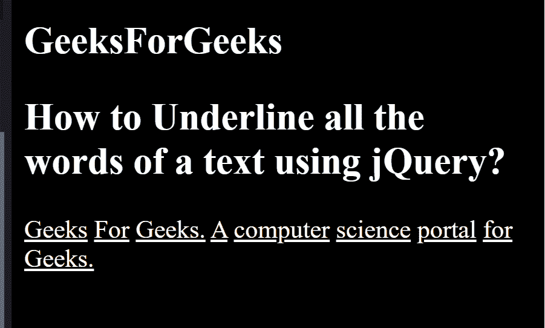

# 如何使用 jQuery 给一个文本的所有单词加下划线？

> 原文:[https://www . geeksforgeeks . org/如何使用-jquery/](https://www.geeksforgeeks.org/how-to-underline-all-words-of-a-text-using-jquery/) 给文本中的所有单词加下划线

给定一个语句，任务是使用 jQuery 给 HTML 页面的所有文本单词加下划线。我们将使用文本修饰属性为每个单词添加下划线。

**HTML 代码:**

## 超文本标记语言

```html
<!DOCTYPE html>
<html>

<head>
    <style>
        p span {
            text-decoration: underline;
        }
    </style>

    <script src=
"https://code.jquery.com/jquery-git.js">
    </script>
</head>

<body>
    <h2>GeeksForGeeks</h2>

    <h2>
        How to underline all the words 
        of a text using jQuery?
    </h2>

    <p>
        Geeks For Geeks. A computer 
        science portal for Geeks.
    </p>
</body>

</html>
```

**jQuery Code:**

```html
$('p').each(function () {

    var text_words = $(this).text().split(' ');

    $(this).empty().html(function () {

        for (i = 0; i < text_words.length; i++) {
            if (i === 0) {
                $(this).append('<span>' 
                + text_words[i] + '</span>');
            } else {
                $(this).append(' <span>' 
                + text_words[i] + '</span>');
            }
        }
    });
});
```

**最终代码:**下面的代码是上面两个代码片段的组合。

```html
<!DOCTYPE html>
<html>

<head>
    <style>
        p span {
            text-decoration: underline;
        }
    </style>

    <script src=
"https://code.jquery.com/jquery-git.js">
    </script>
</head>

<body>
    <h2>GeeksForGeeks</h2>

    <h2>
        How to underline all the words 
        of a text using jQuery?
    </h2>

    <p>
        Geeks For Geeks. A computer 
        science portal for Geeks.
    </p>

    <script>
        $(document).ready(function () {
            $('p').each(function () {
                var text_words = 
                    $(this).text().split(' ');

                $(this).empty().html(function () {
                    for (i = 0; i < text_words.length; i++) {
                        if (i === 0) {
                            $(this).append('<span>' 
                            + text_words[i] + '</span>');
                        }
                        else {
                            $(this).append(' <span>' 
                            + text_words[i] + '</span>');
                        }
                    }
                });
            });
        });
    </script>
</body>

</html>
```

**输出:**



**支持的浏览器如下:**

*   谷歌 Chrome
*   微软公司出品的 web 浏览器
*   火狐浏览器
*   歌剧
*   旅行队