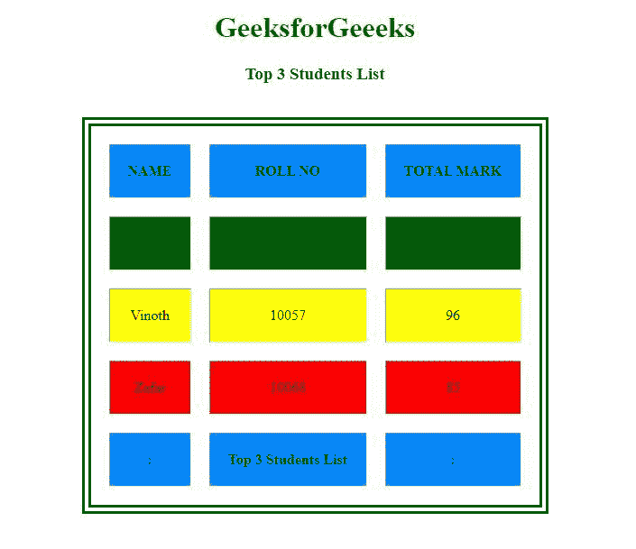

# 如何使用 jQuery 将 JSON 通用解析成块？

> 原文:[https://www . geesforgeks . org/how-universal-parse-JSON-in-blocks-use-jquery/](https://www.geeksforgeeks.org/how-to-universally-parse-json-into-blocks-using-jquery/)

在 jQuery 中，将任何数据解析成任何块都是通过使用 DOM 插入方法来实现的。DOM 插入方法有 [append()](https://www.geeksforgeeks.org/jquery-append-method/) 、 [appendTo()](https://www.geeksforgeeks.org/jquery-appendto-with-examples/) 、 [html()](https://www.geeksforgeeks.org/jquery-html-method/) 、 [prepend()](https://www.geeksforgeeks.org/jquery-prepend-with-examples/) 、 [prependTo()](https://www.geeksforgeeks.org/jquery-prependto-with-examples/) 、 [text()](https://www.geeksforgeeks.org/jquery-text-method/) 。将 JSON 解析成任何块也是以同样的方式处理的，但是与 **Ajax 回调函数**和**一起解析。JSON()方法**。这里**解析。JSON()方法**在 *jQuery 3.0* 中被弃用，因此在以后的版本中改为使用 **JSON.parse()** 方法。

**语法:**

```html
/* JSON data might be in array also */
var $json-data= '{json-index:json-values}'

/* Creating object for parsed JSON data */
var $json-object= JSON.parse($jsondata);

/* Parse text along with JSON data-value
 with respect to index */
$("selected block").text($json-object.index);
```

或者

```html
/* Parse HTML tag along with JSON data-value
 with respect to index */
$("selected block").html( "opentag" + $json-object.index + "closetag");

```

**方法 1:**

*   让我们使用$，应用 AJAX 回调函数。ajax()方法。
*   $.ajax()方法以不同的方式执行，但是在这里我们只是将配置对象/对象文字作为它的唯一参数传递给$。ajax()方法以及 JSON Array 数据。

**示例 1:** 在下面的示例中，使用了 AJAX Callback 函数将 JSON 数组解析为 HTML 块。

```html
<!DOCTYPE html>
<html lang="en">

<head>
    <meta charset="utf-8">

    <meta name="viewport"
        content="width=device-width, 
                initial-scale=1">
    <script src="
https://ajax.googleapis.com/ajax/libs/jquery/3.4.1/jquery.min.js">
    </script>
</head>

<body>
    <center>
        <h1 style="color:green;">GeeksforGeeeks</h1>
        <h3>Top 3 Students List</h3>
        <br>
        <table style="border:10px;border-style: double;" 
                border="2" cellpadding="20"
                cellspacing="20">
            <thead>
                <tr>
                    <th>NAME</th>
                    <th>ROLL NO</th>
                    <th>TOTAL MARK</th>
                </tr>
            </thead>
            <tbody>
                <tr>
                    <td align="center"
                        data-stud="student1"
                        data-topstud="Name">
                </td>
                    <td align="center"
                        data-stud="student1"
                        data-topstud="Roll">
                </td>
                    <td align="center"
                        data-stud="student1"
                        data-topstud="TotalMark">
                </td>
                </tr>
                <tr>
                    <td align="center"
                        data-stud="student2"
                        data-topstud="Name">
                </td>
                    <td align="center"
                        data-stud="student2"
                        data-topstud="Roll">
                </td>
                    <td align="center"
                        data-stud="student2"
                        data-topstud="TotalMark">
                </td>
                </tr>
                <tr>
                    <td align="center"
                        data-stud="student3"
                        data-topstud="Name">
                </td>
                    <td align="center"
                        data-stud="student3"
                        data-topstud="Roll">
                </td>
                    <td align="center"
                        data-stud="student3"
                        data-topstud="TotalMark">
                </td>
                </tr>
            </tbody>
            <tfoot>
                <tr>
                    <th>:</th>
                    <th> Top 3 Students List</th>
                    <th>:</th>
                </tr>
            </tfoot>
        </table>
    </center>

    <script>
        var data = {
                "student1": [{
                    "Name": "Arun",
                    "Roll": 10056,
                    "TotalMark": 98,
                }],
                "student2": [{
                    "Name": "Vinoth",
                    "Roll": 10057,
                    "TotalMark": 96,
                }],
                "student3": [{
                    "Name": "Zafar",
                    "Roll": 10068,
                    "TotalMark": 85,
                }]
            }

        //AJAX callback:
        $('td').html(function() {
            var $block = $(this)
            return data[$block.data('stud')]
                    [0][$block.data('topstud')];
        });

        $("th").css("background-color", "#08f");
        $("tr:nth-child(1)").css("background-color", "green");
        $("tr:nth-child(2)").css("background-color", "yellow");
        $("tr:nth-child(3)").css("background-color", "red");
    </script>
</body>

</html>
```

**输出:**


**方法 2:**

*   使用本机 JSON.parse 方法解析 JSON 字符串。
*   使用 JSON.parse 方法代替 jQuery 3.0 的弃用方法$。parseJSON()。

**示例 2:** 在下面的示例中，使用 jQuery.parseJSON()方法和 JSON.parse()方法将 JSON 数据解析为一个 HTML 块。

```html
<!DOCTYPE html>
<html lang="en">

<head>
    <meta charset="utf-8">
    <meta name="viewport"
        content="width=device-width, 
                initial-scale=1">
    <script src="
https://ajax.googleapis.com/ajax/libs/jquery/3.4.1/jquery.min.js">
    </script>

    <style>
        div {
            border: 2px solid green;
            padding: 20px;
        }

        h2 {
            color: red;
        }

        b {
            color: #08f;
        }
    </style>
</head>

<body>
    <center>
        <h1 style="color:green;">
            GeeksforGeeeks
        </h1>
        <br>

        <div>
            <h2>Employee Details</h2>
            <p></p>
            <h2>Website Details</h2>
            <em></em>
        </div>
    </center>

    <script>

        // Using jQuery.parseJSON()
        var company = jQuery.parseJSON(
            '{"employee_name":"Adam","age":25,"salary":"11,500"}');

        $('p').html("<b>Employee Name:</b> " + company.employee_name
                    + ",<br><b>Age:</b> " + company.age + 
                    ",<br> <b>Sal/Month:</b> " + company.salary);
    </script>

    <script>
        $(document).text(function() {
            var $mytxt = '{ "website":"GeeksforGeeeks", 
            "url":"https://www.geeksforgeeks.org/" }'

            // Using JSON.parse()
            var $web = JSON.parse($mytxt);
            var $block = $('em');
            return $block.text("WebsiteName: " + 
                            $web.website +
                            ", URL: " + $web.url);
        });
    </script>
</body>

</html>
```

**输出:**


**参考:**[https://API . jquery . com/](https://api.jquery.com/)