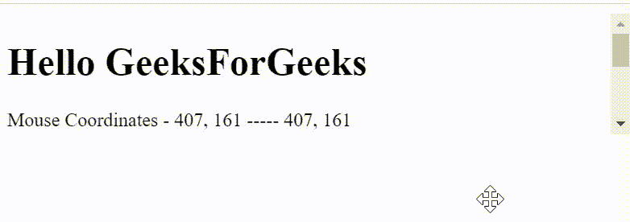

# 使用 jQuery 滚动时如何更新鼠标位置？

> 原文:[https://www . geeksforgeeks . org/如何通过 jquery 更新鼠标滚动时的位置/](https://www.geeksforgeeks.org/how-to-update-mouse-location-when-scrolling-with-jquery/)

**[jQuery](https://www.geeksforgeeks.org/jquery-tutorials/)** 为我们提供了一组广泛的**鼠标事件**，用于提供关于鼠标指针移动的信息。例如，当在选定元素上执行左键单击时，会发出 jQuery **[【鼠标向下】](https://www.geeksforgeeks.org/jquery-mousedown-with-examples/)** 事件。要确定鼠标指针在选定 HTML 元素上的坐标，我们可以简单地使用 jQuery**[mouse move](https://www.geeksforgeeks.org/jquery-mousemove-with-examples/)**事件。然而，要确定滚动的选定元素的鼠标指针坐标，我们首先需要了解滚动实际上是如何工作的。

窗口对象表示包含 **[DOM](https://www.geeksforgeeks.org/dom-document-object-model/)** 的窗口。**文档**对象指向加载在窗口对象中的 DOM。一个*元素*代表*文档*中的一个对象。
**[视口](https://www.geeksforgeeks.org/html-viewport-meta-tag-for-responsive-web-design/)** 是指网页的可见区域。

*视口*因我们查看网页的设备而异，例如移动设备、平板电脑或电脑。视口不是一个实际的 HTML 元素，但它被称为用户可见的 HTML 文档，并适合可用的空间。

在视口中，每个元素都与*滚动框*相关联。文档中每个有溢出内容的元素都有一个相关的滚动框。因此，每当用户滚动时，它会影响元素滚动框，而不是整个文档。甚至窗口也有一个相关的滚动框，它根据视口的不同而不同。因此，每当我们滚动整个文档时，它只是改变我们在视口中能够看到的任何内容，而对文档或窗口对象本身没有任何影响。

每当我们执行滚动时，鼠标指针在文档对象上的实际位置保持不变。因此，您可以简单地获取鼠标指针在元素滚动框内相对于其最后位置的相对变化。本教程将演示如何使用 jQuery 获取滚动鼠标的相对更新坐标。

*   **步骤 1:** 使用 [npm](https://www.geeksforgeeks.org/node-js-npm-node-package-manager/) 安装 [**浏览器同步**](https://www.browsersync.io/) 。我们将使用 Browsersync 启动一个服务器，并提供一个 URL 来查看 HTML 站点，并使用 CDN(内容交付网络)加载 **jQuery** ，如代码所示。我们将在全球安装**浏览器同步**。

    ```html
    npm install -g browser-sync
    ```

*   **Step 2:** Create an **index.html** file in your project root folder.
    **index.html:** Add the following code snippet in that file.

    ## 超文本标记语言

    ```html
    <!DOCTYPE html>
    <html lang="en">

    <head>
        <meta charset="UTF-8">
        <meta name="viewport" content=
            "width=device-width, initial-scale=1.0">
        <title>jQuery Mouse Events</title>
        <script src=
    "https://ajax.googleapis.com/ajax/libs/jquery/3.5.1/jquery.min.js">
        </script>
    </head>

    <body>
        <div id="scoller" style=
            "overflow-y: scroll; 
            height:100px;">

            <h1>Hello GeeksForGeeks</h1>

            <div>Mouse Coordinates - 
                <span id="coordinates"></span>
            </div>

            <br><br>

            <div>
                A Computer Science portal for 
                geeks. It contains well written,
                well thought and well explained 
                computer science and programming 
                articles, quizzes and ...
            </div>
            <div>
                A Computer Science portal for 
                geeks. It contains well written,
                well thought and well explained 
                computer science and programming 
                articles, quizzes and ...
            </div>
        </div>

        <script type="text/javascript">
            var xPos = 0;
            var yPos = 0;
            var lastScrolled = 0;
            $(document).ready(function (event) {

                // Coordinates of the Mouse      
                $(document).mousemove(
                    function (event) {

                    // console.log(event);
                    xPos = event.pageX;
                    yPos = event.pageY;
                    $("#coordinates").text(event.pageX 
                            + ", " + event.pageY 
                            + " ----- " + event.clientX 
                            + ", " + event.clientY);
                });

                // New Relative Position of Mouse
                // on Scroll Functionality 
                $('#scoller').scroll(function (event) {
                    if (lastScrolled != $('#scoller')
                            .scrollTop()) {
                        yPos -= lastScrolled;
                        lastScrolled = $('#scoller')
                                .scrollTop();
                        yPos += lastScrolled;
                        console.log("New X Pos = " + xPos
                            + " New Y Pos = " + yPos);
                    }
                });
            });
        </script>
    </body>

    </html>
    ```

    **解释:**CSS**[overflow](https://www.geeksforgeeks.org/css-overflow/)**属性用于控制一个太大而无法放入视口的 HTML 元素内容的行为。我们可以简单地使用 **`overflow: hidden`** 剪辑内容，或者添加滚动功能，使用 **`overflow: scroll`** 在视口中查看元素的内容，如代码所示。

    jQuery **[ready()](https://www.geeksforgeeks.org/jquery-ready-with-examples/)** 方法用于等待网页加载完成后再执行剩下的 javaScript 代码。

    每当鼠标在选定元素上移动时，jQuery**[mouse move()](https://www.geeksforgeeks.org/jquery-mousemove-with-examples/)**方法用于获取鼠标指针的 **X** 和 **Y** 坐标。我们可以使用全局**事件**对象获取坐标，如代码所示。

    当用户在选定的 HTML 元素滚动框中滚动时，会发出 jQuery 滚动事件。滚动事件适用于所有具有相关滚动框的元素，包括窗口对象的*文档*属性。 **[滚动()](https://www.geeksforgeeks.org/jquery-scroll-with-examples/)** 方法在选定的 HTML 元素上触发滚动事件，如代码所示。

    jQuery**[scroll top()](https://www.geeksforgeeks.org/jquery-scrolltop-with-examples/)**方法用于返回所选 HTML 元素滚动框的垂直滚动条位置。这个方法也可以用来设置垂直滚动条的位置。当滚动条在顶部，用户没有滚动时，位置为 **0** 。在代码中，此方法用于计算鼠标指针在垂直滚动上的相对位置，即当选定的 HTML 元素仅垂直滚动(Y 坐标)并且鼠标指针的水平位置(X 坐标)固定时。在这种情况下，所选的 HTML 元素有一个与之关联的水平滚动，那么您也可以使用 jQuery**[scrolleft()](https://www.geeksforgeeks.org/jquery-scrollleft-with-examples/)**方法来计算鼠标指针在水平滚动上的相对位置。为了更好地理解上述概念，请参考输出。

*   **Step 4:** To launch the application using Browsersync, run the following command in the project directory.

    ```html
    browser-sync start --server --files "*"
    ```

    这将在**服务器**模式下启动浏览器同步，并按照 ***** 通配符的指定，监视目录中所有文件的更改。默认情况下，该应用程序将在 **http://localhost:3000/** 启动。
    **输出:**
    