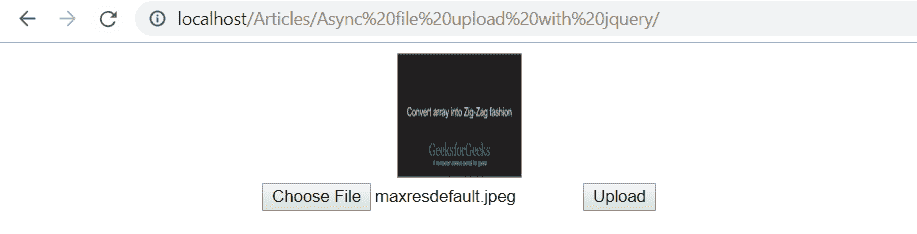

# 如何使用 jQuery 异步上传文件？

> 原文:[https://www . geesforgeks . org/如何使用-jquery/](https://www.geeksforgeeks.org/how-to-upload-files-asynchronously-using-jquery/) 异步上传文件

将文件从本地机器上传到服务器称为文件上传。它的工作原理与定义完全相同，当我们从浏览器中选择文件并单击提交按钮时，浏览器从本地机器中获取文件并将其提交给服务器，服务器会将文件保存到定义的路径中。这里使用 ajax 和 jQuery 异步上传文件。

**已用功能:**

*   **FormData():** 它创建一个新的 FormData 对象。
*   [**【FormData . append():**](https://www.geeksforgeeks.org/jquery-append-method/)它将新值追加到 FormData 对象内部的现有键上，或者如果该键尚不存在，则添加该键。
*   **move_uploaded_file():** 将上传的文件移动到新的位置。

**运行程序的步骤:**

*   在 xampp/htdocs 目录下创建**上传**的文件夹。
*   按照要求复制和编辑 html/jQuery 代码。
*   创建一个文件**upload.php**并复制下面给出的 php 代码。
*   启动 **Apache 服务器**，使用浏览器打开 html 文件。
*   选择任何文本或图像文件，然后单击上传按钮。
*   该文件将被上传到 xamp/htdocs 中的“上传”文件夹。
*   如果文件是图像，它也将被显示，如果不是图像文件，则“上传的文件没有图像”消息将被显示。

**示例:**

*   **上传. php**

    ```
    <?php

    /* Getting file name */
    $filename = $_FILES['file']['name'];

    /* Location */
    $location = "upload/".$filename;
    $uploadOk = 1;

    if($uploadOk == 0){
       echo 0;
    }else{
       /* Upload file */
       if(move_uploaded_file($_FILES['file']['tmp_name'], $location)){
          echo $location;
       }else{
          echo 0;
       }
    }
    ?>
    ```

*   **HTML 文件:**

    ```
    <!DOCTYPE html>
    <html>
    <head>
        <title>
            Async file upload with jQuery
        </title>

        <script src=
    "https://ajax.googleapis.com/ajax/libs/jquery/3.3.1/jquery.min.js">
        </script>
    </head>

    <body>
        <div align="center">
            <form method="post" action="" enctype="multipart/form-data"
                    id="myform">

                <div >
                    <input type="file" id="file" name="file" />
                    <input type="button" class="button" value="Upload"
                            id="but_upload">
                </div>
            </form>
        </div>    

        <script type="text/javascript">
            $(document).ready(function() {
                $("#but_upload").click(function() {
                    var fd = new FormData();
                    var files = $('#file')[0].files[0];
                    fd.append('file', files);

                    $.ajax({
                        url: 'upload.php',
                        type: 'post',
                        data: fd,
                        contentType: false,
                        processData: false,
                        success: function(response){
                            if(response != 0){
                               alert('file uploaded');
                            }
                            else{
                                alert('file not uploaded');
                            }
                        },
                    });
                });
            });
        </script>
    </body>

    </html>
    ```

**输出:**


jQuery 是一个开源的 JavaScript 库，它简化了 HTML/CSS 文档之间的交互，它以其“少写多做”的理念而闻名。
跟随本 [jQuery 教程](https://www.geeksforgeeks.org/jquery-tutorials/)和 [jQuery 示例](https://www.geeksforgeeks.org/jquery-examples/)可以从头开始学习 jQuery。