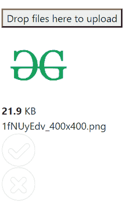

# 如何使用 jQuery Dropzone Plugin 上传文件？

> 原文:[https://www . geesforgeks . org/如何上传文件-使用-jquery-dropzone-plugin/](https://www.geeksforgeeks.org/how-to-upload-files-using-jquery-dropzone-plugin/)

jQuery 有许多类型的文件上传插件，用于上传各种类型的文件，并且可以在后端进一步处理。通常，PHP 被广泛用作带有 ajax 调用的后端语言。我们也有动态 jQuery 插件，我们可以在那里拖放文件。

一些文件上传插件是:

*   好的上传者
*   JQuery 文件上传
*   上传
*   Plupload
*   Formstone 上传
*   Dropzone(快捷区域)

还有很多。

**CDN 链接:**

**示例:**下面的示例是使用 Dropzone 插件和代码所需的 CDN 库实现的。

```html
<!DOCTYPE html>
<html>

<head>

    <!-- Required meta tags -->
    <meta charset="utf-8">
    <meta name="viewport" content=
        "width=device-width, 
        initial-scale=1, shrink-to-fit=no">

    <!-- Bootstrap CSS -->
    <link rel="stylesheet" href=
"https://stackpath.bootstrapcdn.com/bootstrap/4.3.1/css/bootstrap.min.css"
        integrity=
"sha384-ggOyR0iXCbMQv3Xipma34MD+dH/1fQ784/j6cY/iJTQUOhcWr7x9JvoRxT2MZw1T"
        crossorigin="anonymous">

    <!-- jQuery first, then Popper.js, 
        then Bootstrap JS -->
    <script src="https://code.jquery.com/jquery-3.3.1.slim.min.js"
        integrity=
"sha384-q8i/X+965DzO0rT7abK41JStQIAqVgRVzpbzo5smXKp4YfRvH+8abtTE1Pi6jizo"
        crossorigin="anonymous">
    </script>

    <script src=
"https://cdnjs.cloudflare.com/ajax/libs/dropzone/5.7.1/dropzone.min.js"
        integrity="sha256-fegGeSK7Ez4lvniVEiz1nKMx9pYtlLwPNRPf6uc8d+8="
        crossorigin="anonymous">
    </script>

    <script src=
"https://cdnjs.cloudflare.com/ajax/libs/popper.js/1.14.7/umd/popper.min.js"
        integrity=
"sha384-UO2eT0CpHqdSJQ6hJty5KVphtPhzWj9WO1clHTMGa3JDZwrnQq4sF86dIHNDz0W1"
        crossorigin="anonymous">
    </script>

    <script src=
"https://stackpath.bootstrapcdn.com/bootstrap/4.3.1/js/bootstrap.min.js"
        integrity=
"sha384-JjSmVgyd0p3pXB1rRibZUAYoIIy6OrQ6VrjIEaFf/nJGzIxFDsf4x0xIM+B07jRM"
        crossorigin="anonymous">
    </script>

    <style>
        body {
            padding: 2%;
        }
    </style>
</head>

<body>
    <form action="/file-upload" class="dropzone">
        <div class="fallback">
            <input name="file" type="file" multiple />
        </div>
    </form>
</body>

</html> 
```

**输出:**


**结论:**在上面的例子中，我们可以一次拖动多个文档。我们可以只通过 JavaScript 代码来执行相同的操作，我们还可以对文件的大小和类型进行限制。