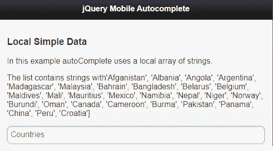
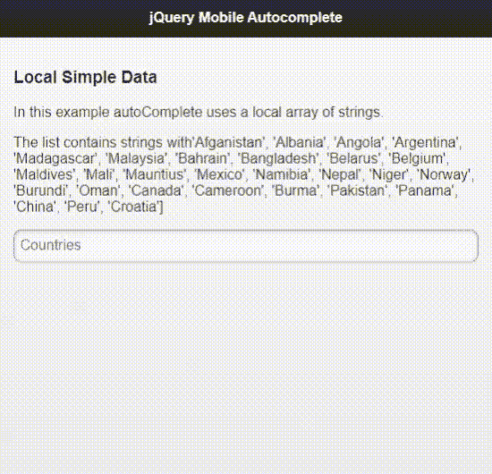

# 如何使用 jQuery 手机自动完成插件？

> 原文:[https://www . geeksforgeeks . org/如何使用-a-jquery-mobile-autocomplete-plugin/](https://www.geeksforgeeks.org/how-to-use-a-jquery-mobile-autocomplete-plugin/)

在本文中，我们将了解**自动完成** jQuery Mobile 插件，该插件帮助移动或网络开发人员在他们的项目中添加自动完成搜索框。

请从以下链接下载所需的预编译文件，并将其保存在您的工作文件夹中以供实施。在包含源代码时，请注意正确的文件路径。

> https://github.com/commadelimited/autoComplete.js

**示例 1:** 以下示例演示了使用上述插件对国家列表进行自动完成搜索的功能。

## 超文本标记语言

```html
<!DOCTYPE html>
<html>
<head>

    <meta content="initial-scale=1, maximum-scale=1,
        user-scalable=0" name="viewport" />
    <meta name="viewport" content="width=device-width" />
    <meta name="apple-mobile-web-app-capable" content="yes" />
        <!--jQuery Mobile library for stylesheet -->
    <link rel="stylesheet" 
         href="http://code.jquery.com/mobile/1.2.0/
         jquery.mobile-1.2.0.min.css" />
    <link rel="stylesheet" href="styles.css" />

    <script 
          src="http://code.jquery.com/jquery-1.8.2.min.js">
        </script>
        <!--jQuery Mobile library-->
    <script 
          src="http://code.jquery.com/mobile/1.2.0/
          jquery.mobile-1.2.0.min.js">
        </script>
         <!--jQuery Mobile Autocomplete plugin-->
    <script src="jqm.autoComplete-1.5.2.js">
         </script>
    <script src="code.js"></script>
</head>

<body>
    <div data-role="page" id="mainPage">

        <div data-role="header">
          <h1>jQuery Mobile Autocomplete</h1>            
        </div>

        <div data-role="content">
            <h3>Local Simple Data</h3>

<p>
            In this example autoComplete uses a local array of strings.</p>

<p>
            The list contains strings with'Afganistan', 'Albania', 'Angola',
                'Argentina',
                     'Madagascar', 'Malaysia',
               'Bahrain', 'Bangladesh', 'Belarus',    'Belgium',    
               'Maldives', 'Mali', 'Mauritius', 'Mexico',
                 'Namibia', 'Nepal', 'Niger', 'Norway', 'Burundi', 'Oman',
               'Canada', 'Cameroon', 'Burma', 'Pakistan', 'Panama', 'China', 
               'Peru', 'Croatia']                
            </p>

<p>
            <input type="text" id="searchField" placeholder="Countries">
            <ul id="suggestions" data-role="listview" data-inset="true">
            </ul>
            </p>

        </div>
    </div>

    <script>

        $("#mainPage").bind("pageshow", function(e) {

            var dataList = ['Afganistan', 'Albania', 'Angola', 
                           'Argentina',
                     'Madagascar', 'Malaysia',
                            'Bahrain', 'Bangladesh', 'Belarus',    'Belgium',    
               'Maldives', 'Mali', 'Mauritius', 'Mexico',
                 'Namibia', 'Nepal', 'Niger', 'Norway', 'Burundi',
                           'Oman',
               'Canada', 'Cameroon', 'Burma', 'Pakistan', 'Panama',
                           'China', 
               'Peru', 'Croatia'];

            $("#searchField").autocomplete({
                target: $('#suggestions'),
                source: dataList,
                link: 'resultArray.html?term=',
                minLength: 1,
                matchFromStart: false
            });
        });
    </script>

</body>
</html>
```

**“resultArray.html”文件:**下面演示了上述代码中使用的“resultarray . html”文件的代码，它是上述 HTML 代码的 javascript 部分中使用的链接文件。

## 超文本标记语言

```html
<!DOCTYPE html>
<html>
<body>
   <h2>Result page </h2>
    <div data-role="page" id="mainPage">        
        <div data-role="content">

<p>
            I'm the result page for Country 
                       autocomplete search.
            </p>

        </div>
    </div>
</body>
</html>
```

**输出:**

*   **搜索前:**



*   **搜索后:**



**示例 2:** 以下示例演示了对由国家/地区名称组成的列表以“值”和“标签”的形式自动完成对象搜索。

## 超文本标记语言

```html
<!DOCTYPE html>
<html>
<head>    
    <meta content="initial-scale=1, maximum-scale=1,
    user-scalable=0" name="viewport" />
    <meta name="viewport" content="width=device-width" />
    <meta name="apple-mobile-web-app-capable" content="yes" />

    <link rel="stylesheet" 
     href="http://code.jquery.com/mobile/1.2.0/
         jquery.mobile-1.2.0.min.css" />
    <link rel="stylesheet" href="styles.css" />

    <script src="http://code.jquery.com/jquery-1.8.2.min.js">
        </script>
    <script src="http://code.jquery.com/mobile/1.2.0/
        jquery.mobile-1.2.0.min.js">
     </script>
    <script src="jqm.autoComplete-1.5.2-min.js">
        </script>
    <script src="code.js"></script>
</head>

<body>
    <div data-role="page" id="mainPage">

        <div data-role="header">
          <h1>jQuery Mobile Autocomplete</h1>            
        </div>

        <div data-role="content">
           <h3>Callback Function</h3>

<p>
          The autoComplete uses a local array of objects. 
          The function selects the new "data-autocomplete" 
          property on each anchor tag in the selected list.
        </p>

<p>
        <input type="text" id="searchFieldID" 
                 placeholder="Countries">
        <ul id="suggestions" data-role="listview" 
                 data-inset="true"></ul>
        </p>

        </div>
    </div>

    <script>
        $("#mainPage").bind("pageshow", function(e) {

            var autocompleteData = $.parseJSON(
'[{"value":"AL","label":"Alabama"},{"value":"AK","label":"Alaska"},
{"value":"AS","label":"American Samoa"},{"value":"AZ","label":"Arizona"},
{"value":"AR","label":"Arkansas"},{"value":"CA","label":"California"},
{"value":"CO","label":"Colorado"},{"value":"CT","label":"Connecticut"},
{"value":"DE","label":"Delaware"},{"value":"DC","label":"District of Columbia"},
{"value":"FL","label":"Florida"},{"value":"GA","label":"Georgia"},
{"value":"GU","label":"Guam"},{"value":"HI","label":"Hawaii"},
{"value":"ID","label":"Idaho"},{"value":"IL","label":"Illinois"},
{"value":"IN","label":"Indiana"},{"value":"IA","label":"Iowa"},
{"value":"KS","label":"Kansas"},{"value":"KY","label":"Kentucky"},
{"value":"LA","label":"Louisiana"},{"value":"ME","label":"Maine"},
{"value":"MD","label":"Maryland"},{"value":"MA","label":"Massachusetts"},
{"value":"MI","label":"Michigan"},{"value":"MN","label":"Minnesota"},
{"value":"MS","label":"Mississippi"},{"value":"MO","label":"Missouri"},
{"value":"MT","label":"Montana"},{"value":"NE","label":"Nebraska"},
{"value":"NV","label":"Nevada"},{"value":"NH","label":"New Hampshire"},
{"value":"NJ","label":"New Jersey"},{"value":"NM","label":"New Mexico"},
{"value":"NY","label":"New York"},{"value":"NC","label":"North Carolina"},
{"value":"ND","label":"North Dakota"},
{"value":"NI","label":"Northern Marianas Islands"},
{"value":"OH","label":"Ohio"},{"value":"OK","label":"Oklahoma"},
{"value":"OR","label":"Oregon"},{"value":"PA","label":"Pennsylvania"},
{"value":"PR","label":"Puerto Rico"},{"value":"RI","label":"Rhode Island"},
{"value":"SC","label":"South Carolina"},{"value":"SD","label":"South Dakota"},
{"value":"TN","label":"Tennessee"},{"value":"TX","label":"Texas"},
{"value":"UT","label":"Utah"},{"value":"VT","label":"Vermont"},
{"value":"VI","label":"Virgin Islands"},{"value":"VA","label":"Virginia"},
{"value":"WA","label":"Washington"},{"value":"WV","label":"West Virginia"},
{"value":"WI","label":"Wisconsin"},{"value":"WY","label":"Wyoming"}]');

            $("#searchFieldID").autocomplete({
                target: $('#suggestions'),
                source: autocompleteData,
                callback: function(e) {
                    var $a = $(e.currentTarget);
                    $('#searchFieldID').
                                        val( $a.data('autocomplete').value );
                    $("#searchFieldID").autocomplete('clear');
                },
                link: 'resultArray.html?term=',
                minLength: 1
            });
        });
    </script>

</body>
</html>
```

**注意:**JavaScript 部分使用的“resultArray.html”文件的代码与第一个示例中使用的代码相同。

**输出:**

