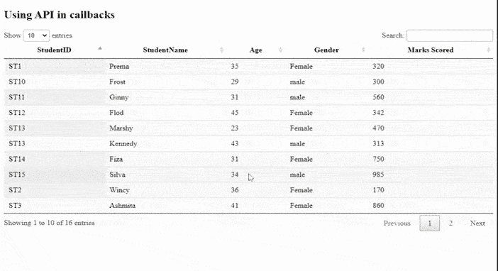
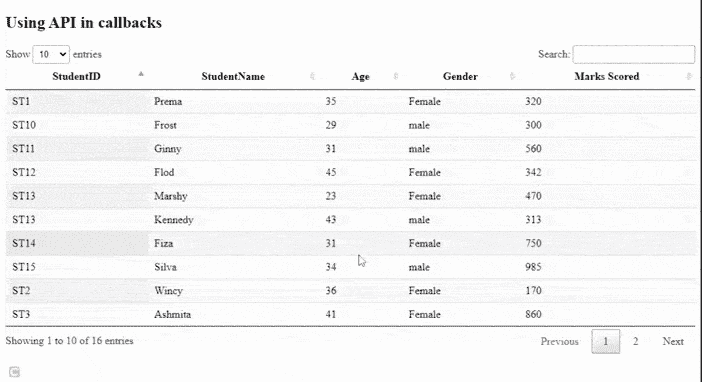

# 如何使用 jQuery DataTables 插件在回调中使用 API？

> 原文:[https://www . geeksforgeeks . org/如何使用-API-内部-回调-使用-jquery-datatables-plugin/](https://www.geeksforgeeks.org/how-to-use-api-inside-callbacks-using-jquery-datatables-plugin/)

数据表是一个现代的 jQuery 插件，用于为网页的 HTML 表添加交互式和高级控件。DataTables 是一个简单易用的 jQuery 插件，有许多选项可供开发人员进行自定义更改。其他常见功能是分页、搜索、排序和多列排序。

在本文中，我们将学习在回调中使用 API。显示了一个非常简单的示例，开发人员可以根据应用程序的需要添加功能。

需要实现的预编译文件有:

*   CSS cdn 链接:

    ```html
    https://cdn.datatables.net/1.10.22/css/jquery.dataTables.min.css
    ```

*   **JavaScript CDN 链接:**

    ```html
    //cdn.datatables.net/1.10.22/js/jquery.dataTables.min.js
    ```

**方法:**以上所有文件都包含在内，以便进一步实现，用于处理数据表。一个简单的*学生*表被用于他们的详细信息，如*学生证，姓名，年龄，性别，*和*得分*。该表是使用代码的 JavaScript 部分中的 jQuery DataTable 插件初始化的。单击事件时，它获取单元格节点并绘制结果。该插件的 [<u>$()</u>](https://datatables.net/reference/api/%24()) <u>。API</u> 方法用于获取表体中的所有单元格节点，然后对其进行相关操作。使用单元格内的值对表中的进行过滤。

**示例:** 以下示例显示了点击事件回调内部 API 的使用。*init complete*(初始化完成回调)有助于了解学生表何时被初始化、完全加载和绘制。了解如何配置连接到表的组件非常有用。

## 超文本标记语言

```html
<!DOCTYPE html>
<html>
  <head>
    <!--Datatable plugin CSS file -->
    <link
      rel="stylesheet"
      href=
"https://cdn.datatables.net/1.10.22/css/jquery.dataTables.min.css"/>
    <!--jQuery library file -->
    <script
      type="text/javascript"
      src="https://code.jquery.com/jquery-3.5.1.js">
    </script>
    <!--Datatable plugin JS library file -->
    <script
      type="text/javascript"
      src=
"https://cdn.datatables.net/1.10.22/js/jquery.dataTables.min.js">
    </script>
  </head>

  <body>
    <h2>Using API in callbacks</h2>
    <!--HTML tables with student data-->
    <table id="tableID" class="display" 
           style="width: 100%">
      <thead>
        <tr>
          <th>StudentID</th>
          <th>StudentName</th>
          <th>Age</th>
          <th>Gender</th>
          <th>Marks Scored</th>
        </tr>
      </thead>
      <tbody>
        <tr>
          <td>ST1</td>
          <td>Prema</td>
          <td>35</td>
          <td>Female</td>
          <td>320</td>
        </tr>
        <tr>
          <td>ST2</td>
          <td>Wincy</td>
          <td>36</td>
          <td>Female</td>
          <td>170</td>
        </tr>
        <tr>
          <td>ST3</td>
          <td>Ashmita</td>

          <td>41</td>
          <td>Female</td>
          <td>860</td>
        </tr>
        <tr>
          <td>ST4</td>
          <td>Kelina</td>
          <td>32</td>
          <td>Female</td>
          <td>433</td>
        </tr>
        <tr>
          <td>ST5</td>
          <td>Satvik</td>
          <td>41</td>
          <td>male</td>
          <td>162</td>
        </tr>
        <tr>
          <td>ST6</td>
          <td>William</td>
          <td>37</td>
          <td>Female</td>
          <td>372</td>
        </tr>
        <tr>
          <td>ST7</td>
          <td>Chandan</td>
          <td>31</td>
          <td>male</td>
          <td>375</td>
        </tr>
        <tr>
          <td>ST8</td>
          <td>David</td>
          <td>45</td>
          <td>male</td>
          <td>327</td>
        </tr>
        <tr>
          <td>ST9</td>
          <td>Harry</td>
          <td>29</td>
          <td>male</td>
          <td>205</td>
        </tr>
        <tr>
          <td>ST10</td>
          <td>Frost</td>
          <td>29</td>
          <td>male</td>
          <td>300</td>
        </tr>
        <tr>
          <td>ST11</td>
          <td>Ginny</td>
          <td>31</td>
          <td>male</td>
          <td>560</td>
        </tr>
        <tr>
          <td>ST12</td>
          <td>Flod</td>
          <td>45</td>
          <td>Female</td>
          <td>342</td>
        </tr>
        <tr>
          <td>ST13</td>
          <td>Marshy</td>
          <td>23</td>
          <td>Female</td>
          <td>470</td>
        </tr>
        <tr>
          <td>ST13</td>
          <td>Kennedy</td>
          <td>43</td>
          <td>male</td>
          <td>313</td>
        </tr>
        <tr>
          <td>ST14</td>
          <td>Fiza</td>
          <td>31</td>
          <td>Female</td>
          <td>750</td>
        </tr>
        <tr>
          <td>ST15</td>
          <td>Silva</td>
          <td>34</td>
          <td>male</td>
          <td>985</td>
        </tr>
      </tbody>
    </table>

    <script>
      <!--Initialization of datatables -->

      $(document).ready(function () {
        $("#tableID").DataTable({
          initComplete: function () {

            // Getting API instance
            var api = this.api();

            // On click event, get cell nodes
            api.$("td").click(function () {
              api.search(this.innerHTML).draw();
            });
          },
        });
      });
    </script>
  </body>
</html>
```

**输出:**

*   **API 回调前:**



回调前

*   **API 回调后:**

