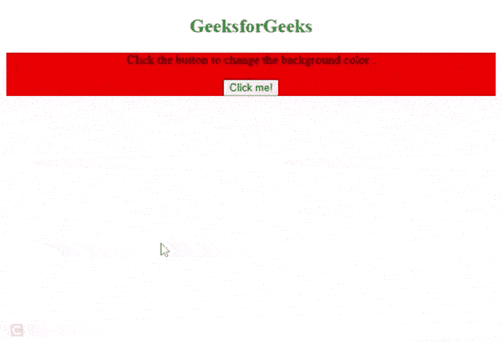

# 如何在 jQuery 模板中使用条件运算符？

> 原文:[https://www . geeksforgeeks . org/如何使用-条件运算符-in-jquery-a-template/](https://www.geeksforgeeks.org/how-to-use-conditional-operator-in-jquery-a-template/)

在本文中，我们将学习在jQuery **中使用三元或条件运算符。**

三元或条件运算符接受三个操作数，一个条件后跟问号，两个表达式后跟分号(:)执行。

**语法:**

> 条件？表达式 1:表达式 2

**示例:**现在让我们尝试一个示例，以了解在 jQuery 模板中如何使用条件运算符。

## 超文本标记语言

```
<!DOCTYPE HTML>
<html>
<head>
    <script src="https://code.jquery.com/jquery-3.5.0.js"></script>
</head>

<body style="text-align:center;">
   <h2 style="color:green">GeeksforGeeks</h2>
   <div style="background-color:red">

<p>Click the button to change the background color .</p>

       <button>Click me!</button>
   </div>

  <script>
    function toggleColor(){
      tag = $('div');
      // Ternary Operator (add/remove background color)
      // If tag color is green convert it to red otherwise convert to green.
     tag.css('background') == 'green' ? tag.css({'background':'red'}) : tag.css({'background':'green'});
   }

    $('button').on('click', function(){
      toggleColor();
    });
    </script>
</body>
</html>
```

**输出:**



三元算子