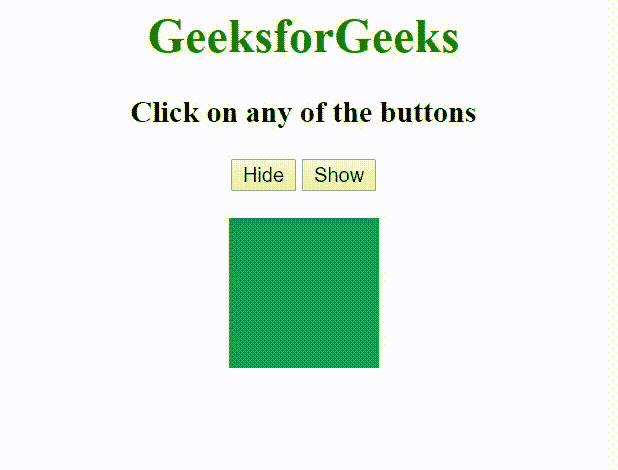

# 如何在 jQuery 中使用 Explode 效果？

> 原文:[https://www . geeksforgeeks . org/使用方法-jquery 中的爆炸效果/](https://www.geeksforgeeks.org/how-to-use-explode-effect-in-jquery/)

“分解”效果可以与“显示/隐藏/切换”元素一起使用。这会将元素爆炸或内爆成许多碎片。

**语法:**

```
selector.hide | show | toggle( "explode", {arguments}, speed );
```

**参数:**

*   **件数:**保存件数。默认件数为 9 件。
*   **Mode:** The mode of the animation.

    要爆炸的碎片数应该是一个完美的正方形，任何其他值都四舍五入到最接近的正方形。

**示例:**使用带爆炸效果的按钮隐藏和显示 Div。

```
<!DOCTYPE HTML>
<html>

<head>
    <title>Explode Example</title>

    <script type = "text/javascript" src=
"https://ajax.googleapis.com/ajax/libs/jquery/2.1.3/jquery.min.js">
    </script>

    <script type = "text/javascript" src=
"https://ajax.googleapis.com/ajax/libs/jqueryui/1.11.3/jquery-ui.min.js">
    </script>

    <script type = "text/javascript" language = "javascript">

        $(document).ready(function() {

            $("#hide").click(function(){
                $(".target").hide( "explode", {pieces: 9 }, 2000 );
            });

            $("#show").click(function(){
                $(".target").show( "explode", {pieces: 9}, 2000 );
            });
        });
    </script>
</head>

<body style = "text-align:center;">

    <h1 style = "color:green;" > 
            GeeksforGeeks 
    </h1>

    <p style = "font-size: 20px; font-weight: bold;">
        Click on any of the buttons
    </p>

    <button id = "hide"> Hide </button>
    <button id = "show"> Show</button> 

    <br><br>

    <div class = "target" style="width:100px;height:100px;
            background:#0f9d58;margin:0 auto;">
    </div>
</body>

</html>
```

**输出:**
