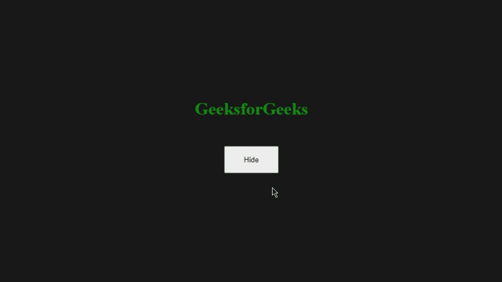
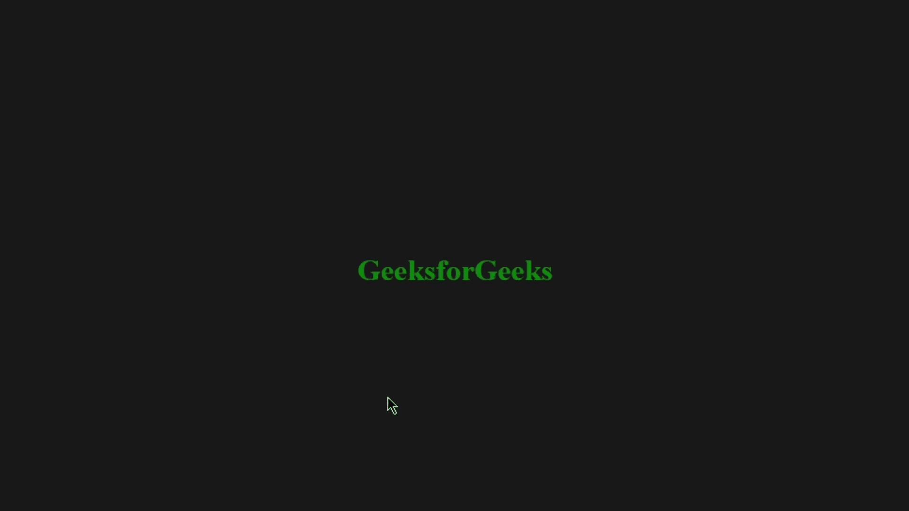
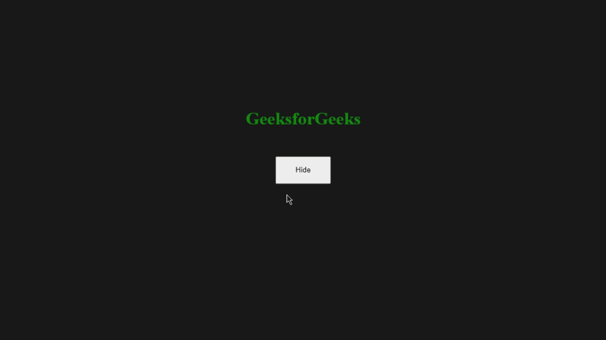
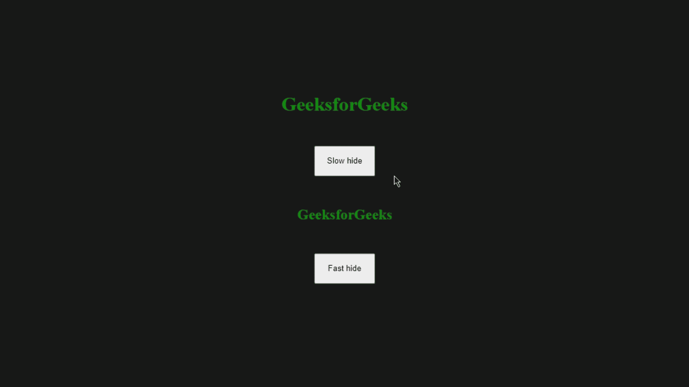
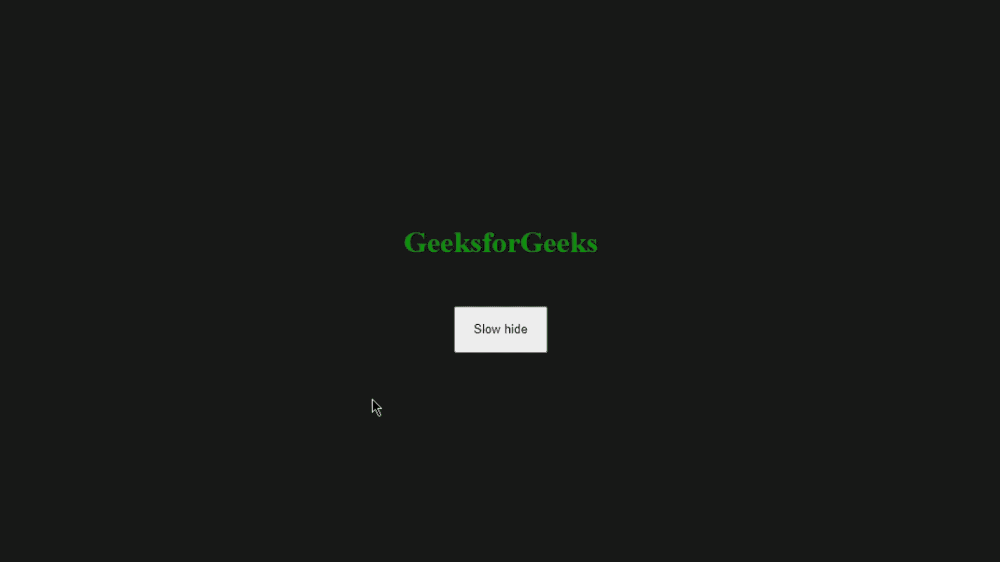

# jQuery 中如何使用 hide()方法？

> 原文:[https://www . geeksforgeeks . org/如何使用隐藏方法-in-jquery/](https://www.geeksforgeeks.org/how-to-use-hide-method-in-jquery/)

jQuery 中的 [**hide()**](https://www.geeksforgeeks.org/jquery-hide-with-examples/) 方法用于隐藏选中的网页元素。在本文中，我们将详细讨论**隐藏()**方法。此方法通常用于 jQuery 中的效果或动画。它还允许我们制作隐藏任何特定元素的行为(过渡)的动画。

**语法:**

```html
.hide( duration, easing, complete )
```

**参数:**此方法有以下参数:

*   **持续时间:**它将决定任何动画运行多长时间。它可以是字符串或数字。可能的值是“快”、“慢”或以毫秒为单位的时间。默认值为 400(毫秒)。
*   **缓和:**它将确定哪个缓和函数正被用于元素的过渡。可能的值是“摆动”和“线性”。默认值为“摆动”。
*   **完成:**动画完成时调用该功能。每次选定的 web 元素都会调用此函数。

**注意:**如果我们不使用任何参数，元素将只是隐藏，没有任何特殊的过渡或效果。我们不必每次都使用每个参数，为了方便起见，我们可以使用其中的任何一个。

现在我们来谈谈如何用这种方法让事情变得简单。我们可以用它来隐藏一个[按钮上选中的元素点击](https://www.geeksforgeeks.org/jquery-click-with-examples/)、【悬停】上的[，点击元素本身，我们还可以设置一个定时器，这样延迟后选中的元素就会被隐藏。](https://www.geeksforgeeks.org/jquery-hover-with-examples/)

让我们看一些 **hide()** 方法的例子，以便更好地理解其工作原理。

**CDN 链接:**以下 jQuery 库文件用于其工作的所有代码中，这些代码包含在每个 HTML 代码的<标题>部分中。

> https://code.jquery.com/jquery-3.6.0.min.js

**示例 1:** 在本例中，我们将 **hide()** 方法设置为一个按钮，这样当按钮被点击时，所选元素将被隐藏。元素可以是*图像、div、h1、*等。

## 超文本标记语言

```html
<!DOCTYPE html>
<html lang="en">
  <head>
    <!-- jQuery CDN link. -->
    <script src=
"https://code.jquery.com/jquery-3.6.0.min.js"
            integrity=
"sha256-/xUj+3OJU5yExlq6GSYGSHk7tPXikynS7ogEvDej/m4="
            crossorigin="anonymous">
    </script>

    <style>
      * {
        margin: 0px;
        padding: 0px;
        box-sizing: border-box;
      }
      .container {
        display: flex;
        justify-content: center;
        align-items: center;
        flex-direction: column;
        background-color: rgb(24, 24, 24);
        height: 100vh;
      }
      button {
        margin: 50px;
        height: 50px;
        width: 100px;
      }
      h1 {
        color: green;
      }
    </style>
  </head>

  <body>
    <div class="container">
      <h1><b>GeeksforGeeks</b></h1>

      <button id="btn">Hide</button>
    </div>

    <!-- Using hide() method to hide <h1/> element. -->
    <script>
      $(document).ready(function () {
        $("#btn").click(function () {
          $("h1").hide();
        });
      });
    </script>
  </body>
</html>
```

**输出:**



**示例 2:** 在下面的示例中，如果我们将鼠标悬停在所选元素上，它将隐藏。使用此代码片段并替换示例 1 的<主体>标签中的代码，以获得此结果。

## 超文本标记语言

```html
<!DOCTYPE html>
<html lang="en">
<head>
    <!-- jQuery CDN link. -->
    <script src=
"https://code.jquery.com/jquery-3.6.0.min.js"
            integrity=
"sha256-/xUj+3OJU5yExlq6GSYGSHk7tPXikynS7ogEvDej/m4="
            crossorigin="anonymous">
    </script>
    <style>
      * {
        margin: 0px;
        padding: 0px;
        box-sizing: border-box;
      }
      .container {
        display: flex;
        justify-content: center;
        align-items: center;
        flex-direction: column;
        background-color: rgb(24, 24, 24);
        height: 100vh;
      }
      button {
        margin: 50px;
        height: 50px;
        width: 100px;
      }
      h1 {
        color: green;
      }
     </style>
</head> 
<body>
    <div class="container">
      <h1><b>GeeksforGeeks</b></h1>
    </div>

    <!-- Using hide() method to hide <h1/> element. -->
    <script>
      $(document).ready(function () {
        $("h1").hover(function () {
          $("h1").hide();
        });
      });
    </script>
</body>
</html>
```

**输出:**



**示例 3:** 对于这个示例，我们将设置一个 2 秒的计时器，经过该时间后，每当我们单击隐藏按钮时，所选元素都会被隐藏。使用此代码片段并替换示例 1 的<主体>标签中的代码，以获得此结果。

## 超文本标记语言

```html
<!DOCTYPE html>
<html lang="en">
<head>
    <!-- jQuery CDN link. -->
    <script src=
"https://code.jquery.com/jquery-3.6.0.min.js"
            integrity=
"sha256-/xUj+3OJU5yExlq6GSYGSHk7tPXikynS7ogEvDej/m4="
            crossorigin="anonymous">
    </script>
    <style>
      * {
        margin: 0px;
        padding: 0px;
        box-sizing: border-box;
      }
      .container {
        display: flex;
        justify-content: center;
        align-items: center;
        flex-direction: column;
        background-color: rgb(24, 24, 24);
        height: 100vh;
      }
      button {
        margin: 50px;
        height: 50px;
        width: 100px;
      }
      h1 {
        color: green;
      }
     </style>
</head>
<body>
    <div class="container">
      <h1><b>GeeksforGeeks</b></h1>
      <button id="btn">Hide</button>
    </div>

    <!-- Using hide() method to hide <h1/> element. -->
    <script>
      $(document).ready(function () {
        $("#btn").click(function () {
          $("h1").delay(2000).hide("fast");
        });
      });
    </script>
</body>
</html>
```

**输出:**



**示例 4:** 在本例中，我们将使用*持续时间*参数并应用*慢速*和*快速*隐藏所选元素的过渡。我们有两个文本元素和两个按钮，一个将慢慢隐藏文本，第二个将立即隐藏文本。在示例 1 中使用这个代码片段。

## 超文本标记语言

```html
<!DOCTYPE html>
<html lang="en">
<head>
    <!-- jQuery CDN link. -->
    <script src=
"https://code.jquery.com/jquery-3.6.0.min.js"
            integrity=
"sha256-/xUj+3OJU5yExlq6GSYGSHk7tPXikynS7ogEvDej/m4="
            crossorigin="anonymous">
    </script>
    <style>
      * {
        margin: 0px;
        padding: 0px;
        box-sizing: border-box;
      }
      .container {
        display: flex;
        justify-content: center;
        align-items: center;
        flex-direction: column;
        background-color: rgb(24, 24, 24);
        height: 100vh;
      }
      button {
        margin: 50px;
        height: 50px;
        width: 100px;
      }
      h1 {
        color: green;
      }
     </style>
</head>
<body>
    <div class="container">
      <h1><b>GeeksforGeeks</b></h1>
      <button id="btn">Slow hide</button>
      <h2><b>GeeksforGeeks</b></h2>
      <button id="btn1">Fast hide</button>
    </div>

    <!-- Using hide() method to hide <h1/> element. -->
    <script>
      $(document).ready(function () {
        $("#btn").click(function () {
          $("h1").hide("slow");
        });
        $("#btn1").click(function () {
          $("h2").hide("fast");
        });
      }
      );
    </script>
</body>
</html>
```

**输出:**



**示例 5:** 对于这个示例，我们将看到如何使用回调函数，以便在隐藏效果完成时调用该函数。我们会在隐藏效果完成后设置一个提醒信息。在示例 1 中使用这个代码片段。

## 超文本标记语言

```html
<!DOCTYPE html>
<html lang="en">
<head>
    <!-- jQuery CDN link. -->
    <script src=
"https://code.jquery.com/jquery-3.6.0.min.js"
            integrity=
"sha256-/xUj+3OJU5yExlq6GSYGSHk7tPXikynS7ogEvDej/m4="
            crossorigin="anonymous">
    </script>
    <style>
      * {
        margin: 0px;
        padding: 0px;
        box-sizing: border-box;
      }
      .container {
        display: flex;
        justify-content: center;
        align-items: center;
        flex-direction: column;
        background-color: rgb(24, 24, 24);
        height: 100vh;
      }
      button {
        margin: 50px;
        height: 50px;
        width: 100px;
      }
      h1 {
        color: green;
      }
     </style>
</head>
<body>
    <div class="container">
      <h1><b>GeeksforGeeks</b></h1>
      <button id="btn">Slow hide</button>
    </div>

    <!-- Using hide() method to hide <h1/> element. -->
    <script>
      $(document).ready(function () {
        $("#btn").click(function () {
          $("h1").hide("slow",function(){
              alert('The text is hidden!')
          });
        });
      }
      );
    </script>
</body>
</html>
```

**输出:**

