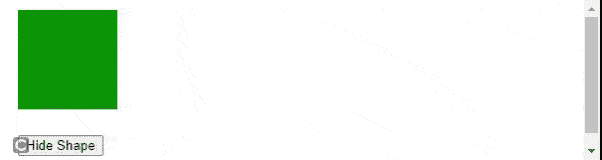

# 如何使用 jQuery 在按钮点击上使用 hide()方法？

> 原文:[https://www . geesforgeks . org/how-用法-隐藏-方法-点击-使用-jquery/](https://www.geeksforgeeks.org/how-to-use-hide-method-on-button-click-using-jquery/)

jQuery 有很多方便的方法来轻松完成工作。在本文中，我们将讨论其中的一种方法，即 [hide()](https://www.geeksforgeeks.org/jquery-hide-with-examples/) 方法。我们可以在网页上使用这种方法来实现各种目的，并获得高效的结果。

第一步是创建一个 HTML 文件，并通过 CDN 链接 jQuery 库文件。

**jQuery CDN 链接:**

[**jQuery hide()方法:**](https://www.geeksforgeeks.org/jquery-hide-with-examples/) 该方法用于隐藏网页元素。

**示例 1:** 创建一个 HTML 文件，并向其中添加以下代码。

## 超文本标记语言

```html
<!DOCTYPE html>
<html lang="en">
  <head>
    <!-- jQuery CDN link. -->
    <script
      src="https://code.jquery.com/jquery-3.6.0.min.js"
      integrity="sha256-/xUj+3OJU5yExlq6GSYGSHk7tPXikynS7ogEvDej/m4="
      crossorigin="anonymous">
    </script>
  </head>

  <body>
    <button id="btn">Hide</button>

    <p><b>GeeksforGeeks</b></p>

    <!-- Using hide() method to hide <p/> element. -->
    <script>
      $(document).ready(function () {
        $("#btn").click(function () {
          $("p").hide();
        });
      });
    </script>
  </body>
</html>
```

**输出:**


隐藏 p 元素

**示例 2:** 我们可以使用 **hide()** 方法隐藏图像。

## 超文本标记语言

```html
<!DOCTYPE html>
<html lang="en">
  <head>
    <!-- jQuery CDN link. -->
    <script
      src="https://code.jquery.com/jquery-3.6.0.min.js"
      integrity="sha256-/xUj+3OJU5yExlq6GSYGSHk7tPXikynS7ogEvDej/m4="
      crossorigin="anonymous">
    </script>
  </head>

  <body>
    
    <button id="btn" 
            style="padding-left: 10px; 
            margin-left: 30px">
       Hide
    </button>
    <!-- Using hide() method to hide an image.-->
    <script>
      $(document).ready(function () {
        $("#btn").click(function () {
          $("#image").hide();
        });
      });
    </script>
  </body>
</html>
```

**输出:**


隐藏图像

**示例 3:****隐藏()**方法也可以用于隐藏任何几何形状。

## 超文本标记语言

```html
<!DOCTYPE html>
<html lang="en">
  <head>
    <!-- jQuery CDN link. -->
    <script
      src="https://code.jquery.com/jquery-3.6.0.min.js"
      integrity="sha256-/xUj+3OJU5yExlq6GSYGSHk7tPXikynS7ogEvDej/m4="
      crossorigin="anonymous">
    </script>
  </head>

  <body>
    <div id="shape" 
         style="height:100px; width:100px; 
                background-color:green; 
                border-radius:00%;margin:10px;">
    </div>

    <button id="btn" style="margin:10px;">Hide Shape</button>  

    <!-- Using hide() method to hide a shape. -->
    <script>
      $(document).ready(function () {
        $("#btn").click(function () {
          $("#shape").hide();
        });
      });
    </script>
  </body>
</html>
```

**输出:**



隐藏形状