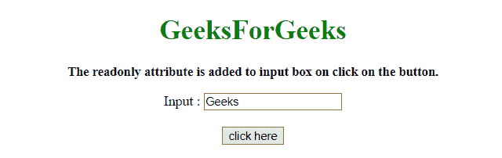
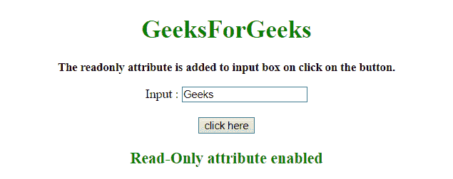

# 如何在 jQuery 中使用输入只读属性？

> 原文:[https://www . geeksforgeeks . org/如何使用-input-readonly-attribute-in-jquery/](https://www.geeksforgeeks.org/how-to-use-input-readonly-attribute-in-jquery/)

使用 jQuery 方法将**只读属性**添加到表单输入字段中。

*   **[jQuery attr() Method](https://www.geeksforgeeks.org/jquery-attr-method/):** This method set/return attributes and values of the selected elements. If this method is used to return the attribute value, it returns the value of the first selected element.If this method is used to set attribute values, it sets one or more than one attribute/value pairs for the set of selected elements.

    **语法:**

    *   **返回属性值:**

    ```
    $(selector).attr(attribute)

    ```

*   **设置属性和值:**

    ```
    $(selector).attr(attribute, value)

    ```

*   **使用函数设置属性和值:**

    ```
    $(selector).attr(attribute, function(index, currentvalue))

    ```

*   **设置多个属性和值:**

    ```
    $(selector).attr({attribute:value, attribute:value, ...})

    ```

**参数:**

*   **属性:**此参数指定属性的名称。
*   **值:**该参数指定属性的值。
*   **函数(索引，currentvalue):** 此参数指定一个返回要设置的属性值的函数。
    *   **索引:**该参数接收集合中元素的索引位置。
    *   **当前值:**此参数接收所选元素的当前属性值。

*   **[jQuery prop()方法](https://www.geeksforgeeks.org/jquery-prop-with-examples/) :** 该方法设置/返回匹配元素的属性和值。如果此方法用于设置或返回属性值，它将返回第一个选定元素的值。如果此方法用于设置属性值，它将为所选元素集设置一个或多个属性/值对。

    **语法:**

    *   **返回属性的值:**

    ```
    $(selector).prop(property)

    ```

    *   **设置属性和值:**

    ```
    $(selector).prop(property, value)

    ```

    *   **使用函数设置属性和值:**

    ```
    $(selector).prop(property, function(index, currentvalue))

    ```

    *   **Set multiple properties and values:**

    ```
    $(selector).prop({property:value, property:value, ...})

    ```

    **参数:**

    *   **属性:**此参数指定属性的名称。
    *   **值:**此参数指定属性的值。
    *   **函数(索引，currentvalue):** 此参数指定一个返回要设置的属性值的函数。
        *   **索引:**该参数接收集合中元素的索引位置。
        *   **当前值:**此参数接收选定元素的当前属性值。

    **示例 1:** 在本示例中，表单输入文本字段的**只读属性**通过使用 **attr()方法**启用。

    ```
    <!DOCTYPE HTML> 
    <html> 
        <head> 
            <title> 
                Add a readonly attribute to an input field
            </title>

            <script src = 
    "https://ajax.googleapis.com/ajax/libs/jquery/3.4.0/jquery.min.js">
            </script>
        </head> 

        <body style = "text-align:center;"> 

            <h1 style = "color:green;" > 
                GeeksForGeeks 
            </h1>

            <p style = "font-size: 15px; font-weight: bold;">
                The readonly attribute is added to input box
                on click on the button.
            </p>

            <form>
                Input : <input type="text" name="input_field" />
            </form>
            <br>

            <button onclick = "GFG_Run()">
                click here
            </button>

            <p id = "GFG_down" style = 
                "color: green; font-size: 20px; font-weight: bold;">
            </p>

            <script>
                function GFG_Run() {

                    $('input').attr('readonly', true);
                    document.getElementById("GFG_down").innerHTML 
                            = "Read-Only attribute enabled";
                }
            </script> 
        </body> 
    </html>                    
    ```

    **输出:**

    *   **之前点击按钮:**
        
    *   **点击按钮后:**
        

    **示例 2:** 在本例中，表单输入文本字段的**只读属性**是通过使用 **prop()方法**启用的。

    ```
    <!DOCTYPE HTML> 
    <html> 
        <head> 
            <title> 
                Add a readonly attribute to an input tag
            </title>

            <script src = 
    "https://ajax.googleapis.com/ajax/libs/jquery/3.4.0/jquery.min.js">
            </script>
        </head> 

        <body style = "text-align:center;">

            <h1 style = "color:green;" > 
                GeeksForGeeks 
            </h1>

            <p style = "font-size: 15px; font-weight: bold;">
                The readonly attribute is added to input box
                on click on the button.
            </p>

            <form>
                Input : <input type="text" name="input_field" />
            </form>
            <br>

            <button onclick = "GFG_Run()">
                click here
            </button>

            <p id = "GFG_down" style = 
                "color: green; font-size: 20px; font-weight: bold;">
            </p>

            <script>
                function GFG_Run() {
                    $('input').prop('readonly', true);
                    document.getElementById("GFG_down").innerHTML
                            = "Read-Only attribute enabled";
                }
            </script> 
        </body> 
    </html>                    
    ```

    **输出:**

    *   **之前点击按钮:**
        
    *   **点击按钮后:**
        

    jQuery 是一个开源的 JavaScript 库，它简化了 HTML/CSS 文档之间的交互，它以其“少写多做”的理念而闻名。
    跟随本 [jQuery 教程](https://www.geeksforgeeks.org/jquery-tutorials/)和 [jQuery 示例](https://www.geeksforgeeks.org/jquery-examples/)可以从头开始学习 jQuery。