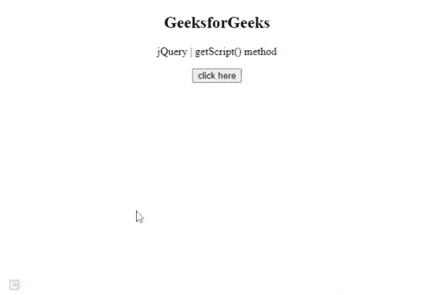

# 如何使用 jQuery getScript？

> 原文:[https://www.geeksforgeeks.org/how-to-use-jquery-getscript/](https://www.geeksforgeeks.org/how-to-use-jquery-getscript/)

jQuery [。 **getScript()**](https://www.geeksforgeeks.org/jquery-getscript-method/) 方法使用 [GET HTTP](https://www.geeksforgeeks.org/http-get-post-methods-php/) 方法从服务器加载一个 JavaScript 文件，然后执行它。

**语法:**

```
$.getScript(url,[callback])
```

让我们看一个例子来理解这个方法是如何工作的。

**示例:**在本例中，我们将使用一个 URL 从服务器加载 JavaScript 文件*‘color . js’*。该文件的功能用于向我们的网页添加动画。

## 超文本标记语言

```
<!DOCTYPE html>
<html>
  <head>
    <script src=
"https://code.jquery.com/jquery-3.5.0.js">
  </script>
  </head>

  <body style="text-align: center">
    <h2 id="heading">GeeksforGeeks</h2>

    <p>jQuery | getScript() method</p>

    <button id="button">click here</button>

    <script>
       /* The getScript method is called 
          by passing url to load color.js 
          and calling a function to add 
          color animations on our page */

      $.getScript(
"https://code.jquery.com/color/jquery.color.js", 
        function () {
        // Selecting button and adding event to it.
        $("#button").click(function () {
          $("#heading")
          .animate({ backgroundColor: "rgb(0, 255, 0)" }, 
          500);
        });
      });
    </script>
  </body>
</html>
```

**输出:**

