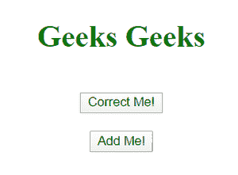
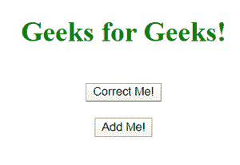
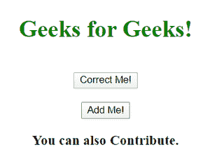

# 如何使用 jQuery 搜索替换 HTML 元素？

> 原文:[https://www . geeksforgeeks . org/如何使用-jquery-to-search-replace-html-elements/](https://www.geeksforgeeks.org/how-to-use-jquery-to-search-and-replace-html-elements/)

在本文中，我们将讨论如何使用 jQuery 来搜索和替换 HTML 元素。就像在香草 JavaScript(纯 JavaScript)中一样，jQuery 也提供了选择 HTML 标签的选择器，这样我们就可以操作 HTML 标签的内容和属性。使用 [jQuery 选择器](https://www.geeksforgeeks.org/jquery-selectors-and-event-methods/)我们可以通过标签名、Id 名、类名以及标签的位置来选择元素。

在下面的示例中，我们使用了两种 jQuery 方法:一种是向现有的 HTML 标记添加内容，另一种是在正文中添加新的 HTML 标记。

**1。text( )** :方法选择标签，text 函数的参数将文本追加到预先存在的标签中。该参数是 HTML 安全的，这意味着无论作为参数传递的 HTML 代码如何，内容都将被精确地复制到标记中。

**2。html( )** :方法选择标签，html 函数的参数将内容添加到所选标签中。它是 HTML 特定的意思，它将检查参数是否是 HTML 内容，并相应地添加它。

## 超文本标记语言

```html
<!DOCTYPE html>
<html>
<head>
    <title>jQuery!!!</title>
    <script type="text/javascript" src=
    "https://code.jquery.com/jquery-3.5.1.min.js">
     </script>
    <style type="text/css">
        h1 {
            color: green;
        }
        body {
            text-align: center;
        }
    </style>
</head>
<body>
    <h1>Geeks Geeks</h1>
    <br>
    <button class="one">Correct Me!</button>
    <br>
    <br>
    <button class="two">Add Me!</button>
    <br>
    <span></span>
    <script type="text/javascript">
        $(".one").click(function()
        {
            $("h1").text("Geeks for Geeks!");
        });

        $(".two").click(function()
        {
            $("span").html("<h3>You can also Contribute.</h3>");
        });
    </script>
</body>
</html>
```

**输出:运行上述 HTML 文件后的页面**



点击“纠正我！”按钮



点击“添加我！”纽扣



<video class="wp-video-shortcode" id="video-422221-1" width="640" height="360" preload="metadata" controls=""><source type="video/mp4" src="https://media.geeksforgeeks.org/wp-content/uploads/20200527210844/Screen-Recording-25-05-2020-8163.mp4?_=1">[https://media.geeksforgeeks.org/wp-content/uploads/20200527210844/Screen-Recording-25-05-2020-8163.mp4](https://media.geeksforgeeks.org/wp-content/uploads/20200527210844/Screen-Recording-25-05-2020-8163.mp4)</video>

其他重要的 jQuery 函数:

**3。css( )** :方法用于选择和操作元素的 css 属性。

**4。attr( )** :方法返回并更改 HTML 标记的属性。

**5。val( )** :该方法返回所有具有 value 属性的标签的值。它还可以通过向其传递参数来设置值。

如果想给一个标签添加多个 CSS 属性，那么更合适的方法是给一个类赋予属性，然后在标签中移除、添加或切换类。这个属性使得 jQuery 非常容易使用和处理。

jQuery 提供了 addClass()、removeClass()和 toggleClass()来添加、移除类并将其切换到 HTML 中的标记。