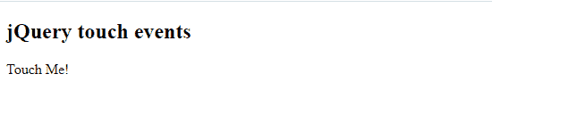

# 如何使用手机 jQuery 触摸事件插件？

> 原文:[https://www . geesforgeks . org/如何使用-jquery-touch-events-plugin-for-mobiles/](https://www.geeksforgeeks.org/how-to-use-jquery-touch-events-plugin-for-mobiles/)

在本文中，我们将学习如何使用完全基于 JavaScript 的 jQuery 触摸事件插件来处理移动用户界面设计中的各种触摸事件。这些是可以与 jQuery 一起使用的附加事件，jQuery 也与桌面应用程序以及移动网络应用程序兼容。

请从[链接](https://github.com/benmajor/jQuery-Touch-Events)下载所需的预编译文件，并保存在您的工作文件夹中以供执行。

或者

在你的网页的头部使用下面的链接

**示例 1:** 以下代码演示了用户使用 **jQuery 触摸事件**插件进行的简单点击事件。

```html
<!DOCTYPE html>
<html>

<head>
    <script type="text/javascript" src=
"http://code.jquery.com/jquery-1.11.1.min.js">
    </script>

    <script src="jquery.mobile-events.min.js">
    </script>
</head>

<body>
    <h2>jQuery touch events</h2>
    <p id="myeventID">Touch Me!</p>
    <p id="response" style="display:none">
        User tapped #myeventID
    </p>

    <script type="text/javascript">

        /*S imple tap event */
        $('#myeventID').tap(function (e) {
            $('#response').show();
        })
    </script>
</body>

</html>
```

**输出:**

*   **Before touch event:**
    
*   **触摸事件后:**在“触摸我！”被点击一次，将显示以下输出。
    T3】

**示例 2:** 下面的代码演示了用户使用如下所示的双链功能进行的单次点击和两次点击事件。

```html
<!DOCTYPE html>
<html>

<head>
    <script type="text/javascript" src=
"http://code.jquery.com/jquery-1.11.1.min.js">
    </script>

    <script src="jquery.mobile-events.min.js">
    </script>
</head>

<body>
    <h2>jQuery touch events</h2>
    <p id="myeventID">Touch Me!</p>
    <p id="response" style="display:none">
        User tapped #myeventID</p>
    <p id="doubletapMsg" style="display:none">
        User double tapped #myeventID!</p>

    <script type="text/javascript">

        /* Double chaining of functions */
        $('#myeventID').tap(function (e) {
            console.log('User tapped #myeventID');
            $('#response').show();
        }).doubletap(function () {
            $('#doubletapMsg').show();
        })
    </script>
</body>

</html>
```

**输出:**在“碰我！”被轻敲两次，将显示以下输出。
T3】

**示例 3:** 以下代码演示了当用户点击 HTML 控件时的点击开始和点击结束触摸事件。

```html
<!DOCTYPE html>
<html>

<head>
    <script type="text/javascript" src=
"http://code.jquery.com/jquery-1.11.1.min.js">
    </script>

    <script src="jquery.mobile-events.min.js">
    </script>
</head>

<body>
    <h2>jQuery tap start and end events</h2>

    <p id="myeventID">Touch Me!</p>

    <script type="text/javascript">
        $("#myeventID").tapstart(function (e, touch) {
            console.log('tap started!');
        });

        $("#myeventID").tapend(function (e, touch) {
            console.log('tap end!');
        });  
    </script>
</body>

</html>
```

**输出:**当用户点击“触摸我！”div，将显示以下输出。
T3】

**示例 4:** 以下代码演示了用户在 HTML 控件上滑动时的滑动事件和滑动结束事件。

```html
<!DOCTYPE html>
<html>

<head>
    <script type="text/javascript" src=
"http://code.jquery.com/jquery-1.11.1.min.js">
    </script>

    <script src="jquery.mobile-events.min.js">
    </script>
</head>

<body>
    <h2>jQuery swipe events</h2>
    <p id="myeventID">Touch Me!</p>

    <script type="text/javascript">

        $("#myeventID").swipeend(function (e, touch) {
            console.log('Swipe event end!');
        });

        $("#myeventID").swipe(function (e, touch) {
            console.log('Swiped by user!');
        });
    </script>
</body>

</html>
```

**输出:**当用户在“触摸我！”div，将显示以下输出。
T3】

插件中有更多的触摸事件处理函数以及数据阈值和实用函数。开发人员可以根据应用程序的需要来使用它们。