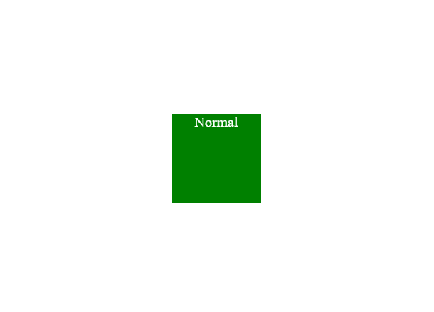
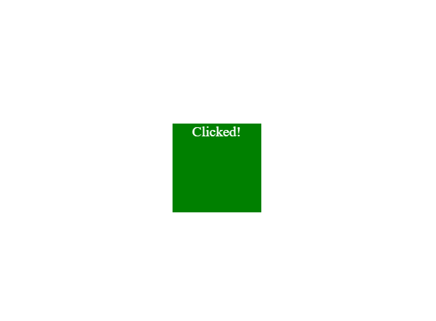
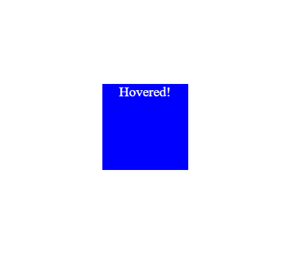

# 如何使用。断断续续。在 jQuery 中悬停？

> 原文:[https://www . geesforgeks . org/如何在 jquery 中使用和悬停/](https://www.geeksforgeeks.org/how-to-use-on-and-hover-in-jquery/)

**[jQuery。on()方法:](https://www.geeksforgeeks.org/jquery-on-with-examples/)** 此方法用于**将事件监听器**附加到元素。这个方法相当于普通 JavaScript 中的 addEventListener。

**语法:**

```html
$(element).on(event, childSelector, data, function)

```

**参数**

*   **事件:**指定要附加的事件(点击、提交等。).
*   **子选择器:**是可选参数，它指定给定事件处理程序可以使用的特定子。
*   **数据:**指定随函数传递的可选数据。
*   **功能:**指定触发附加事件时要运行的功能。

**示例:**

```html
<!DOCTYPE html>
<html>

<head>
    <!-- Adding jQuery Library -->
    <script src=
"https://cdnjs.cloudflare.com/ajax/libs/jquery/3.5.0/jquery.min.js">
    </script>

    <style>
        /* Adding basic styling */
        div {
            background-color: green;
            width: 100px;
            height: 100px;
            color: #fff;
            text-align: center;
        }
    </style>
</head>

<body>
    <div>Normal</div>
    <script>
        $('div').on('click', function () {

            // Changing the content
            $(this).html('Clicked!');
        });
    </script>
</body>

</html>
```

**输出:**

*   **点击 div 元素前:**
    
*   **点击 div 元素后:**
    

**jQuery。悬停()方法:**该方法用于在**鼠标悬停在**和**鼠标退出**条件下指定元素的样式。它以两个函数作为参数:

*   **鼠标过度功能:**鼠标进入元素时触发。
*   **鼠标退出功能:**鼠标离开元素时触发。

您可以在这些函数中指定多种样式。

**语法:**

```html
$(element).hover(mouseoverFunction, mouseoutFunction)
```

**示例:**

```html
<!DOCTYPE html>
<html>

<head>
    <!-- Adding jQuery Library -->
    <script src=
"https://cdnjs.cloudflare.com/ajax/libs/jquery/3.5.0/jquery.min.js">
    </script>

    <style>
        /* Adding basic styling */
        div {
            background-color: green;
            width: 100px;
            height: 100px;
            color: #fff;
            text-align: center;
        }
    </style>
</head>

<body>
    <div>Normal</div>

    <script>
        $('div').hover(function () { // mouse-in 
            $(this).css("background-color", "blue");
            $(this).html('Hovered!');
        },
            function () { // mouse-out
                $(this).css("background-color", "green");
                $(this).html('Normal');
            }
        )
    </script>
</body>

</html>
```

**输出:**

*   **鼠标移过前:**
    
*   **鼠标移过后:**
    