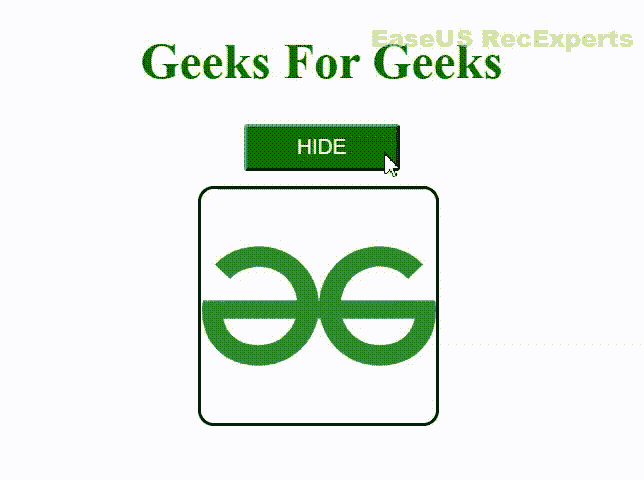

# jQuery 中如何使用 toggle()方法？

> 原文:[https://www . geesforgeks . org/how-to-use-toggle-method-in-jquery/](https://www.geeksforgeeks.org/how-to-use-toggle-method-in-jquery/)

toggle()方法用于在 CSS 属性之间振荡，同时用于对元素产生动画效果。各种 jQuery 效果是隐藏()、淡入淡出()和滑动()。基本上，toggle()方法在 CSS 属性显示之间振荡:如果没有，则返回到原始状态。

对于 hide()，fade()和 slide()具有切换功能，如 hideToggle()、fadeToggle()和 slideToggle()。

**语法:**

```
$(selector).toggle(time, callback_function)
```

**示例:**

## 超文本标记语言

```
<!DOCTYPE html>
<html lang="en">

<head>
    <meta charset="UTF-8">
    <meta http-equiv="X-UA-Compatible" content="IE=edge">
    <meta name="viewport" content=
        "width=device-width, initial-scale=1.0">

    <!-- Including jQuery  -->
    <script src=
    "https://code.jquery.com/jquery-3.6.0.min.js"
        letegrity=
"sha256-/xUj+3OJU5yExlq6GSYGSHk7tPXikynS7ogEvDej/m4=" 
        crossorigin="anonymous">
    </script>

    <style>
        h1 {
            color: #006600;
        }

        button {
            color: white;
            background-color: #006600;
            width: 100px;
            height: 30px;
        }

        body {
            text-align: center;
        }

        div {
            border: 2px solid black;
            border-radius: 10px;
            margin: 10px;
            height: 150px;
            width: 150px;
            position: relative;
            text-align: center;
            display: flex;
            left: 215px;
        }
    </style>
</head>

<body>
    <h1>Geeks For Geeks</h1>

    <button id="btn"> HIDE </button>

    <div id="GFG_IMAGE">

        <!-- Image added using img tag 
            with src attribute -->
        
        
    </div>

    <script>
        $('#btn').click(function () {
            $('#btn').text($('#btn')
                .text() === 'SHOW' ? 'HIDE' : 'SHOW');
            $('div').toggle(2000)
        });
    </script>
</body>

</html>
```

**输出:**

