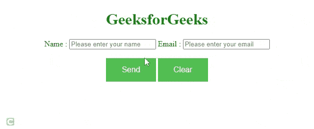

# 如何在 jQuery 中验证邮件 Id？

> 原文:[https://www . geesforgeks . org/如何验证-email-id-in-jquery/](https://www.geeksforgeeks.org/how-to-validate-email-id-in-jquery/)

任务是实现如何在 jQuery 中验证电子邮件。 [jQuery](https://www.geeksforgeeks.org/jquery-tutorials/) 是最快且轻量级的 JavaScript 库，用于简化 [HTML/CSS](https://www.geeksforgeeks.org/web-technology/html-css/) 文档(更准确地说是[文档对象模型(DOM)](https://www.geeksforgeeks.org/dom-document-object-model/) )和 [JavaScript](https://www.geeksforgeeks.org/javascript-tutorial/) 之间的交互。

jQuery 以其“少写多做”的座右铭而闻名它只是意味着你只需要写几行代码就可以实现你的目标。

**方法:**您可以使用正则表达式模式使用 jQuery 验证电子邮件。[正则表达式](https://www.geeksforgeeks.org/write-regular-expressions/)用于搜索操作，它们是表示待匹配模式的特殊字符串。

**示例:**

## 超文本标记语言

```html
<!DOCTYPE html>
<html>

<head>
    <script src=
"https://ajax.googleapis.com/ajax/libs/jquery/3.2.1/jquery.min.js">
    </script>

    <style>
        body {
            text-align: center;
        }

        .contactform-buttons {
            background-color: #4CAF50;
            /* Green */
            border: none;
            color: white;
            padding: 15px 32px;
            text-align: center;
            text-decoration: none;
            display: inline-block;
            font-size: 16px;
        }
    </style>

    <script>
        $(document).ready(function () {
            $('.error').hide();
            $('#submit').click(function () {
                var name = $('#name').val();
                var email = $('#email').val();

                if (name == '') {
                    $('#name').next().show();
                    return false;
                }
                if (email == '') {
                    $('#email').next().show();
                    return false;
                }
                if (IsEmail(email) == false) {
                    $('#invalid_email').show();
                    return false;
                }
                $.post("", $("#myform").serialize(), 
                function (response) {
                    $('#myform').fadeOut('slow', function () {
                        $('#correct').html(response);
                        $('#correct').fadeIn('slow');
                    });
                });
                return false;
            });
        });
        function IsEmail(email) {
            var regex =
/^([a-zA-Z0-9_\.\-\+])+\@(([a-zA-Z0-9\-])+\.)+([a-zA-Z0-9]{2,4})+$/;
            if (!regex.test(email)) {
                return false;
            }
            else {
                return true;
            }
        }
    </script>
</head>

<body>
    <center>
        <h1 style="color:green">GeeksforGeeks</h1>

        <form action="" method="post" id="contactform">

            <label for="name">Name:</label>
            <input name="name" id="name" type="text" 
                placeholder="Please enter your name" 
                class="contact-input">
            <span class="error">
                Enter your name here
            </span>

            <label for="email">Email :</label>
            <input name="email" id="email" type="text" 
                placeholder="Please enter your email" 
                class="contact-input">
            <span class="error">
                Enter your email-id here
            </span>
            <span class="error" id="invalid_email">
                Email-id is invalid
            </span>

            <br /><br />
            <input type="submit" 
                class="contactform-buttons" 
                id="submit" value="Send" />

            <input type="reset" 
                class="contactform-buttons" 
                id="" value="Clear" />
        </form>

        <div id="correct" 
            style="color:gray;">
        </div>
    </center>
</body>

</html>
```

**输出:**

