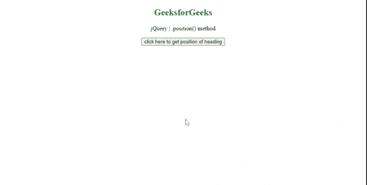

# 如何在 jQuery 中验证位置？

> 原文:[https://www . geeksforgeeks . org/如何验证 jquery 中的位置/](https://www.geeksforgeeks.org/how-to-validate-position-in-jquery/)

在本文中，我们将找到如何使用 jQuery [*位置()*](https://www.geeksforgeeks.org/jquery-position-with-examples/) 方法**来验证位置。***。jQuery 中的 position()* 方法返回第一个匹配元素相对于其父元素的位置。

**语法:**

```
$(selector).position()
```

**返回值:**

*   返回一个包含属性*顶部*和*左侧的对象。*

**举例:**我们举个例子来了解一下*。* **位置()**方法的 jQuery。

## 超文本标记语言

```
<!DOCTYPE HTML>
<html>
<head>
    <script src=
"https://code.jquery.com/jquery-3.5.0.js">
    </script>
</head>
<body style="text-align:center;">
    <h2 id="heading" style="color:green;">
        GeeksforGeeks
    </h2>

<p>
        jQuery | .position() method
    </p>

    <button id="button">
        click here to get position of heading
    </button>

    <script>
    // Selecting h2 tag and using .position() method
    // to find its position relative to offset parent.
     $(document).ready(function(){
      $("button").click(function(){
        var x = $("h2").position();
        $( "p" ).last().text ("Top position is : " +
               x.top + " Left position is : " + x.left);
      });
    });
    </script>
</body> 
</html>
```

**输出:**



jQuery 位置方法