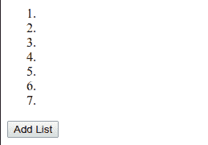
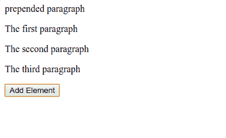
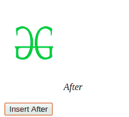
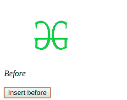

# jQuery |通过示例添加元素

> 原文:[https://www . geesforgeks . org/jquery-add-elements-with-examples/](https://www.geeksforgeeks.org/jquery-add-elements-with-examples/)

jQuery 中的**添加元素**用于追加文档中的内容。下面列出了用于添加内容的方法:

*   **append():** 在选定元素的末尾插入内容。
*   **prepend():** 在选定元素的开头插入内容。
*   ()后的**:**在选定元素后插入内容。
*   **before():** 在选定元素之前插入内容。

**使用 append()方法:**jQuery 中的 append()方法用于在所选元素的末尾添加新元素。

**语法:**

```
$(selector).append("element_to_be_inserted")
```

**参数:**该方法接受需要插入的单参数元素。

**返回值:**不返回任何东西。

**示例:**本示例使用 append()方法添加新元素。

```
<html>
    <head>
        <title>Append Elements</title>
    <head>

    <body>
        <ol>
            <li></li>
            <li></li>
            <li></li>
        </ol>

        <button type="button" id="add_li" name="Add">
            Add List
        </button>

        <script src=
"https://ajax.googleapis.com/ajax/libs/jquery/3.3.1/jquery.min.js">
        </script>

        <!-- Script to use append method to add list -->
        <script type="text/javascript">
            $(document).ready( function() {
                $("#add_li").click( function() {
                    $("ol").append("<li></li>")
                })
            })
        </script>
    </body>
</html>
```

**输出:**


**使用 prepend()方法:**jQuery 中的 prepend()方法用于在所选元素的开头添加新元素。

**语法:**

```
$(selector).prepend("element_to_be_inserted")
```

**参数:**该方法接受单个参数作为参数插入到 DOM 中。

**返回值:**不返回值。

**示例:**本示例使用 prepend()方法添加新段落。

```
<!DOCTYPE html>
<html>

<head>
    <title>
        prepend() method
    </title>

    <script src=
"https://ajax.googleapis.com/ajax/libs/jquery/3.3.1/jquery.min.js">
    </script>
<head>

<body>

    <div id="container">
        <p id="p-first">The first paragraph</p>
        <p id="p-second">The second paragraph</p>
        <p id="p-third">The third paragraph</p>
    </div>

    <button type="button" id="add_p" name="Add Elements">
        Add Element
    </button>

    <!-- Script to use prepend() method to add elements-->
    <script type="text/javascript">
        $(document).ready( function() {
            $("#add_p").click( function() {
                $("#container").prepend("<p>prepended paragraph</p>")
            })
        })
    </script>

    Prepend
    </body>
</html>
```

**输出:**


**使用 after 方法:**jQuery 中的 after()方法用于在所选元素后插入内容。

**语法:**

```
$(selector).after("element_to_be_inserted")
```

**参数:**该方法接受一个参数，该参数用于作为参数插入到 DOM 中。

**返回值:**不返回任何东西。

**示例:**本示例使用 after()方法在 geeksforgeeks 图像后添加一个单词。

```
<!DOCTYPE html>
<html>

<head>
    <title>
        Add Elements using after() method
    </title>

    <script src=
"https://ajax.googleapis.com/ajax/libs/jquery/3.3.1/jquery.min.js">
    </script>
<head>

<body>
    <br><br>

    <button id="btn1">Insert After</button>

    <!-- Script to use after() method to append content -->
    <script type="text/javascript">
        $(document).ready( function() {
            $("#btn1").click(function() {
                $("img").after("<i>After</i>");
            });
        })
    </script>
</body>

</html>
```

**输出:**


**使用 before 方法:**jQuery 中的 before()方法用于在所选元素前插入内容。

**语法:**

```
$(selector).before("element_to_be_inserted")
```

**参数:**该方法接受一个参数，该参数用于作为参数插入到 DOM 中。

**返回值:**不返回任何东西。

**示例:**本示例使用 before 方法在 geeksforgeeks 图像前添加元素。

```
<!DOCTYPE html>
<html>

<head>
    <title>
        Add Element using before() method
    </title>

    <script src=
"https://ajax.googleapis.com/ajax/libs/jquery/3.3.1/jquery.min.js">
    </script>
<head>

<body>
      <br><br>

    <button id="btn1">Insert before</button>

    <!-- Script to use before() method to add element -->
    <script type="text/javascript">
        $(document).ready( function() {
            $("#btn1").click(function() {
                $("img").before("<i>Before</i>");
            });
        })
    </script>
</body>

</html>
```

**输出:**
