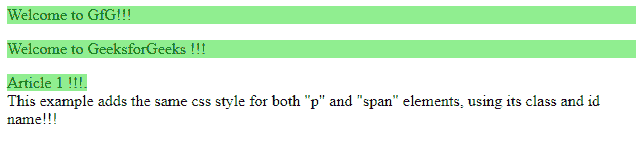

# jQuery | add()方法示例

> 原文:[https://www . geesforgeks . org/jquery-add-method-with-example/](https://www.geeksforgeeks.org/jquery-add-method-with-example/)

使用 **jQuery add()** 方法将元素添加到现有的元素组中。此方法可以将元素添加到整个文档中，或者如果定义了上下文参数，则只添加到上下文元素中。
**语法:**

```
$(selector).add(element, context_parameter)

```

这里选择器帮助找到匹配的元素。
**参数:**它接受下面指定的两个参数:

*   **元素:**是选中的元素。*   **context_parameter:** It is the context parameter of the element defined.

    **jQuery 代码展示 add()方法的工作原理:**

    ```
    <html>

    <head>
        <script src="https://ajax.googleapis.com/ajax/libs
                     /jquery/3.3.1/jquery.min.js"></script>
        <script>
            $(document).ready(function() {
                $(".heading").add("#para1").add("#span1").
                css("background-color", "lightgreen");
            });
        </script>
    </head>

    <body>
        <p style="color:green" class="heading">Welcome to GfG!!!</p>
        <p style="color:green" id="para1">Welcome to GeeksforGeeks !!!</p>
        <span style="color:green" id="span1">Article 1 !!!.</span>
        <div>This example adds the same css style for both
            "p" and "span" elements, using its class and
             id name!!! </div>
    </body>

    </html>
    ```

    **输出:**
    