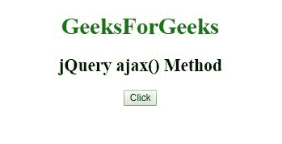
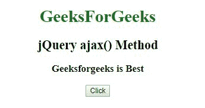
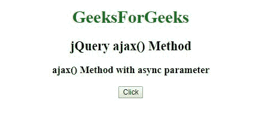

# jQuery | ajax()方法

> 原文:[https://www.geeksforgeeks.org/jquery-ajax-method/](https://www.geeksforgeeks.org/jquery-ajax-method/)

jQuery 中的 **ajax()方法**用于执行一个 ajax 请求或异步 HTTP 请求。

**语法:**

```
$.ajax({name:value, name:value, ... })
```

**参数:**可能值列表如下:

*   **类型:**用于指定请求的类型。
*   **url:** 用于指定发送请求的 url。
*   **用户名:**用于指定在 HTTP 访问认证请求中使用的用户名。
*   **xhr:** 用于创建 XMLHttpRequest 对象。
*   **异步:**默认值为真。它指示请求是否应该异步处理。
*   **beforeSend(xhr):** 这是一个在发送请求之前要运行的函数。
*   **数据类型:**服务器响应的预期数据类型。
*   **错误(xhr，状态，错误):**用于请求失败时运行。
*   **全局:**默认值为真。它用于指定是否为请求触发全局 AJAX 事件句柄。
*   **ifModified:** 默认值为 false。它用于指定只有在响应自上次请求后发生更改时，请求才成功。
*   **jsonp:** 在 jsonp 请求中覆盖回调函数的字符串。
*   **jsoncallback:**用于在 jsonp 请求中指定回调函数的名称。
*   **缓存:**默认值为真。它指示浏览器是否应该缓存请求的页面。
*   **完成(xhr，状态):**这是一个在请求完成时运行的功能。
*   **contentType:** 默认值为:“application/x-www-form-URL encoded”，数据发送到服务器时使用。
*   **上下文:**用于为所有 AJAX 相关的回调函数指定“this”值。
*   **数据:**用于指定发送给服务器的数据。
*   **数据过滤器(数据，类型):**用于处理 XMLHttpRequest 的原始响应数据。
*   **密码:**用于指定在 HTTP 访问认证请求中使用的密码。
*   **processData:** 默认值为真。它用于指定随请求发送的数据是否应转换为查询字符串。
*   **scriptCharset:** 用于指定请求的字符集。
*   **成功(结果、状态、xhr):** 请求成功时运行。
*   **超时:**是请求的本地超时。它以毫秒为单位。
*   **传统:**用于指定是否使用参数序列化的传统风格。

**示例 1:** 本示例使用 ajax()方法，使用 ajax 请求添加文本内容。

```
<!DOCTYPE html>
<html>

<head> 
    <title>
        jQuery ajax() Method
    </title>

    <script src=
"https://ajax.googleapis.com/ajax/libs/jquery/3.3.1/jquery.min.js">
    </script>

    <script>
        $(document).ready(function() {
            $("li:parent").css("background-color", "green");
        });
    </script>
</head> 

<body style="text-align:center;">

    <h1 style="color:green">
        GeeksForGeeks
    </h1>

    <h2>
        jQuery ajax() Method
    </h2>

    <h3 id="h11"></h3>

    <button>Click</button>

    <!-- Script to use ajax() method to
        add text content -->
    <script>
        $(document).ready(function() {
            $("button").click(function() {
                $.ajax({url: "geeks.txt", 
                        success: function(result) {
                    $("#h11").html(result);
                }});
            });
        });
    </script>
</body>

</html>
```

**输出:**

*   **点击按钮前:**
    
*   **点击按钮后:**
    

**示例 2:** 这个示例说明了 jQuery 中的 ajax()方法。

```
<!DOCTYPE html>
<html>

<head> 
    <title>
        jQuery ajax() Method
    </title>

    <script src=
"https://ajax.googleapis.com/ajax/libs/jquery/3.3.1/jquery.min.js">
    </script>

    <script>
        $(document).ready(function() {
            $("li:parent").css("background-color", "green");
        });
    </script>
</head> 

<body style="text-align:center;">

    <h1 style="color:green">
        GeeksForGeeks
    </h1>

    <h2>jQuery ajax() Method</h2>

    <h3 id="h11"></h3>

    <button>Click</button>

    <!-- Script to use ajax() method to
        add text content -->
    <script>
        $(document).ready(function(){
            $("button").click(function(){
                $.ajax({url: "geeks_exp.txt", async: false,
                                success: function(result) {
                    $("h11").html(result);
                }});
            });
        });
    </script>
</body>

</html>
```

**输出:**

*   **点击按钮前:**
    
*   **点击按钮后:**
    

jQuery 是一个开源的 JavaScript 库，它简化了 HTML/CSS 文档之间的交互，它以其“少写多做”的理念而闻名。
跟随本 [jQuery 教程](https://www.geeksforgeeks.org/jquery-tutorials/)和 [jQuery 示例](https://www.geeksforgeeks.org/jquery-examples/)可以从头开始学习 jQuery。