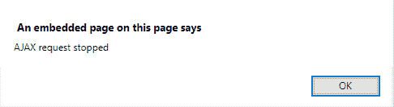

# jQuery | ajaxStop()方法

> 原文:[https://www.geeksforgeeks.org/jquery-ajaxstop-method/](https://www.geeksforgeeks.org/jquery-ajaxstop-method/)

**ajaxStop()** 方法用于指定当 **AJAX 请求完成时要运行的函数。**
**语法:**

```
$(document).ajaxStop(function())

```

**参数:**:只取一个参数。

*   **函数():**它指定了当 Ajax 请求完成时要运行的函数。

> 存储在服务器上的 demo.txt 文件，点击**更改内容**按钮后加载。
> demo . txt 的内容有:
> 这里是 GFG。

**示例-1:** 本示例通过从服务器获取数据来更改< p >元素的内容。请求完成后，页面显示 **AJAX 请求停止**。

```
<!DOCTYPE html>
<html>

<head>
    <script src=
"https://ajax.googleapis.com/ajax/libs/jquery/3.3.1/jquery.min.js">
    </script>
    <script>
        $(document).ready(function() {
            $(document).ajaxStop(function() {
                alert(
                  "AJAX request stopped");
            });
            $("button").click(function() {
                $("#paragraph").load(
                  "demo.txt");
            });
        });
    </script>
    <style>
        body {
            text-align: center;
        }
    </style>
</head>

<body>
    <div id="div_content">
        <h1 style="color: green;">
          GeeksforGeeks
      </h1>
        <p id="paragraph"
           style="font-size: 20px;">
          A computer science portal for geeks
        </p>
    </div>
    <button>Change Content</button>
</body>

</html>
```

**输出:**

*   **之前点击按钮:**
    
*   **点击按钮后:**
    
    

**示例-2:** 本示例通过从服务器获取数据来更改< h1 >元素的内容。请求完成后，页面显示 **AJAX 请求停止**。

```
<!DOCTYPE html>
<html>

<head>
    <script src=
"https://ajax.googleapis.com/ajax/libs/jquery/3.3.1/jquery.min.js">
    </script>
    <script>
        $(document).ready(function() {
            $(document).ajaxStop(function() {
                alert(
                  "AJAX request stopped");
            });
            $("button").click(function() {
                $("#paragraph").load(
                  "demo.txt");
            });
        });
    </script>
    <style>
        body {
            text-align: center;
        }
    </style>
</head>

<body>
    <div id="div_content">
        <h1 style="color: green;">
          GeeksforGeeks
      </h1>
        <p id="paragraph" 
           style="font-size: 20px;">
      A computer science portal for geeks
        </p>
    </div>
    <button>Change Content</button>
</body>

</html>
```

**输出:**

*   **之前点击按钮:**
    
*   **点击按钮后:**
    
    