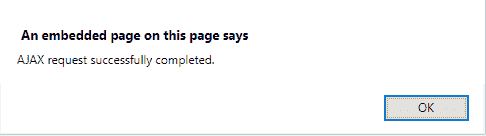

# jQuery | ajaxSuccess()方法

> 原文:[https://www.geeksforgeeks.org/jquery-ajaxsuccess-method/](https://www.geeksforgeeks.org/jquery-ajaxsuccess-method/)

jQuery 中的 **ajaxSuccess()方法**用于指定当 **AJAX 请求成功完成时要运行的函数。**

**语法:**

```
$(document).ajaxSuccess(function(event, xhr, options))
```

**参数:**:该方法接受单参数函数，为必选项。该函数接受三个参数，如上所述，如下所述:

*   **事件:**保存事件对象。
*   **xhr:** 它保存 XMLHttpRequest 对象。
*   **选项:**保存 AJAX 请求中使用的选项。

存储在服务器上的 demo.txt 文件，点击**更改内容**按钮后加载。
T3

```
This is GFG.
```

**示例 1:** 本示例通过从服务器获取数据来更改< p >元素的内容。当 AJAX 请求成功完成时，页面显示 **AJAX 请求成功完成。**。

```
<!DOCTYPE html> 
<html> 
    <head> 
        <script src= 
"https://ajax.googleapis.com/ajax/libs/jquery/3.3.1/jquery.min.js"> 
        </script> 

        <!-- Script to use ajaxSuccess() method -->
        <script> 
            $(document).ready(function(){
                $(document).ajaxSuccess(function(){
                    alert("AJAX request successfully completed.");
                });

                $("button").click(function(){
                    $("#paragraph").load("demo.txt");
                });
            });
        </script> 
    </head> 

    <body style="text-align:center;"> 

        <div id="div_content"> 

            <h1 style = "color: green;">
                GeeksforGeeks
            </h1> 

            <p id = "paragraph" style= "font-size: 20px;">
                A computer science portal for geeks
            </p> 
        </div> 

        <button>
            Change Content
        </button> 
    </body> 
</html>                    
```

**输出:**

*   **之前点击按钮:**
    
*   **点击按钮后:**
    
    

**示例 2:** 本示例通过从服务器获取数据来更改< h1 >元素的内容。当 AJAX 请求成功完成时，页面显示 **AJAX 请求成功完成。**。

```
<!DOCTYPE html> 
<html> 
    <head> 
        <script src=
"https://ajax.googleapis.com/ajax/libs/jquery/3.3.1/jquery.min.js"> 
        </script> 

        <!-- Script to use ajaxSuccess() method -->
        <script> 
            $(document).ready(function() {
                $(document).ajaxSuccess(function() {
                    alert("AJAX request successfully completed.");
                });

                $("button").click(function() {
                    $("#heading").load("demo.txt");
                });
            });
        </script> 
    </head> 

    <body style="text-align:center;"> 

        <div id="div_content"> 

            <h1 id = "heading" style = "color: green;">
                GeeksforGeeks
            </h1> 

            <p style= "font-size: 20px;">
                A computer science portal for geeks
            </p> 
        </div> 
        <button>Change Content</button> 
    </body> 
</html>                    
```

**输出:**

*   **之前点击**
    按钮
*   **点击**
    
    按钮后