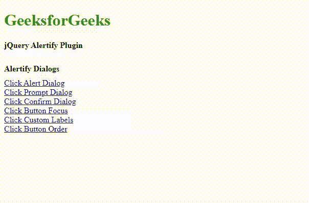
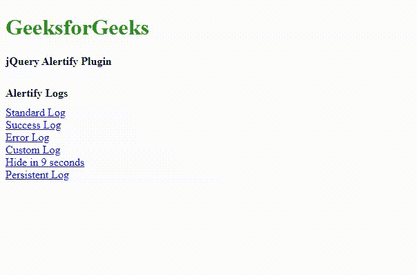
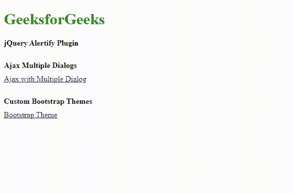

# jQuery |警报插件

> 原文:[https://www.geeksforgeeks.org/jquery-alertify-plugin/](https://www.geeksforgeeks.org/jquery-alertify-plugin/)

jQuery 框架提供了 **alertify.js** 插件，该插件提供了预先设计的可定制通知系统以及交互式浏览器对话框。这个可扩展且可主题化的插件对于开发人员来说是非常有用的，它提供了一个优化版本的警报消息，并具有叠加功能。
这个小型库系统有效地显示确认弹出窗口、成功或错误警报以及带有排队对话框的提示消息，可广泛用于调试过程。

请[下载](https://github.com/MohammadYounes/AlertifyJS)库，并根据项目要求包含所需文件。

**示例 1:** 在代码中很容易理解、定制和实现。它不依赖于任何第三方库，但很容易与它们集成。下面的代码演示了漂亮的对话框及其堆叠功能。

## 超文本标记语言

```html
<!DOCTYPE html>
<html lang="en">

<head>
    <meta charset="utf-8">
    <meta name="viewport" content="width=device-width">
    <title>jQuery Alertify Plugin</title>
    <link rel="stylesheet" href="alertify.core.css" />
    <link rel="stylesheet" href="alertify.default.css" id="linkID" />

    <script src="http://code.jquery.com/jquery-1.9.1.js">
    </script>

    <script src="alertify.min.js"></script>

    <style>
        .alertify-log-custom {
            background: green;
        }

        .height {
            height: 10px;
        }
    </style>
</head>

<body>
    <h1 style="color:green">GeeksforGeeks</h1>
    <b> jQuery Alertify Plugin</b>
    <div class="height"></div><br>

    <b>Alertify Dialogs</b>
    <div class="height"></div>
    <a href="#" id="alertID">Click Alert Dialog</a><br>
    <a href="#" id="promptID">Click Prompt Dialog</a><br>
    <a href="#" id="confirmID">Click Confirm Dialog</a><br>
    <a href="#" id="focusID">Click Button Focus</a><br>
    <a href="#" id="labelsID">Click Custom Labels</a><br>
    <a href="#" id="orderID">Click Button Order</a>

    <script>
        function reset() {
            $("#linkID").attr("href", "alertify.default.css");
            alertify.set({
                labels: {
                    ok: "OK",
                    cancel: "Cancel"
                },
                delay: 4000,
                buttonFocus: "ok",
                buttonReverse: false

            });
        }

        // Alertify Standard Dialog boxes
        $("#alertID").on('click', function () {
            reset();
            alertify.alert("Welcome GFG !");
            alertify.alert("Alertify alert dialog");
            return false;
        });

        $("#confirmID").on('click', function () {
            reset();
            alertify.confirm(
                "Please confirm the dialog box ", function (event) {
                    if (event) {
                        alertify.success(
                            "You have clicked OK to confirm our"
                            + " terms and conditions.");
                    } else {
                        alertify.error(
                            "You have clicked Cancel not to confirm.");
                    }
                });
            return false;
        });

        $("#promptID").on('click', function () {
            reset();
            alertify.prompt(
                "This is a prompt dialog box", function (event, string) {
                    if (event) {
                        alertify.success(
                            "You have clicked OK and typed: " + string);
                    } else {
                        alertify.error(
                            "You have clicked Cancel");
                    }
                }, "Please enter, this is default value");
            return false;
        });

        $("#success").on('click', function () {
            reset();
            alertify.success("Success message");
            return false;
        });

        $("#error").on('click', function () {
            reset();
            alertify.error("Error message");
            return false;
        });

        $("#labelsID").on('click', function () {
            reset();
            alertify.set({ labels: { ok: "Accept", cancel: "Deny" } });
            alertify.confirm(
                "Confirm dialog with custom button labels",
                function (event) {
                    if (event) {
                        alertify.success("You have clicked OK");
                    } else {
                        alertify.error("You have clicked Cancel");
                    }
                });
            return false;
        });

        $("#focusID").on('click', function () {
            reset();
            alertify.set({ buttonFocus: "cancel" });
            alertify.confirm(
                "Confirm dialog with cancel button focused",
                function (event) {
                    if (event) {
                        alertify.success("You have clicked OK");
                    } else {
                        alertify.error("You have clicked Cancel");
                    }
                });
            return false;
        });

        $("#orderID").on('click', function () {
            reset();
            alertify.set({ buttonReverse: true });
            alertify.confirm(
                "Confirm dialog with reversed button order",
                function (event) {
                    if (event) {
                        alertify.success("You have clicked OK");
                    } else {
                        alertify.error("You have clicked Cancel");
                    }
                });
            return false;
        });
    </script>
</body>

</html>
```

**输出:**



**示例 2:** 下面的代码演示了来自 **alertify.js** 插件的日志消息的使用。

## 超文本标记语言

```html
<!DOCTYPE html>
<html lang="en">

<head>
    <meta charset="utf-8">
    <meta name="viewport" content="width=device-width">
    <title>jQuery Alertify Plugin</title>
    <link rel="stylesheet" href="alertify.core.css" />
    <link rel="stylesheet"
        href="alertify.default.css" id="linkID" />

    <script src=
        "http://code.jquery.com/jquery-1.9.1.js">
    </script>
    <script src="alertify.min.js"></script>

    <style>
        .alertify-log-custom {
            background: green;
        }

        .height {
            height: 10px;
        }
    </style>
</head>

<body>
    <h1 style="color:green">GeeksforGeeks</h1>
    <b> jQuery Alertify Plugin</b>
    <div class="height"> </div><br>

    <b>Alertify Logs</b>
    <div class="height"> </div>

    <a href="#" id="notificationID">Standard Log</a><br>
    <a href="#" id="successID">Success Log</a><br>
    <a href="#" id="errorID">Error Log</a><br>
    <a href="#" id="customID">Custom Log</a><br>
    <a href="#" id="delayID">Hide in 9 seconds</a><br>
    <a href="#" id="foreverID">Persistent Log</a>

    <script>
        function reset() {
            $("#linkID").attr("href", "alertify.default.css");
            alertify.set({
                labels: {
                    ok: "OK",
                    cancel: "Cancel"
                },
                delay: 4000,
                buttonFocus: "ok",
                buttonReverse: false

            });
        }

        $("#notificationID").on('click', function () {
            reset();
            alertify.log("Standard log message");
            return false;
        });

        $("#successID").on('click', function () {
            reset();
            alertify.success("Success log message");
            return false;
        });

        $("#errorID").on('click', function () {
            reset();
            alertify.error("Error log message");
            return false;
        });

        // Custom Properties
        $("#delayID").on('click', function () {
            reset();
            alertify.set({ delay: 9000 });
            alertify.log("Hiding in 9 seconds");
            return false;
        });

        $("#foreverID").on('click', function () {
            reset();
            alertify.log("It will stay until clicked", "", 0);
            return false;
        });

        // Custom Log message
        $("#customID").on('click', function () {
            reset();
            alertify.custom = alertify.extend("custom");
            alertify.custom("Its a custom log message");
            return false;
        });
    </script>
</body>

</html>
```

**输出:**



**示例 3:** 下面的代码演示了如何实现主题化对话框，以及如何使用通知消息进行 ajax 调用，如代码所示。

## 超文本标记语言

```html
<!DOCTYPE html>
<html lang="en">

<head>
    <meta charset="utf-8">
    <meta name="viewport" content="width=device-width">
    <title>jQuery Alertify Plugin</title>
    <link rel="stylesheet" href="alertify.core.css" />
    <link rel="stylesheet"
        href="alertify.default.css" id="linkID" />

    <script src=
        "http://code.jquery.com/jquery-1.9.1.js">
    </script>
    <script src="alertify.min.js"></script>

    <style>
        .alertify-log-custom {
            background: green;
        }

        .height {
            height: 10px;
        }
    </style>
</head>

<body>
    <h1 style="color:green">GeeksforGeeks</h1>
    <b> jQuery Alertify Plugin</b>
    <div class="height"> </div><br>

    <b>Ajax Multiple Dialogs</b>
    <div class="height"> </div>
    <a href="#" id="ajax">
        Ajax with Multiple Dialog</a>
    <div class="height"> </div><br />

    <b>Custom Bootstrap Themes</b>
    <div class="height"> </div>
    <a href="#" id="bootstrap">Bootstrap Theme</a>

    <script>
        function reset() {
            $("#linkID").attr("href", "alertify.default.css");
            alertify.set({
                labels: {
                    ok: "OK",
                    cancel: "Cancel"
                },
                delay: 4000,
                buttonFocus: "ok",
                buttonReverse: false

            });
        }

        // Ajax call
        $("#ajax").on("click", function () {
            reset();
            alertify.confirm("Confirm?", function (event) {
                if (event) {
                    alertify.alert("Successful Ajax call after OK");
                } else {
                    alertify.alert("Successful Ajax call after Cancel");
                }
            });
        });

        // Custom Themes
        $("#bootstrap").on('click', function () {
            reset();
            $("#linkID").attr("href", "alertify.bootstrap.css");
            alertify.prompt(
                "It prompts dialog with bootstrap theme",
                    function (event) {
                    if (event) {
                        alertify.success("You have clicked OK");
                    } else {
                        alertify.error("You have clicked Cancel");
                    }
                }, "This is Default Value");
            return false;
        });

    </script>

</body>

</html>
```

**输出:**

