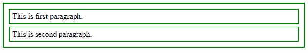

# jQuery | andSelf()带示例

> 原文:[https://www.geeksforgeeks.org/jquery-andself-with-examples/](https://www.geeksforgeeks.org/jquery-andself-with-examples/)

**和 Self( )** 是 jQuery 中的一个内置方法，用于将前一组元素添加到当前集合中。这个方法将以前的 DOM 树元素添加到当前的集合中，并在内部堆栈中维护它们，内部堆栈将处理对匹配的元素集合的更改。文档对象模型是一个万维网联盟标准。这定义了访问 DOM 树中的元素。
**语法:**

```
andSelf( )(selector);

```

**参数:**不接受任何参数。
**返回值:**根据指定的选择器返回所有添加的元素。
**显示 andSelf()工作方式的 jQuery 代码:**

```
<html>

<head>
    <script type="text/javascript" 
    src="https://ajax.googleapis.com/ajax/libs/jquery/2.1.3/jquery.min.js">
    </script>
    <script>
        $(document).ready(function() {
            $("div").find("p").andSelf().addClass("border");
        });
    </script>
    <style>
        p,
        div {
            margin: 5px;
            padding: 5px;
        }

        .border {
            border: 2px solid green;
        }

        .background {
            background: green;
        }
    </style>
</head>

<body>
    <div>
        <p>This is first paragraph.</p>
        <p>This is second paragraph.</p>
    </div>
</body>

</html>
```

在这里，边框将被添加到上一个选择，这是一个部门，然后第二个选择，这是段落。
**输出:**
