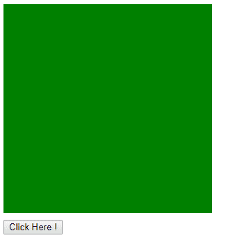
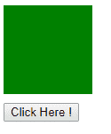
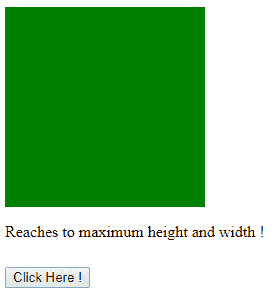

# jQuery |动画()示例

> 原文:[https://www.geeksforgeeks.org/jquery-animate-with-examples/](https://www.geeksforgeeks.org/jquery-animate-with-examples/)

**动画()**是 jQuery 中的一个内置方法，用来**用 CSS 样式**改变元素的状态。此方法也可用于更改 CSS 属性，为选定元素创建动画效果。

**语法:**

```html
(selector).animate({styles}, para1, para2, para3);

```

这里的“选择器”是被选择的元素。
**参数:**接受以下指定的四个参数-

*   **样式:**帮助设置新的 css 属性。
*   **para1:** 为可选参数，用于设置参数的速度，默认值为 400 毫秒。
*   **para2:** 可选，这指定了元件在不同位置的速度。
*   **para3:** 是可选功能，用于动画完成后执行。

**返回值:**返回使用上述方法所做的更改。

<center>**jQuery code to show the working of animate() method:**</center>

**Code #1:**

```html
<html>

<head>
    <script src="https://ajax.googleapis.com/ajax/libs/
           jquery/3.3.1/jquery.min.js"></script>
    <script>
        <!-- jQuery code to show animate() method -->
        $(document).ready(function() {
            $("#b1").click(function() {
                $("#box").animate({
                    width: "300px"
                });
                $("#box").animate({
                    height: "300px"
                });
            });
        });
    </script>
    <style>
        div {
            width: 100px;
            height: 100px;
            background-color: green;
        }

        #b1 {
            margin-top: 10px;
        }
    </style>
</head>

<body>
    <div id="box"></div>
    <!-- click on this button -->
    <button id="b1">Click Here !</button>
</body>

</html>
```

**输出:**
点击前“点击这里！”
按钮-

点击“点击这里！”按钮-


**代码#2:**
在下面的代码中，所有的参数都传递给了这个方法。

```html
<html>

<head>
    <script src="https://code.jquery.com/jquery-1.10.2.js">
    </script>
    <style>
        div {
            background-color: green;
            height: 100px;
            width: 100px;
            margin-top: 10px;
        }

        #b1 {
            margin-top: 10px;
        }
    </style>
</head>

<body>
    <div id="box"></div>
    <!-- click here and animation will start -->
    <button id="b1">Click Here !</button>
    <!-- jQuery code to show the animate method -->
    <script>
        $(document).ready(function() {
            $("#b1").click(function() {
                $("#box").animate({
                    height: "200px",
                    width: "200px"
                }, {
                    duration: 1000,
                    easing: "linear",
                    complete: function() {
$(this).after("<p>Reaches to maximum height and width !</p>");
                    }
                });
            });
        });
    </script>
</body>

</html>
```

**输出:**
点击【点击此处】按钮前-


点击【点击此处】按钮后-
