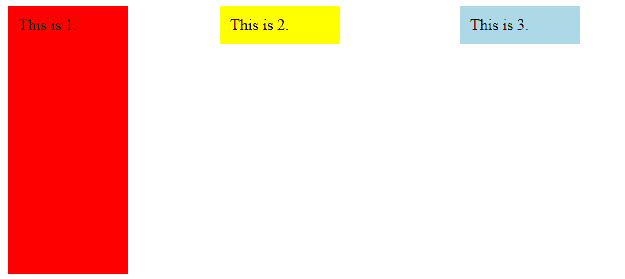
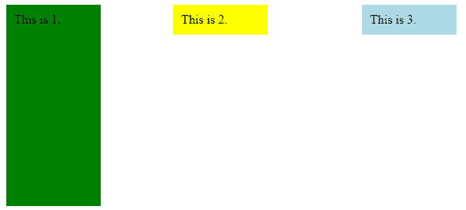

# jQuery |示例动画选择器

> 原文:[https://www . geesforgeks . org/jquery-animated-selector-with-examples/](https://www.geeksforgeeks.org/jquery-animated-selector-with-examples/)

动画是 jQuery 中的内置选择器，用于选择当前动画的元素。

**语法:**

```html
$(:animated)
```

**返回值:**该选择器返回当前动画的元素。

以下示例说明了 jQuery 中的动画选择器:

**示例:**

```html
<html>
    <head>
        <script src=
        "https://ajax.googleapis.com/ajax/libs/jquery/3.3.1/jquery.min.js">
        </script>

        <!-- jQuery code to show the working of this method -->
        <script>
            $(document).ready(function() {
                function aniDiv() {
                    $("#d3").animate({
                        height: "50%"
                    }, "slow");
                    $("#d3").animate({
                        height: "90%"
                    }, "slow", aniDiv);
                }
                aniDiv();
                $("#d3").click(function() {
                    $(":animated").css("background-color", "green");
                });
            });
        </script>
        <style>
            #d1, #d2, #d3 {
                padding: 10px;
            }
            #d1 {
                width: 100px;
                float: right;
                background: lightblue;
                margin-right: 80px;
                margin-left: 120px;
            }
            #d2 {
                width: 100px;
                float: right;
                margin-right: 100px;
                background: yellow;
            }
            #d3 {
                width: 100px;
                background: red;
            }
        </style>
    </head>
    <body>
        <div>
            <!-- this div element will get selected -->
            <div id="d1" >This is 3.</div>
            <div id="d2" >This is 2.</div>
            <div id="d3" >This is 1.</div>
        </div>
    </body>
</html>                    
```

**输出:**
点击 div 元素前(红色):

点击 div 元素后，div 的颜色会发生变化:
