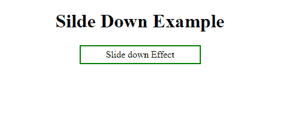

# jQuery |动画、幻灯片方法示例

> 原文:[https://www . geesforgeks . org/jquery-动画-幻灯片-方法-示例/](https://www.geeksforgeeks.org/jquery-animation-slide-methods-with-examples/)

**jQuery** 是一个非常强大的 JavaScript 框架。使用 jQuery，我们可以为我们的网站或基于网络的应用程序添加特殊效果。
我们可以使用 jQuery 添加各种效果，比如隐藏/显示、淡入淡出效果、动画、回叫等等。
[用于隐藏/显示、切换、淡化效果。](https://www.geeksforgeeks.org/jquery-hideshow-toggle-fading-methods-examples/)
jQuery 包含了几个函数库，这些函数库提供了向网页添加动画的技术。这些包括简单动画，标准动画。
在本文中，我们将学习如何将上述效果添加到我们的网页中。

**jQuery 动画:**

在 jQuery 中，我们可以使用 animate()方法生成各种类型的动画。这种方法可以在网页中产生简单到复杂的动画。使用动画，我们可以改变 HTML 元素的属性，如背景颜色、改变边框样式、改变导航属性、格式化字体属性等。
我们通过在方法的 params 参数中提供样式规则来对属性进行更改。
**语法:**

```html
$("selector").animate({params}, speed, callback);
```

在哪里

*   params 参数指定在执行 animate()方法期间要更改的 CSS 属性。这是必需的参数。
*   速度参数指定应用效果的速度。他们只能接受这些值:“慢”、“快”或毫秒。
*   call back 参数指定在执行 animate()方法后要执行的函数。

**让我们看看它是如何用 JavaScript 代码实现的:**
在这段代码中，我们制作了矩形的动画，并将其形状改为圆形。

```html
<!DOCTYPE html>
<html>

<head>
    <script src="https://ajax.googleapis.com/ajax/
                libs/jquery/3.3.1/jquery.min.js">
</script>
    <style type="text/css">
        div {
            width: 100px;
            height: 100px;
            background-color: green;
        }
    </style>
</head>

<body>
    <div></div>
    <br/>
    <button id="animate">Animate Me</button>
    <script type="text/javascript">
        $("#animate").click(function() {
            $("div").animate({
                    width: "200px",
                    height: "200px",
                    borderRadius: "50%",
                    marginLeft: "210px",
                    marginTop: "70px",
                },
                2000,
            );
        });
    </script>
</body>

</html>
```

**输出:**
点击**动画我**之前

点击**动画我**之后


<center>**jQuery Slide:**</center>

Using jQuery , we can add the slide up or down effect in our web page . The slides are always present in the web page in the form of div pairs . There are three methods to add the sliding effects in our web page .These are as follows:

*   **slideDown() :**This method makes the element to slide down.
    Syntax:

    ```html
    $(selector).slideDown(speed,callback);
    ```

    **示例:**在本例中，我们展示了下滑效果。如果单击“向下滑动”面板，则会对 HTML 元素进行相应的更改。
    T3】代号:

    ```html
    <!DOCTYPE html>
    <html>
    <head>
    <script src="https://ajax.googleapis.com/
                 ajax/libs/jquery/3.3.1/jquery.min.js"></script>
    <style type="text/css"> 
    #p1, #f1 {
        padding: 5px;
        text-align: center;
        background-color: white;
        border: solid 2px green;
        }
    #p1 {
        padding: 50px;
        width:100px;
        display:none;
        color: green;
        font-style: italic;
        }
    #f1 {
        width:190px;
        }    
    </style>
    </head>
    <body>
    <h1 align="center">Silde Down Example</h1>
    <center>
    <div id="f1">Slide down Effect</div>
    <div id="p1">Welcome to GeeksForGeeks.</div>
    </center>
    <script type="text/javascript"> 
        $("#f1").click(function(){
            $("#p1").slideDown("slow");
        });
    </script>
    </body>
    </html>
    ```

    **输出:**
    下降效果
    前下降效果
    后

*   **slideUp():**This method makes the element to slide up.
    Syntax:

    ```html
    $(selector).slideUp(speed,callback);
    ```

    **示例:**在本例中，我们展示了上滑效果。如果单击“上滑”面板，则会对 HTML 元素进行相应的更改。
    T3】代号:

    ```html
    <!DOCTYPE html>
    <html>
    <head>
    <script src="https://ajax.googleapis.com/ajax/
                 libs/jquery/3.3.1/jquery.min.js"></script>
    <style type="text/css"> 
    #p2, #f2 {
        padding: 5px;
        text-align: center;
        background-color: white;
        border: solid 2px black;
        }
    #p2 {
        padding: 50px;
        width:100px;
        color: green;
        font-style: italic;
        }
    #f2 {
        width:190px;
        }    
    </style>
    </head>
    <body>
    <h1 align="center">Slide Up Example</h1>
    <center>
    <div id="f2">Slide up Effect</div>
    <div id="p2">Welcome to GeeksForGeeks.</div>
    </center>
    <script type="text/javascript"> 
        $("#f2").click(function(){
            $("#p2").slideUp("slow");
        });
    </script>
    </body>
    </html>
    ```

    **输出:**上升效果
    前的 T2上升效果
    后的 T5

*   **slideToggle() :**This method makes the element to slide up/down.
    If the element is in the slide up position, it makes it slide down.
    If the element is in the slide down position, it makes it slide up.
    Syntax:

    ```html
    $(selector).slideToggle(speed,callback);
    ```

    在哪里

    *   速度参数指定应用效果的速度。他们只能接受这些值:“慢”、“快”或毫秒。
    *   call back 参数指定在执行特定的 slide 方法后要执行的函数。

    **示例:**在本例中，我们展示了上滑效果。如果单击“上滑”面板，则会对 HTML 元素进行相应的更改。
    T3】代号:

    ```html
    <!DOCTYPE html>
    <html>
    <head>
    <script src="https://ajax.googleapis.com/
                ajax/libs/jquery/3.3.1/jquery.min.js">
    </script>
    <style type="text/css"> 
    #p3 ,#f3 {
        padding: 5px;
        text-align: center;
        background-color: white;
        border: solid 2px green;
        }
    #p3 {
        padding: 50px;
        width:100px;
        color: green;
        font-style: italic;
        }
    #f3 {
        width:190px;
        }    
    </style>
    </head>
    <body>
    <h1 align="center">Slide Up/Down Example</h1>
    <center>
    <div id="f3">Slide up/down Effect</div>
    <div id="p3">Welcome to GeeksForGeeks.</div>
    </center>
    <script type="text/javascript"> 
        $("#f3").click(function(){
            $("#p3").slideToggle("slow");
        });
    </script>
    </body>
    </html>
    ```

    **输出:**
    效果前
    
    第一次点击
    
    第二次点击
    