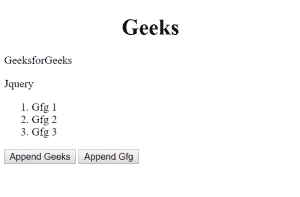
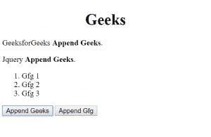
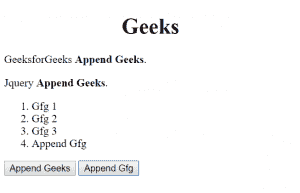
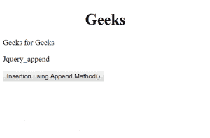
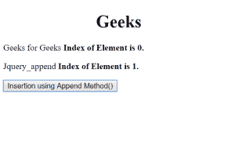

# jQuery | append()方法

> 原文:[https://www.geeksforgeeks.org/jquery-append-method/](https://www.geeksforgeeks.org/jquery-append-method/)

jQuery 中的这个**追加()方法**是用来在选中元素的末尾插入一些内容的。

**语法:**

```
$(selector).append( content, function(index, html) )
```

**参数:**该方法接受两个参数，如上所述，如下所述:

*   **内容:**必选参数，用于指定要插入到所选元素末尾的内容。内容的可能值是 HTML 元素、jQuery 对象和 DOM 元素。
*   **函数(index，html):** 为可选参数，用于指定将返回待插入内容的函数。
    *   **索引:**用于返回元素的索引位置。
    *   **html:** 用于返回选中元素的当前 html。

**示例 1:** 本示例在段落和列表末尾追加内容。

```
<!DOCTYPE html>
<html>

<head>
    <title>
        jQuery append() Method
    </title>

    <script src="
https://ajax.googleapis.com/ajax/libs/jquery/3.3.1/jquery.min.js">
    </script>

    <!-- Script to append content -->
    <script>
        $(document).ready(function(){
            $("#btn1").click(function(){
                $("p").append(" <b>Append Geeks</b>.");
            });

            $("#btn2").click(function(){
                $("ol").append("<li>Append Gfg</li>");
            });
        });
    </script>
</head>

<body>
    <h1 style="margin-left: 150px;">Geeks</h1>

    <p>GeeksforGeeks</p>
    <p>Jquery</p>

    <ol>
        <li>Gfg 1</li>
        <li>Gfg 2</li>
        <li>Gfg 3</li>
    </ol>

    <button id="btn1">Append Geeks</button>
    <button id="btn2">Append Gfg</button>
</body>

</html>
```

**输出:**

*   **点击按钮前:**
    
*   **点击按钮后:**
    
    

**示例 2:** 本示例在段落末尾追加内容。

```
<!DOCTYPE html>
<html>

<head>
    <title>
        jQuery append() Method
    </title>

    <script src="
https://ajax.googleapis.com/ajax/libs/jquery/3.3.1/jquery.min.js">
    </script>

    <!-- Script to append content -->
    <script>
        $(document).ready(function() {
            $("button").click(function() {
                $("p").append(function(n) {
                    return "<b>   Index of Element is "
                            + n + ".</b>";
                });
            });
        });
    </script>
</head>

<body>
    <h1 style="margin-left:150px;">Geeks</h1>

    <p>Geeks for Geeks</p>
    <p>Jquery_append</p>

    <button>
        Insertion using Append Method()
    </button>
</body>

</html>
```

**输出:**

*   **点击按钮前:**
    
*   **点击按钮后:**
    