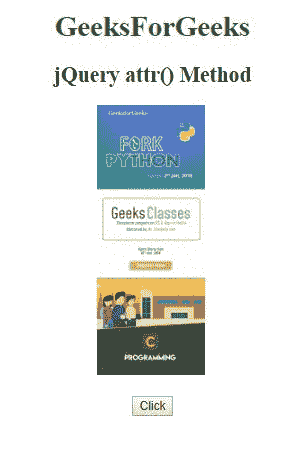
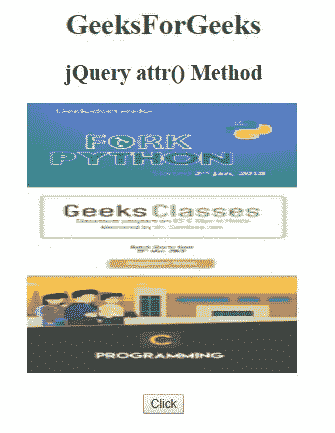
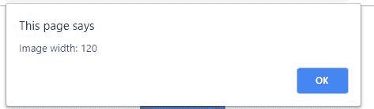
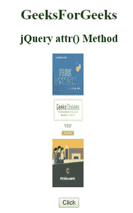
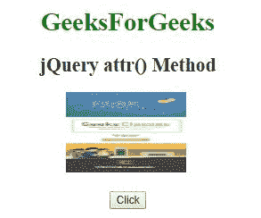

# jQuery | attr()方法

> 原文:[https://www.geeksforgeeks.org/jquery-attr-method/](https://www.geeksforgeeks.org/jquery-attr-method/)

jQuery 中的 **attr()方法**用于**设置**或**返回**所选元素的属性和值。

**语法:**

*   要返回属性值:

    ```html
    $(selector).attr(attribute)
    ```

*   设置属性和值:

    ```html
    $(selector).attr(attribute, value)
    ```

*   使用函数设置属性和值:

    ```html
    $(selector).attr(attribute, function(index, currentvalue))
    ```

*   要设置多个属性和值:

    ```html
    $(selector).attr({attribute:value, attribute:value, ...})
    ```

**参数**

*   **属性:**此参数用于指定属性的名称
*   **值:**用于指定属性的值
*   **函数(index，currentvalue):** 用于指定返回要设置的属性值的函数
*   **索引:**借助此参数接收的元素的索引位置。
*   **当前值:**用于接收所选元素的当前属性值。

**示例-1:**

```html
<!DOCTYPE html>
<html>

<head>
    <title>jQuery attr() Method
  </title>

    <script src=
"https://ajax.googleapis.com/ajax/libs/jquery/3.3.1/jquery.min.js">
  </script>
</head>

<body>
    <center>
        <h1 style="color:green;">  
            GeeksForGeeks</h1>
        <h2> jQuery attr() Method</h2>
        <h3 style="color:lightgreen;">
      </h3>
        
        <br>
        <br>
        <button>Click</button>
        <script>
            $(document).ready(function() {
                $("button").click(function() {
                    $("img").attr("width", "300");
                });
            });
        </script>
    </center>
</body>

</html>
```

**输出:**
**之前点击按钮:**


**点击按钮后:**


**示例-2:**

```html
<!DOCTYPE html>
<html>

<head>
    <title>jQuery attr() Method</title>
    <script src=
"https://ajax.googleapis.com/ajax/libs/jquery/3.3.1/jquery.min.js">
  </script>
</head>

<body>
    <center>
        <h1 style="color:green;">  
            GeeksForGeeks</h1>
        <h2> jQuery attr() Method</h2>
        <h3 style="color:lightgreen;"></h3>
        
        <br>
        <br>
        <button>Click</button>
        <script>
            $(document).ready(function() {
             $("button").click(function() {
               alert("Image width: " + 
                     $("img").attr("width"));
                });
            });
        </script>
    </center>
</body>

</html>
```

**输出:**

**之前点击按钮:**


**点击按钮后:**


**示例-3:**

```html
<!DOCTYPE html>
<html>

<head>
    <title>jQuery attr() Method</title>
    <script src=
"https://ajax.googleapis.com/ajax/libs/jquery/3.3.1/jquery.min.js">
  </script>
</head>

<body>
    <center>
        <h1 style="color:green;">  
            GeeksForGeeks</h1>
        <h2> jQuery attr() Method</h2>
        <h3 style="color:lightgreen;">
      </h3>
        
        <br>
        <br>
        <button>Click</button>
        <script>
            $(document).ready(function() {
             $("button").click(function() {
              $("img").attr("width", function(n, v) {
                return v - 50;
                    });
                });
            });
        </script>
    </center>
</body>

</html>
```

**输出:**

**之前点击按钮:**


**点击按钮后:**


**示例-4:**

```html
<!DOCTYPE html>
<html>

<head>
    <title>jQuery attr() Method
  </title>

    <script src=
"https://ajax.googleapis.com/ajax/libs/jquery/3.3.1/jquery.min.js">
  </script>
</head>

<body>
    <center>
        <h1 style=
            "color:green;">  
            GeeksForGeeks</h1>

        <h2> jQuery attr() Method</h2>
        <h3 style="color:lightgreen;"></h3>
        
        <br>
        <br>
        <button>Click</button>

        <script>
            $(document).ready(function() {
             $("button").click(function() {
              $("img").attr({
                   width: "150",
                   height: "100"
                    });
                });
            });
        </script>
    </center>
</body>

</html>
```

**输出:**

**之前点击按钮:**


**点击按钮后:**
