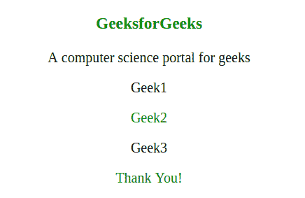
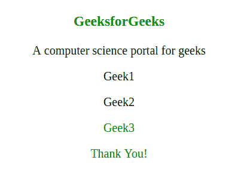

# jQuery |【属性】选择器

> 原文:[https://www.geeksforgeeks.org/jquery-attribute-selector/](https://www.geeksforgeeks.org/jquery-attribute-selector/)

**【属性】选择器**是 jQuery 中内置的选择器，用于选择所有具有指定属性的元素。

**语法:**

```
$("[attribute_name]")

```

**参数:**

*   **属性名称:**是指定要选择的属性的必需参数。

**示例-1:**

```
<!DOCTYPE html>
<html>

<head>
    <script src=
"https://ajax.googleapis.com/ajax/libs/jquery/3.3.1/jquery.min.js">
    </script>

    <script>
        $(document).ready(function() {
            $("[class]").css("color",
                             "green");
        });
    </script>
</head>

<body>
    <center>

        <!-- Class attribute-->

        <h3 class>GeeksforGeeks</h3>
        <p>A computer science portal for geeks</p>

        <!--id attribute-->

        <p id>Geek1</p>

        <!--class attribute-->

        <p class>Geek2</p>
        <p>Geek3</p>

        <!--class attribute-->

        <div class> Thank You! </div>

    </center>
</body>

</html>
```

**输出:**


在上面的例子中，所有具有指定属性(类)的元素都被格式化为绿色，即“极客 2”和“谢谢！”。

**示例-2:**

```
<!DOCTYPE html>
<html>

<head>
    <script src=
"https://ajax.googleapis.com/ajax/libs/jquery/3.3.1/jquery.min.js">
    </script>

    <script>
        $(document).ready(function() {
            $("[class]").css("color",
                             "green");
        });
    </script>
</head>

<body>
    <center>

        <!-- Class(demo) attribute-->

        <h3 class="demo">GeeksforGeeks</h3>
        <p>A computer science portal for geeks</p>

        <!--id attribute-->

        <p id>Geek1</p>
        <p>Geek2</p>

        <!--class(test) attribute-->

        <p class="test">Geek3</p>

        <!--class(sample) attribute-->

        <div class="sample"> Thank You! </div>

    </center>
</body>

</html>
```

**输出:**


在上面的示例中，具有指定属性(类)的所有元素都被格式化为绿色，而不是考虑属性值。“极客暴发户”、“极客 3”和“谢谢！”被格式化了。