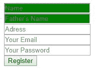
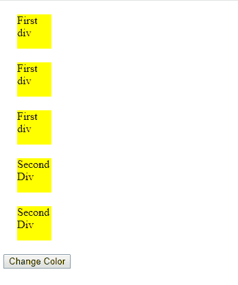
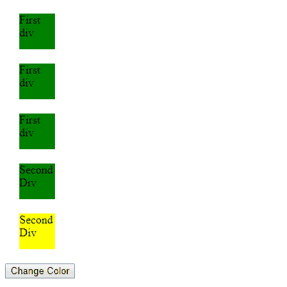

# jQuery |【属性* =值】选择器

> 原文:[https://www . geesforgeks . org/jquery-attribute value-selector-2/](https://www.geeksforgeeks.org/jquery-attributevalue-selector-2/)

**$(“[属性* =值]”)**用于选择属性参数指定的属性包含值参数指定的词的所有元素。
**语法:**

```html
$("[attribute*='value']")
```

**参数:**该选择器有两个参数。

*   **属性:属性**指定需要查找的属性。
*   **值:值**是与具有指定属性的每个元素匹配的值的字符串。

**Return:** 返回所有选中元素的数组。
**例-1:**

## 超文本标记语言

```html
<!DOCTYPE html>
<html lang="en">

<head>
    <meta charset="UTF-8">
    <meta name="viewport"
          content="width=device-width,
                   initial-scale=1.0">

    <meta http-equiv="X-UA-Compatible"
          content="ie=edge">
    <title>Document</title>
</head>

<body>
    <input type="text"
           name="name"
           placeholder="Name" />
    <br/>

    <!--This input element contains name
    attribute which have name string in it-->
    <input type="text"
           name="fathers_name"
           placeholder="Father's Name" />
    <br/>

    <!--This input element contains name
     attribute which have name string in it-->
    <input type="text"
           name="address"
           placeholder="Address" />
    <br/>

    <input type="email"
           name="email"
           placeholder="Your Email" />
    <br/>
    <input type="password"
           name="password"
           placeholder="Your Password" />
    <br/>
    <input type="button"
           value="Register" />
</body>
<script src=
"https://ajax.googleapis.com/ajax/libs/jquery/3.3.1/jquery.min.js">
  </script>

<script>
    $(document).ready(function() {
        $("input[name*='name']").css({
            background: "green"
        });
    });
</script>

</html>
```

**输出:**



**示例-2:**

## 超文本标记语言

```html
<!DOCTYPE html>
<html lang="en">

<head>
    <meta charset="UTF-8">
    <meta name="viewport"
          content="width=device-width,
                   initial-scale=1.0">.

    <meta http-equiv="X-UA-Compatible"
          content="ie=edge">

    <title>Document</title>
    <style>
        div {
            width: 50px;
            height: 50px;
            background-color: yellow;
            margin: 20px;
        }
    </style>
</head>

<body>
    <!--All these will be selected because
    target attribute contains first as value-->

    <div target="first"> First div </div>
    <div target="first"> First div </div>
    <div target="first"> First div </div>

    <div target="second first">
        Second Div
    </div>
    <!-- this will be selected as target
     attribute contains first as value-->
    <div target="second">
        Second Div
    </div>
    <button id="CC">Change Color</button>
</body>

<script src=
"https://ajax.googleapis.com/ajax/libs/jquery/3.3.1/jquery.min.js">
</script>

<script>
    // change color.
    $("#CC").click(function() {
        $("div[target*='first']").css({
            background: "green"
        });
    });
</script>

</html>
```

**之前:**



**之后:**

