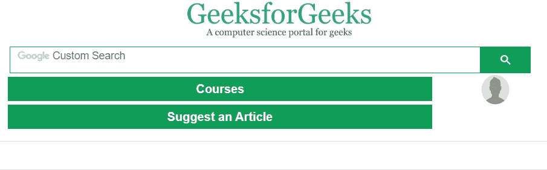

# jQuery |【属性$ =值】选择器

> 原文:[https://www . geesforgeks . org/jquery-attribute value-selector-3/](https://www.geeksforgeeks.org/jquery-attributevalue-selector-3/)

**【属性$ =值】选择器**用于选择具有特定属性的每个元素，具有特定的结束字符串。

**语法:**

```html
$("[attribute$='value']")
```

**参数:**

*   **属性:**需要此参数指定要查找的属性。
*   **值:**此参数是指定字符串所必需的，即该值应以结束。

**示例-1:**

```html
<!DOCTYPE html>
<html>

<head>
    <script src=
"https://ajax.googleapis.com/ajax/libs/jquery/3.3.1/jquery.min.js">
  </script>

  <script>
        $(document).ready(function() {
            $("a[href$='.org']").css(
              "background-color", "green");
        });
    </script>
</head>

<body>
    <center>
        <h1>GeeksForGeeks</h1>
        <a href=
        "https://www.geeksforgeeks.org/">
          geeksforgeeks.org
        </a>
        <br>

        <a href=
        "http://www.google.com">
          Google.com
        </a>
        <br>

        <a href=
        "http://www.wikipedia.org">
          wikipedia.org
        </a>
    </center>

</body>

</html>
```

**输出:**
**之前点击链接:**


**点击极客后返回链接:**


**点击谷歌链接后:**


**点击维基百科链接后:**


**示例-2:**

```html
<!DOCTYPE html>
<html>

<head>
    <script src=
"https://ajax.googleapis.com/ajax/libs/jquery/3.3.1/jquery.min.js">
  </script>

  <script>
        $(document).ready(function() {
            $("h3[id$='.org']").css(
              "background-color", "green");
        });
    </script>
</head>

<body>
    <center>
        <h1>GeeksForGeeks</h1>
        <h3 id="geeksforgeeks.org/">
          geeksforgeeks.org
      </h3>

        <h3 id="google.com">
          Google.com
      </h3>

        <h3 id="wikipedia.org">
          wikipedia.org
      </h3>
    </center>

</body>

</html>
```

**输出:**
