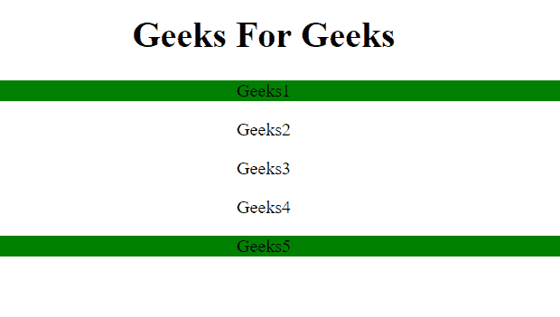
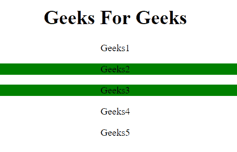

# jQuery |【属性| =值】选择器

> 原文:[https://www . geesforgeks . org/jquery-attribute value-selector-4/](https://www.geeksforgeeks.org/jquery-attributevalue-selector-4/)

**【属性| =值】选择器**用于选择具有特定属性的每个元素，具有特定的字符串值(如“极客”)或起始字符串后跟连字符(如“极客-伪客”)。

**语法:**

```
$("[attribute|='value']")
```

**参数:**

*   **属性:**需要此参数指定要搜索的属性。
*   **值:**需要此参数来指定属性值应该以哪个字符串开头。

**示例-1:**

## 超文本标记语言

```
<!DOCTYPE html>
<html>

<head>
    <script src=
"https://ajax.googleapis.com/ajax/libs/jquery/3.3.1/jquery.min.js">
  </script>

  <script>
        $(document).ready(function() {
            $("p[title|='GeeksForGeeks']").css(
              "background-color", "green");
        });
    </script>
</head>

<body>
    <center>
        <h1>Geeks For Geeks</h1>
        <p title="GeeksForGeeks">
          Geeks1
      </p>

        <p title="google">
          Geeks2
      </p>

        <p title="Tom">
          Geeks3
      </p>

        <p title="See You GeeksForGeeks">
          Geeks4
      </p>

        <p title=
      "GeeksForGeeks-is the best place to learn">
          Geeks5
      </p>

    </center>

</body>

</html>
```

**输出:**



**示例-2:**

## 超文本标记语言

```
<!DOCTYPE html>
<html>

<head>
    <script src=
"https://ajax.googleapis.com/ajax/libs/jquery/3.3.1/jquery.min.js">
  </script>

  <script>
        $(document).ready(function() {
            $("p[title|='google']").css(
              "background-color", "green");
        });
    </script>
</head>

<body>
    <center>
        <h1>Geeks For Geeks</h1>
        <p title="GeeksForGeeks">
          Geeks1
      </p>

        <p title="google">
          Geeks2
      </p>

        <p title="google- tom">
          Geeks3
      </p>

        <p title="See You GeeksForGeeks">
          Geeks4
      </p>

        <p title=
       "GeeksForGeeks-is the best place to learn">
          Geeks5
      </p>

    </center>

</body>

</html>
```

**输出:**

