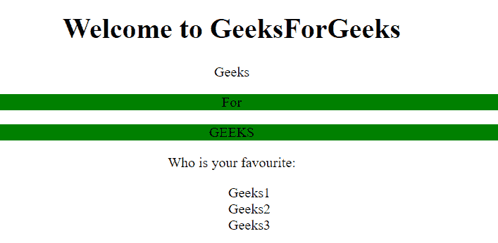
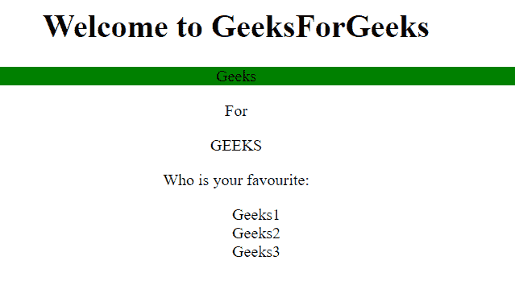

# jQuery |【属性！=值]选择器

> 原文:[https://www . geesforgeks . org/jquery-attribute value-selector-5/](https://www.geeksforgeeks.org/jquery-attributevalue-selector-5/)

**【属性！= value]jquery 中的选择器**用于选择每个没有指定属性和值的元素。
**语法:**

```html
$("[attribute!='value']")
```

**参数:**

*   **属性:**需要此参数指定要搜索的属性。
*   **值:**需要此参数指定要搜索的值。

**示例-1:**

```html
<!DOCTYPE html>
<html>

<head>
    <script src=
"https://ajax.googleapis.com/ajax/libs/jquery/3.3.1/jquery.min.js">
  </script>

  <script>
        $(document).ready(function() {
            $("p[class!='intro']").css(
              "background-color", "green");
        });
    </script>
</head>

<body>
    <center>
        <h1>Welcome to GeeksForGeeks
      </h1>

        <p class="intro">Geeks</p>
        <p>For</p>
        <p>GEEKS</p>
        <p></p>
        Who is your favourite:
        <ul id="choose">
            <li>Geeks1</li>
            <li>Geeks2</li>
            <li>Geeks3</li>
        </ul>
    </center>

</body>

</html>
```

**输出:**


**示例-2:**

```html
<!DOCTYPE html>
<html>

<head>
    <script src=
"https://ajax.googleapis.com/ajax/libs/jquery/3.3.1/jquery.min.js">
  </script>
    <script>
        $(document).ready(function() {
            $("p[class='intro']").css(
              "background-color", "green");
        });
    </script>
</head>

<body>
    <center>
        <h1>Welcome to GeeksForGeeks
      </h1>

        <p class="intro">Geeks</p>
        <p>For</p>
        <p>GEEKS</p>
        <p></p>
        Who is your favourite:
        <ul id="choose">
            <li>Geeks1</li>
            <li>Geeks2</li>
            <li>Geeks3</li>
        </ul>
    </center>

</body>

</html>
```

**输出:**
