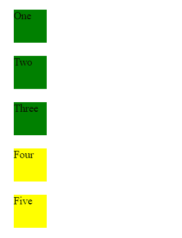

# jquery |【attribute^=value】选择器

> 原文:[https://www . geesforgeks . org/jquery-attribute value-selector-6/](https://www.geeksforgeeks.org/jquery-attributevalue-selector-6/)

**【attribute^=value】**选择器用于选择所有具有由属性参数指定的给定属性的元素，该属性参数以值参数指定的单词开始。

**语法:**

```
$("[attribute^='value']")
```

**参数:**该选择器包含两个参数，如下所示:

*   **属性:**用于指定需要选择的属性(任意 html 元素)。
*   **值:**它包含每个选定元素的值应该从其开始的字符串。

**返回值:**返回所有选中元素的数组。

**示例 1:** 本示例使用[attribute^=value]选择器选择类名以 top 开头的元素。

```
<!DOCTYPE html>
<html>

<head>
    <title>
        jQuery [attribute^=value] Selector
    </title>

    <script src=
"https://ajax.googleapis.com/ajax/libs/jquery/3.3.1/jquery.min.js">
    </script>
</head>

<body>
    <h3 class="top-heading">
        Welcome to GeeksforGeeks
    </h3>

    <p class="top-content">
        A Computer Science portal for geeks.<br/> It
        contains well written, well thought and well
        explained<br/> computer science and
        programming articles 
    </p>

    <p class="topcoder">
        Competitive programming is not tough.
    </p>

    <p class="be-on-top">
        Every one should learn Programming.
    </p>

    <!-- Script to use attribute^=value selector -->
    <script>
        $(document).ready(function() {
            var select = $("[class^='top']")
            select.css({
                background:"green"
            })
        });
    </script>
</body>
</html>                    
```

**输出:**


**示例 2:** 本示例使用[attribute^=value]选择器选择类名以 top 开头的元素。

```
<!DOCTYPE html>
<html>

<head>
    <title>
        jQuery [attribute^=value] Selector
    </title>

    <style>
        div{
            width: 50px;
            height:50px;
            background-color: yellow; 
            margin: 20px;
        }
    </style>
</head>

<body>

    <!-- All div selected whose class
    starts with top -->
    <div class="top">
        One
    </div>

    <div class="top-only">
        Two
    </div>

    <div class="top second-class">
        Three
    </div>

    <div class="first top">
        Four
    </div>
    <div class="first top third">
        Five
    </div>

    <script    src=
"https://ajax.googleapis.com/ajax/libs/jquery/3.3.1/jquery.min.js">
    </script>

    <!-- Script to use [attribute^=value] selector -->
    <script>
        $(document).ready(function() {
            var select = $("[class^='top']");
            select.css({
                background: "green"
            });
        });
    </script>
</body>

</html>                    
```

**输出:**
