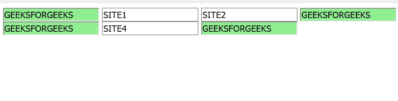

# jQuery |【属性~ =值】选择器

> 原文:[https://www . geesforgeks . org/jquery-attribute value-selector-7/](https://www.geeksforgeeks.org/jquery-attributevalue-selector-7/)

**jQuery【属性~ =值】选择器**选择名称属性包含特定字符串的所有元素。
**语法:**

```
$("[attribute~='string']")
```

**参数:**

*   **属性:**指定用于查找的属性。
*   **字符串:**指定要查找的字符串值。

**示例:**

```
<!DOCTYPE html>
<html>

<head>
    <script src=
"https://ajax.googleapis.com/ajax/libs/jquery/3.3.1/jquery.min.js">
  </script>

    <script>
     $(document).ready(function() {
       $("input[name~='GFG']").css("background-color",
                                   "LIGHTGREEN");
        });
    </script>
</head>

<body>

    <input name="GFG" type="text" value="GEEKSFORGEEKS">
    <input name="2" type="text" value="SITE1">
    <input name="3" type="text" value="SITE2">
    <input name="GFG" type="text" value="GEEKSFORGEEKS">
    <input name="GFG" type="text" value="GEEKSFORGEEKS">
    <input name="4" type="text" value="SITE4">

    <input name="GFG" type="text" value="GEEKSFORGEEKS">

</body>

</html>
```

**输出:**
